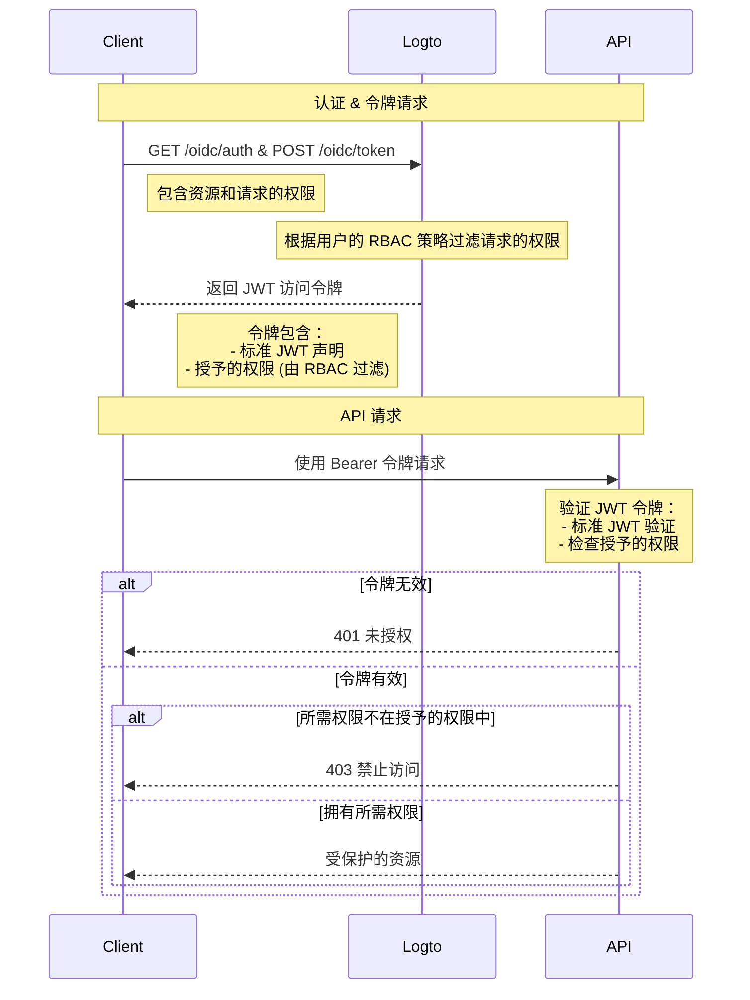

# 使用 RBAC 保护 API 资源

除了通过确保存在有效的 JWT 来保护资源的 [保护你的 API](/authorization/api-resources/protect-your-api) 之外，还可以应用基于角色的访问控制 (RBAC)。

在本文中，我们将重点介绍 RBAC 如何影响认证流程中的权限 (Scope) 委派和验证。

## 授权流程图



从图中可以看出，与基本的 API 保护相比，主要区别在于权限的处理。Logto 不再直接授予所有请求的权限，而是根据用户的 RBAC 策略进行过滤。JWT 令牌将仅包含用户通过其角色授予的权限。在 API 端，在验证令牌的真实性后，还有一个额外的检查，以确保令牌包含请求资源所需的权限。

## 可选：处理用户权限变更

用户权限可能会在会话期间发生变化——例如，他们可能被分配了新角色或现有角色权限被修改。在这些情况下，可能需要检测这些变化并更新应用程序 UI。

当用户权限发生变化时会发生什么？有两种情况。

### 系统中没有引入新权限

即使在用户权限更改后，当前的访问令牌仍将保持有效，直到它们过期。然而，新权限将在后续访问令牌中反映出来，任何被撤销的权限将被省略。

以下是一些**推荐的操作**：

**选项 1：使用短期访问令牌过期时间**

短期访问令牌可确保更频繁地更新用户权限。在控制台的 [API 资源](/authorization/api-resources/#logto-api-resource-schema) 设置中配置令牌过期设置。缺点是这会增加你的令牌使用量。

**选项 2：动态检查权限**

定期调用 [Logto Management API](/integrate-logto/interact-with-management-api) 端点（例如，SWR）或使用 WebSocket 等技术实现长连接以动态获取用户权限。在检测到更改时，清除现有的访问令牌，新颁发的令牌将自动反映权限范围的更改。- API：用户角色 - API：角色权限

当检测到权限更改时，首先从存储中清除访问令牌，然后调用 SDK 方法 `getAccessToken()` 获取新令牌。新颁发的访问令牌应反映权限更改。

### 系统中引入了新权限并分配给用户

当你的系统中引入新权限时会发生这种情况。在这种情况下，你必须首先在初始化 Logto 客户端时包含新引入的权限范围。例如：

```tsx
new LogtoClient({
  appId: 'your-app-id',
  redirectUrl: 'your-redirect-url',
  resources: ['your-api-resource'],
  scopes: [
    // ... 你现有的权限范围,
    'new-scope',
  ],
});
```

其次，你的每个客户端应用程序需要重新同意或重新登录用户，以接收新的权限更改。然后，新权限范围将在新的访问令牌中反映出来。

重新同意的代码示例：

```tsx
signIn({ redirectUrl: 'your-redirect-url', prompt: 'consent' });
```
