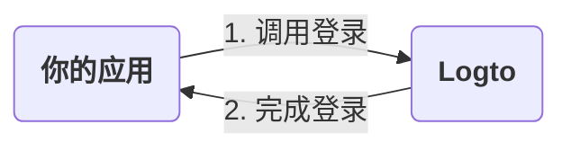
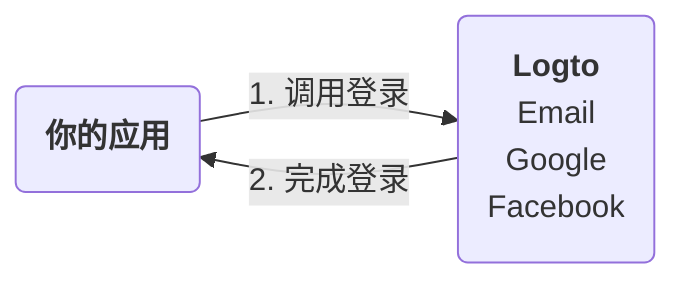
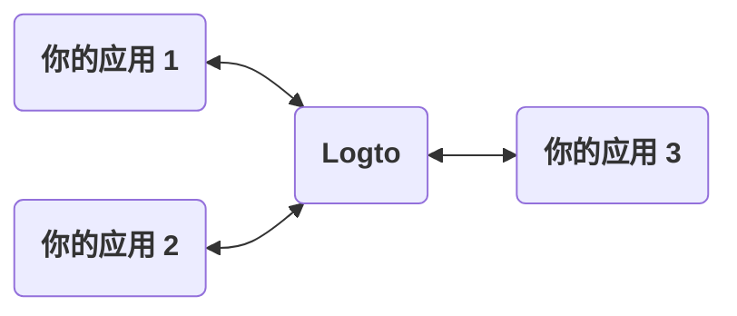
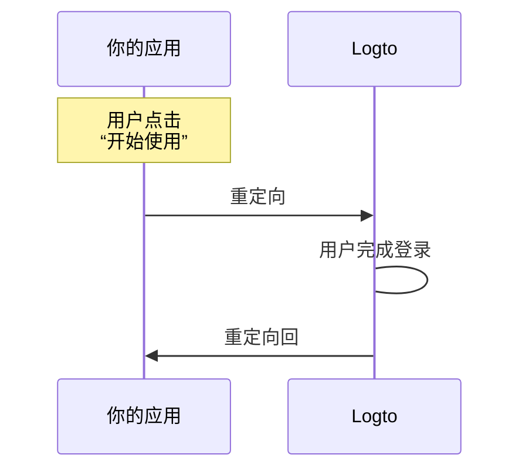
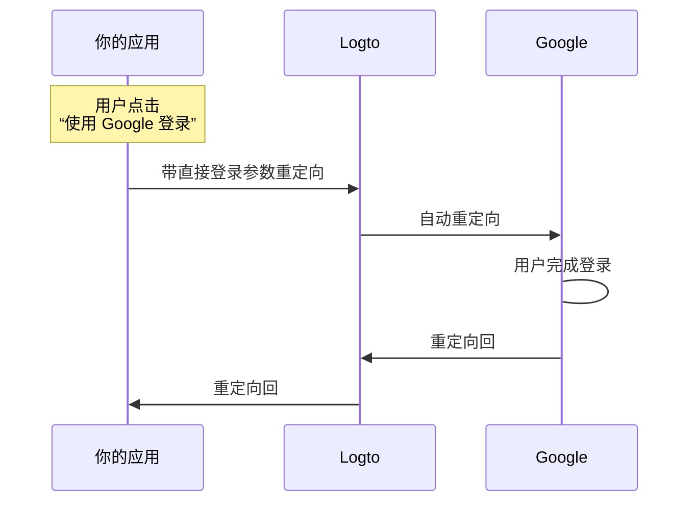

# 登录体验解析

本页面解释了 Logto 中的登录体验及其设计原因。

## 介绍

登录体验是 Logto 中的用户认证 (Authentication) 过程。该过程可以简化为如下步骤：



1. 你的应用调用登录方法。
2. 用户被重定向到 Logto 登录页面。对于原生应用，将打开系统浏览器。
3. 用户登录后被重定向回你的应用（在 Logto 中配置为“重定向 URI”）。

虽然这个过程很简单，但重定向部分有时可能显得多余。然而，它在许多方面都是有益且安全的。我们将在以下部分中解释原因。

## 为什么要重定向？

### 灵活性

重定向允许你将认证 (Authentication) 过程与应用解耦。随着业务的发展，你可以保持相同的认证 (Authentication) 过程而无需更改应用。例如，你可以添加多因素认证 (MFA) 或更改登录方法，而无需修改应用。



### 多应用支持

如果你有多个应用，用户可以一次登录后访问所有应用，而无需再次登录。这对于 SaaS 业务或拥有多个服务的公司尤其有用。



### 原生应用

对于原生应用，重定向到系统浏览器是一种安全的用户认证 (Authentication) 方式，并且在 iOS 和 Android 上都有内置支持。

- **iOS**：Apple 提供了 [ASWebAuthenticationSession](https://developer.apple.com/documentation/authenticationservices/aswebauthenticationsession) 用于安全认证 (Authentication)。
- **Android**：Google 提供了 [Custom Tabs](https://developer.chrome.com/docs/android/custom-tabs) 以实现无缝体验。

### 安全性

在底层，Logto 是一个 [OpenID Connect (OIDC)](https://openid.net/specs/openid-connect-core-1_0.html) 提供商。OIDC 是一种广泛采用的用户认证 (Authentication) 标准。

Logto 强制执行严格的安全措施，如 [PKCE](https://tools.ietf.org/html/rfc7636)，并禁用不安全的流程，如隐式流程。重定向是一种安全的用户认证 (Authentication) 方式，可以防止许多常见攻击。

## 如果我需要在应用中显示一些登录组件怎么办？

有时你的团队可能希望在应用中显示一些登录组件，例如“使用 Google 登录”按钮。这可以通过使用 Logto 的“直接登录”功能来实现。

### 它是如何工作的？

假设你的应用中有两个号召性用语按钮：“开始使用”和“使用 Google 登录”。这些按钮的设计如下：

- “开始使用”：重定向到正常的登录页面。
- “使用 Google 登录”：重定向到 Google 登录页面。

这两个操作都需要完成登录过程并重定向回你的应用。

---

#### 点击“开始使用”的过程

在这种情况下，登录体验与默认情况相同。用户被重定向到 Logto 登录页面，然后返回到你的应用。



:::note
如果你在 Logto 中配置了社交登录方法（例如，Google、Facebook），用户可能会被重定向到相应的登录页面。在图示中，我们仅展示了一般流程以简化说明。
:::

---

#### 点击“使用 Google 登录”的过程

在这种情况下，用户会自动重定向到 Google 登录页面，而无需与 Logto 登录页面交互。这种自动重定向的速度几乎是瞬间的，用户可能不会注意到重定向。



---

总之，直接登录功能是一种在不改变安全级别的情况下自动化登录体验中某些交互的方式。

### 在应用中使用直接登录

要使用直接登录，你需要在调用登录方法时传递 `direct_sign_in` 参数。该值应由 Logto 识别的特定格式组成。例如，要使用 Google 登录，值应为 `social:google`。

在一些 Logto 官方 SDK 中，有一个专门用于直接登录的选项。以下是在 `@logto/client` JavaScript SDK 中使用直接登录的示例：

```ts
client.signIn({
  redirectUri: 'https://some-redirect-uri',
  directSignIn: { method: 'social', target: 'google' },
});
```

有关更多详细信息，请参阅 [直接登录](/end-user-flows/authentication-parameters/direct-sign-in)。

:::info
我们正在逐步在所有 Logto 官方 SDK 中推出此功能。如果你在 SDK 中没有看到它，请随时联系我们。
:::

## 我需要用户在我的应用中填写他们的凭据

如果你需要用户直接在应用中填写他们的凭据（例如电子邮件和密码），而不是重定向到 Logto，目前我们无法为你提供帮助。历史上曾有“资源所有者密码凭据”授权，但现在被认为是不安全的，并已在 [OAuth 2.1 中正式弃用](https://datatracker.ietf.org/doc/html/draft-ietf-oauth-security-topics#name-resource-owner-password-cre)。

要了解有关 ROPC 授权类型安全风险的更多信息，请查看我们的博客文章 [为什么你应该弃用 ROPC 授权类型](https://blog.logto.io/deprecated-ropc-grant-type/)。

## 相关资源：

<Url href="https://blog.logto.io/oauth-2-1/">OAuth 2.1 来了：你需要知道什么</Url>
