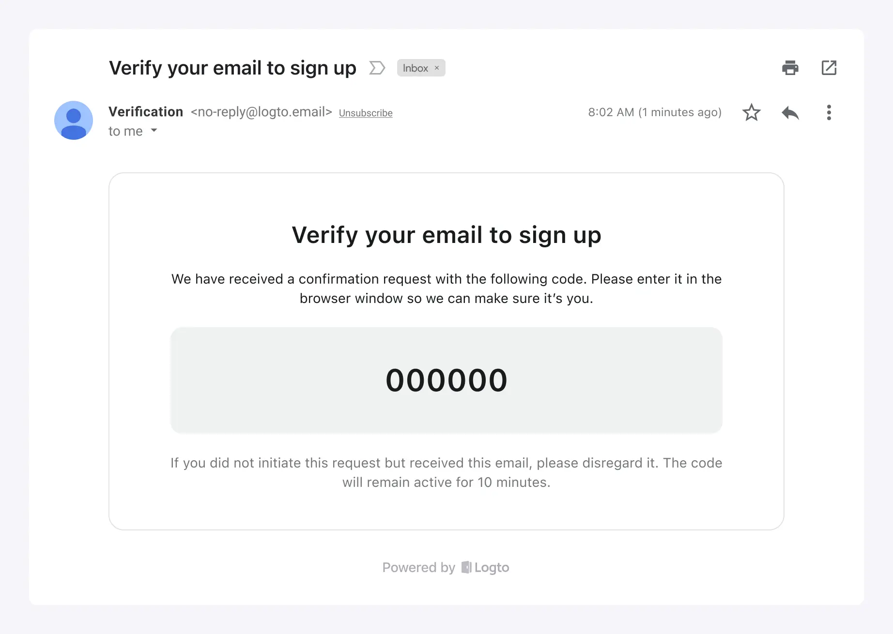

Logto 提供内置电子邮件服务，方便你在以下场景中使用：

1. 快速探索或测试 Logto 的电子邮件登录体验。
2. 直接用于你的在线产品。它主要适用于愿意使用 `logto.email` 作为发件人电子邮件域的新创业公司。

Logto 电子邮件服务的特点：

- **免费使用**：完全免费，没有每日电子邮件使用限制，节省你的成本。
- **轻松无忧**：无需配置任何第三方电子邮件服务提供商。只需自定义电子邮件模板的基本品牌信息。如果你还没有自己的品牌信息，可以选择几次点击即可开始使用。
- **确保交付**：基于 Logto 的电子邮件服务，你可以获得稳定的服务和可靠的电子邮件交付，确保用户可以访问你的产品。

然而，尽管方便，但需要注意一些限制：

1. 电子邮件将从固定地址 `no-reply@logto.email` 发送。
2. 你不能在电子邮件中添加链接或任何其他自定义内容。

根据你不断变化的业务需求，你可以选择以后使用其他电子邮件服务提供商。我们提供一系列[开箱即用的电子邮件服务连接器](/connectors/email-connectors#popular-email-providers)，还支持[SMTP](/integrations/smtp)、[HTTP](/integrations/http-email) 和 [WebHook](/developers/webhooks) 触发器发送电子邮件，因此你总能找到适合你的方式。

:::note
Logto 内置免费电子邮件服务目前仅适用于 [Cloud](https://cloud.logto.io/) 用户。对于开源服务的用户，你可以灵活配置你的电子邮件服务提供商进行电子邮件登录。
:::

## 配置步骤

按照以下步骤配置 Logto 电子邮件服务：

1. 前往 <CloudLink to="/connectors/passwordless">Connector > Email and SMS connectors</CloudLink>。
2. 要添加新的电子邮件连接器，点击“**设置**”按钮并选择“**Logto 电子邮件服务**”连接器。
3. 一旦“Logto 电子邮件服务”连接器成功创建，你可以自定义电子邮件模板中显示的基本品牌信息。
4. 进行这些更改后，记得在保存更改之前向你的电子邮件地址发送测试电子邮件模板。

自定义选项：

- **发件人邮箱**：发件人邮箱设置为 `no-reply@logto.email`，无法修改。
- **发件人名称**：设置你的品牌名称作为发件人名称，以确保用户识别。
- **公司信息**：显示你的公司名称、地址或邮政编码，以增强用户信任并满足合规要求。_请注意，不允许使用 URL。_
- **应用标志**：上传你的应用品牌标志，以便在用户收到的电子邮件中展示应用的品牌价值。

## 统一电子邮件模板

Logto 电子邮件服务使用针对特定认证 (Authentication) 场景定制的统一电子邮件模板：

| 用途         | 场景                                                                                                                                                                                                 |
| ------------ | ---------------------------------------------------------------------------------------------------------------------------------------------------------------------------------------------------- |
| 注册         | 用户使用他们的电子邮件创建账户，并通过输入 Logto 发送到他们电子邮件的验证码进行验证。                                                                                                                |
| 登录         | 用户使用他们的电子邮件登录，并通过输入验证码而不是输入密码进行验证。                                                                                                                                 |
| 忘记密码     | 如果用户在登录时忘记密码，他们可以选择使用他们已经通过 Logto 验证的电子邮件来验证身份。                                                                                                              |
| 通用         | 此模板可以用作各种场景的通用备选选项，包括测试连接器配置等。                                                                                                                                         |
| 组织邀请     | 使用此模板向用户发送加入组织的邀请链接。                                                                                                                                                             |
| 用户权限验证 | 在应用使用过程中，可能会有一些高风险操作或风险较高的操作需要额外的用户验证，例如银行转账、删除正在使用的资源和取消会员资格。`用户权限验证`模板可用于定义用户在这些情况下收到的电子邮件验证码的内容。 |
| 绑定新标识符 | 当用户修改他们的个人资料时，他们可能会将电子邮件地址绑定到他们当前的账户。在这种情况下，`绑定新标识符`模板可用于自定义验证电子邮件的内容。                                                           |

以下是“注册”用途类型的电子邮件模板示例，带有自定义品牌信息：

如果没有提供自定义品牌信息，电子邮件模板仍然可以使用默认显示和布局：

## 常见问题解答

### 是否可以向 Logto 电子邮件服务添加自定义 CSS 或 HTML？

Logto 的内置电子邮件服务不支持自定义 CSS 或 HTML。你只能修改通用品牌元素。此限制是为了维护内置电子邮件服务的稳定性，因为所有租户共享相同的 IP 地址和发件人地址。有关更多详细信息，请参阅“[提高电子邮件交付的因素](https://blog.logto.io/verification-email-delivery#factors-to-improve-email-delivery)”。

要自定义电子邮件模板，我们建议使用其他电子邮件连接器，例如 AWS Direct Mail、SendGrid、Mailgun、Postmark 或 SMTP。

