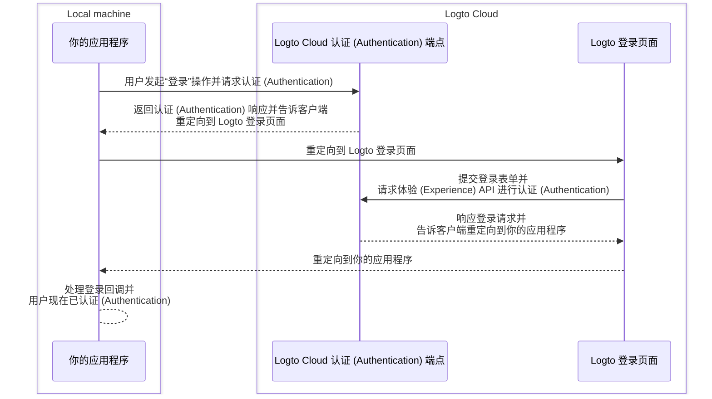
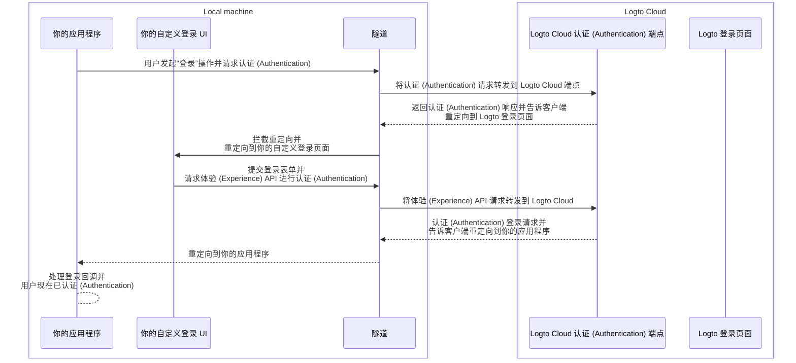

import TabItem from '@theme/TabItem';
import Tabs from '@theme/Tabs';

# 在本地调试和测试你的自定义 UI

对于 Logto Cloud 用户，我们让你可以轻松地将“自定义 UI”引入 Logto。Cloud 用户现在可以在 <CloudLink to="/sign-in-experience/branding">控制台 > 登录体验 > 品牌 > 引入你的 UI</CloudLink> 中上传包含自定义 UI 资源的 zip 文件（查看 [引入你的 UI](/customization/bring-your-ui) 页面以获取更多详细信息）。

然而，在开发这些自定义 UI 页面时，用户希望在上传到 Logto Cloud 之前在本地测试和调试代码。此 CLI 命令帮助你设置一个本地隧道，并将以下 3 个实体连接在一起：你的 Logto Cloud 认证 (Authentication) 端点、你的应用程序和你的自定义登录 UI。

## 我为什么需要这个？

默认情况下，当你在应用程序中点击“登录”按钮时，你将被导航到 Logto 端点配置的登录页面。成功的登录流程可以如下图所示：



但现在由于你正在开发自己的自定义登录 UI，你需要一种方式导航到在本地机器上运行的自定义登录 UI 页面。
这需要一个本地隧道服务来拦截来自应用程序的外发请求并将其重定向到你的自定义登录 UI 页面。

此外，你需要与 [Logto 的体验 (Experience) API](https://openapi.logto.io/group/endpoint-experience) 交互以认证 (Authentication) 用户和管理会话。
此服务还将帮助将这些体验 (Experience) API 请求转发到 Logto Cloud 以避免 CORS 问题。

下图的序列图展示了使用你的自定义 UI 和隧道服务的成功“登录”流程：



通过使用隧道服务，你现在可以在本地开发和测试你的自定义登录 UI，而无需每次更改时都将资源上传到 Logto Cloud。

## 指导说明

### 步骤 1：执行命令

假设你的 Cloud 租户 ID 是 `foobar`，并且你有一个在本地开发服务器上运行的自定义登录页面，地址为 `http://localhost:4000`，那么你可以这样执行命令：

<Tabs groupId="cmd">

  <TabItem value="cli" label="CLI">

```bash
logto-tunnel -p 9000 --experience-uri http://localhost:4000/ --endpoint https://foobar.logto.app/
```

  </TabItem>
  <TabItem value="npx" label="npx">

```bash
npx @logto/tunnel -p 9000 --experience-uri http://localhost:4000/ --endpoint https://foobar.logto.app/
```

  </TabItem>

</Tabs>

如果你在 Logto 中配置了自定义域名，也可以这样使用：

<Tabs groupId="cmd">

  <TabItem value="cli" label="CLI">

```bash
logto-tunnel -p 9000 --experience-uri http://localhost:4000/ --endpoint https://your.custom.domain/
```

  </TabItem>
  <TabItem value="npx" label="npx">

```bash
npx @logto/tunnel -p 9000 --experience-uri http://localhost:4000/ --endpoint https://your.custom.domain/
```

  </TabItem>

</Tabs>

或者，该命令还支持静态 html 资源，而无需先在开发服务器上运行。只需确保在你指定的路径中有一个 `index.html`。

<Tabs groupId="cmd">

  <TabItem value="cli" label="CLI">

```bash
logto-tunnel -p 9000 --experience-path /path/to/your/static/files --endpoint https://foobar.logto.app/
```

  </TabItem>
  <TabItem value="npx" label="npx">

```bash
npx @logto/tunnel -p 9000 --experience-path /path/to/your/static/files --endpoint https://foobar.logto.app/
```

  </TabItem>

</Tabs>

### 步骤 2：更新应用程序中的端点 URI

最后，运行你的应用程序并将其 Logto 端点设置为隧道服务地址 `http://localhost:9000/`。

以 React 应用程序为例：

```tsx title=App.tsx
import { LogtoProvider, LogtoConfig } from '@logto/react';

const config: LogtoConfig = {
  // endpoint: 'https://foobar.logto.app/', // 原始 Logto Cloud 端点
  endpoint: 'http://localhost:9000/', // 隧道服务地址
  appId: '<your-application-id>',
};

const App = () => (
  <LogtoProvider config={config}>
    <YourAppContent />
  </LogtoProvider>
);
```

如果你使用社交登录，还需要在社交提供商设置中将重定向 URI 更新为隧道服务地址。

```
http://localhost:9000/callback/<connector-id>
```

如果一切设置正确，当你在应用程序中点击“登录”按钮时，你应该被导航到你的自定义登录页面，而不是 Logto 的内置 UI，并且拥有有效的会话（cookies），这允许你进一步与 Logto 体验 (Experience) API 交互。

编码愉快！
