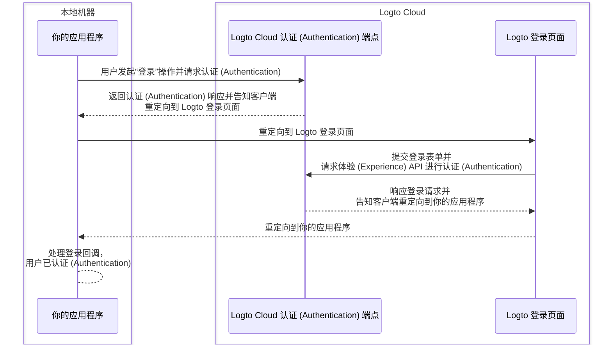
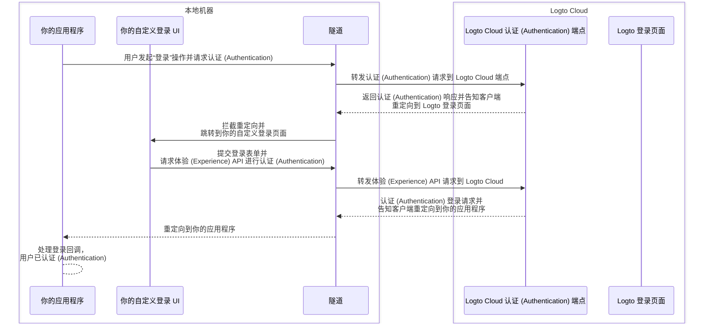

import TabItem from '@theme/TabItem';
import Tabs from '@theme/Tabs';

# 在本地调试和测试你的自定义 UI

对于 Logto Cloud 用户，我们让你可以轻松地将“自定义 UI”带入 Logto。Cloud 用户现在可以在 <CloudLink to="/sign-in-experience/branding">控制台 > 登录与账户 > 品牌设置 > 自定义 UI</CloudLink> 上传包含自定义 UI 资源的 zip 文件（详细信息请查看 [自定义 UI](/customization/bring-your-ui) 页面）。

然而，在开发这些自定义 UI 页面时，用户希望在上传到 Logto Cloud 之前，能够在本地测试和调试代码。这个 CLI 命令可以帮助你建立本地隧道，并将以下 3 个实体连接在一起：
你的 Logto Cloud 认证 (Authentication) 端点、你的应用程序，以及你的自定义登录 UI。

## 为什么需要这个？ \{#why-do-i-need-this}

默认情况下，当你在应用程序中点击“登录”按钮时，会跳转到 Logto 端点配置的登录页面。一次成功的登录流程可以如下图所示：


```mermaid
sequenceDiagram
    box 本地机器
    participant A as 你的应用程序
    end
    box Logto Cloud
    participant B as Logto Cloud 认证 (Authentication) 端点
    participant C as Logto 登录页面
    end
    A ->> B: 用户发起“登录”操作并请求认证 (Authentication)
    B -->> A: 返回认证 (Authentication) 响应并告知客户端<br/>重定向到 Logto 登录页面
    A ->> C: 重定向到 Logto 登录页面
    C ->> B: 提交登录表单并<br/>请求体验 (Experience) API 进行认证 (Authentication)
    B -->> C: 响应登录请求并<br/>告知客户端重定向到你的应用程序
    C -->> A: 重定向到你的应用程序
    A --> A: 处理登录回调，<br/>用户已认证 (Authentication)
```

但现在由于你正在开发自己的自定义登录 UI，你需要一种方式跳转到本地运行的自定义登录 UI 页面。
这就需要一个本地隧道服务来拦截来自你应用程序的外部请求，并将其重定向到你的自定义登录 UI 页面。

此外，你还需要与 [Logto 的体验 (Experience) API](https://openapi.logto.io/group/endpoint-experience) 交互，以认证 (Authentication) 用户并管理会话。
该服务还会帮助你将这些体验 (Experience) API 请求转发到 Logto Cloud，以避免 CORS 问题。

下方的时序图展示了在有自定义 UI 和隧道服务的情况下，一个成功的“登录”流程是如何运作的：


```mermaid
sequenceDiagram
    box 本地机器
    participant A as 你的应用程序
    participant B as 你的自定义登录 UI
    participant C as 隧道
    end
    box Logto Cloud
    participant D as Logto Cloud 认证 (Authentication) 端点
    participant E as Logto 登录页面
    end
    A ->> C: 用户发起“登录”操作并请求认证 (Authentication)
    C ->> D: 转发认证 (Authentication) 请求到 Logto Cloud 端点
    D -->> C: 返回认证 (Authentication) 响应并告知客户端<br/>重定向到 Logto 登录页面
    C ->> B: 拦截重定向并<br/>跳转到你的自定义登录页面
    B ->> C: 提交登录表单并<br/>请求体验 (Experience) API 进行认证 (Authentication)
    C ->> D: 转发体验 (Experience) API 请求到 Logto Cloud
    D -->> C: 认证 (Authentication) 登录请求并<br/>告知客户端重定向到你的应用程序
    C -->> A: 重定向到你的应用程序
    A --> A: 处理登录回调，<br/>用户已认证 (Authentication)
```

有了隧道服务，你现在可以在本地开发和测试你的自定义登录 UI，无需每次更改都上传资源到 Logto Cloud。

## 操作指南 \{#instructions}

### 步骤 1：执行命令 \{#step-1-execute-the-command}

假设你的 Cloud 租户 ID 是 `foobar`，并且你有一个自定义登录页面在本地开发服务器 `http://localhost:4000` 上运行，那么你可以这样执行命令：

<Tabs groupId="cmd">

  <TabItem value="cli" label="CLI">

```bash
logto-tunnel -p 9000 --experience-uri http://localhost:4000/ --endpoint https://foobar.logto.app/
```

  </TabItem>
  <TabItem value="npx" label="npx">

```bash
npx @logto/tunnel -p 9000 --experience-uri http://localhost:4000/ --endpoint https://foobar.logto.app/
```

  </TabItem>

</Tabs>

如果你在 Logto 中配置了自定义域名，也同样适用：

<Tabs groupId="cmd">

  <TabItem value="cli" label="CLI">

```bash
logto-tunnel -p 9000 --experience-uri http://localhost:4000/ --endpoint https://your.custom.domain/
```

  </TabItem>
  <TabItem value="npx" label="npx">

```bash
npx @logto/tunnel -p 9000 --experience-uri http://localhost:4000/ --endpoint https://your.custom.domain/
```

  </TabItem>

</Tabs>

另外，该命令也支持静态 html 资源，无需先在开发服务器上运行。只需确保你指定的路径下有 `index.html` 文件即可。

<Tabs groupId="cmd">

  <TabItem value="cli" label="CLI">

```bash
logto-tunnel -p 9000 --experience-path /path/to/your/static/files --endpoint https://foobar.logto.app/
```

  </TabItem>
  <TabItem value="npx" label="npx">

```bash
npx @logto/tunnel -p 9000 --experience-path /path/to/your/static/files --endpoint https://foobar.logto.app/
```

  </TabItem>

</Tabs>

### 步骤 2：在你的应用程序中更新端点 URI \{#step-2-update-endpoint-uri-in-your-application}

最后，运行你的应用程序，并将其 Logto 端点设置为隧道服务地址 `http://localhost:9000/`。

以 React 应用为例：

```tsx title=App.tsx
import { LogtoProvider, LogtoConfig } from '@logto/react';

const config: LogtoConfig = {
  // endpoint: 'https://foobar.logto.app/', // 原 Logto Cloud 端点
  endpoint: 'http://localhost:9000/', // 隧道服务地址
  appId: '<your-application-id>',
};

const App = () => (
  <LogtoProvider config={config}>
    <YourAppContent />
  </LogtoProvider>
);
```

如果你使用了社交登录，还需要在社交平台的设置中将重定向 URI 更新为隧道服务地址。

```
http://localhost:9000/callback/<connector-id>
```

如果一切设置正确，当你在应用程序中点击“登录”按钮时，应该会跳转到你的自定义登录页面，而不是 Logto 内置 UI，并且会带有有效的会话（cookie），允许你进一步与 Logto 体验 (Experience) API 交互。

祝你编码愉快！

## 相关资源 \{#related-resources}

<Url href="https://blog.logto.io/automate-custom-sign-in-ui-deployment-with-github-actions">
  使用 GitHub Actions 工作流自动部署你的自定义登录 UI
</Url>
