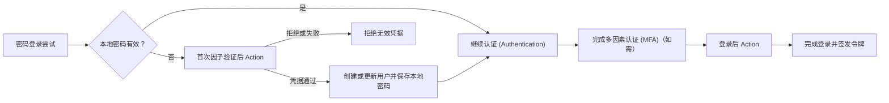

# Actions

Logto Actions 允许你在认证 (Authentication) 流程的特定节点运行受信任的 JavaScript。Action 是同步执行的：认证 (Authentication) 请求会等待脚本执行，脚本结果可以更新用户或决定流程是否继续。

当决策必须在认证 (Authentication) 流程内部发生时，Actions 非常有用。常见用例包括：

- 用户首次登录时，从旧有身份系统迁移用户和密码。
- 在 Logto 完成登录前，刷新用户资料或应用特定数据。
- 调用外部服务，并将其结果应用到 Logto 用户。

:::note
Actions 仅在 Logto Cloud 企业版计划中提供。
:::

:::warning
Action 脚本可以影响认证 (Authentication) 并修改用户数据。只有受信任的管理员才应被允许查看、创建、编辑、测试、启用或删除它们。

在自托管部署中，Action 脚本在 Logto 服务器进程内以其权限运行。授予脚本编辑或测试权限等同于授予 Logto 主机上的代码执行权限，因此管理控制台不应与不受信任的用户共享。将脚本视为受信任的服务器端代码；运行时会限制脚本的时间和内存，但这不是针对不受信任代码的安全边界。
:::

## Actions 如何融入登录流程 \{#how-actions-fit-into-sign-in}

Logto 目前提供两种 Action 类型：



| Action 类型                                                          | 运行时机                                                                                       | 可执行操作                                                                          |
| -------------------------------------------------------------------- | ---------------------------------------------------------------------------------------------- | ----------------------------------------------------------------------------------- |
| [首次因子验证后](/developers/actions/post-first-factor-verification) | 在密码登录过程中，仅当 Logto 的本地密码验证失败时运行。本地密码有效时不会运行。                | 针对旧有系统验证提交的凭据，然后创建新的 Logto 用户或更新现有用户并迁移提交的密码。 |
| [登录后](/developers/actions/post-sign-in)                           | 用户完成所有认证 (Authentication) 因子（包括需要时的 MFA）后，Logto 完成登录并签发令牌前运行。 | 使用最终登录上下文更新和丰富现有 Logto 用户。                                       |

两种 Action 类型仅在 Experience API 的 `SignIn` 交互中运行。首次因子验证后仅适用于密码登录；登录后 Action 与认证 (Authentication) 方法无关。

## 脚本模型 \{#script-model}

每种 Action 类型都有一个配置和一个名为 `runAction` 的 JavaScript 入口函数：

```js
const runAction = async ({ event, environmentVariables = {} }) => {
  // 检查 event，可选地获取外部数据，并返回该 Action 类型支持的结果。
};
```

参数包含：

- `event`：生产环境下的认证 (Authentication) 事件。其结构取决于 Action 类型。
- `environmentVariables`：为该 Action 配置的字符串值。这些值通过函数参数传递；无法通过 `process.env` 获取。

编辑器提供类型信息，但保存的脚本以 JavaScript 执行。脚本可以是异步的，并可使用注入的 `fetch` 函数调用外部 HTTPS API。不能导入包或访问 Node.js 全局变量，如 `require` 或 `process`。

每种 Action 类型支持的返回结果不同；在启用 Action 前请参阅对应的参考页面。

## Actions 与 Webhook 的区别 \{#actions-and-webhooks}

Actions 与 [Webhook](/developers/webhooks) 用途不同：

|                                        | Actions                            | Webhook                                       |
| -------------------------------------- | ---------------------------------- | --------------------------------------------- |
| 执行方式                               | 与认证 (Authentication) 同步、内联 | 异步，认证 (Authentication) 请求之外          |
| 能否影响当前认证 (Authentication) 流程 | 可以                               | 不可以                                        |
| 能否通过结果修改用户                   | 可以，使用支持的用户补丁           | 不能直接修改；接收方可单独调用 Management API |
| 事件覆盖范围                           | 选定的认证 (Authentication) 节点   | 广泛的交互和数据变更事件                      |
| 典型用途                               | 凭据迁移、令牌前用户资料丰富       | 通知、下游同步、分析                          |

异步工作应放在 Webhook 中。仅当 Logto 需要结果以继续认证 (Authentication) 时才使用 Action。

## 下一步 \{#next-steps}

- [配置和测试 Actions](/developers/actions/configure-and-test-actions)
- [在密码登录时迁移用户](/developers/actions/post-first-factor-verification)
- [登录后丰富用户信息](/developers/actions/post-sign-in)
