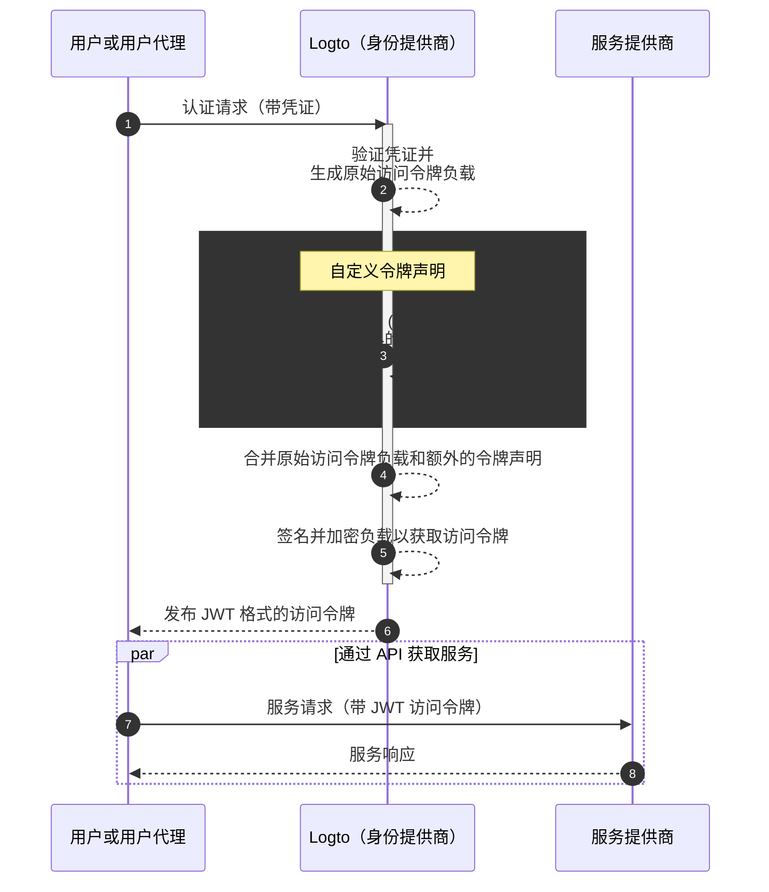

# 自定义令牌声明 (Claims)

## 介绍

[访问令牌 (Access tokens)](https://auth.wiki/access-token) 在认证 (Authentication) 和授权 (Authorization) 过程中起着关键作用，携带主体的身份信息和权限，并在 [Logto 服务器](/concepts/core-service)（作为认证服务器或身份提供商 (IdP)）、你的 Web 服务服务器（资源提供者）和客户端应用程序（客户端）之间传递。

[令牌声明 (Token claims)](https://auth.wiki/claim) 是提供有关实体或令牌本身信息的键值对。声明可能包括用户信息、令牌过期时间、权限以及与认证 (Authentication) 和授权 (Authorization) 过程相关的其他元数据。

在 Logto 中，有两种类型的访问令牌：

- **JSON Web Token**：[JSON Web Token (JWT)](https://auth.wiki/jwt) 是一种流行的格式，以一种既安全又可被客户端读取的方式编码声明。常见的声明如 `sub`、`iss`、`aud` 等与 OAuth 2.0 协议一致（详见 [此链接](https://datatracker.ietf.org/doc/html/rfc7519#section-4)）。JWT 令牌允许消费者直接访问声明而无需额外的验证步骤。在 Logto 中，当客户端初始化特定资源或组织的授权请求时，访问令牌默认以 JWT 格式发布。
- **不透明令牌 (Opaque token)**：不透明令牌 (Opaque token) 不是自包含的，总是需要通过 [令牌内省 (token introspection)](https://auth.wiki/token-introspection) 端点进行额外的验证步骤。尽管其格式不透明，不透明令牌可以帮助获取声明并在各方之间安全传输。令牌声明安全地存储在 Logto 服务器中，并通过令牌内省端点由客户端应用程序访问。当授权请求中不包含特定资源或组织时，访问令牌以不透明格式发布。这些令牌主要用于访问 OIDC `userinfo` 端点和其他一般用途。

在许多情况下，标准声明不足以满足你的应用程序的特定需求，无论你使用的是 JWT 还是不透明令牌。为了解决这个问题，Logto 提供了在访问令牌中添加自定义声明的灵活性。通过此功能，你可以为你的业务逻辑包含额外的信息，这些信息都可以安全地在令牌中传输，并在不透明令牌的情况下通过内省检索。

## 自定义令牌声明如何工作？

Logto 允许你通过回调函数 `getCustomJwtClaims` 将自定义声明插入到 `访问令牌` 中。你可以提供 `getCustomJwtClaims` 函数的实现以返回自定义声明的对象。返回值将与原始令牌负载合并并签名以生成最终的访问令牌。

:::warning
Logto 内置的令牌声明不能被覆盖或修改。自定义声明将作为附加声明添加到令牌中。如果任何自定义声明与内置声明冲突，这些自定义声明将被忽略。
:::
