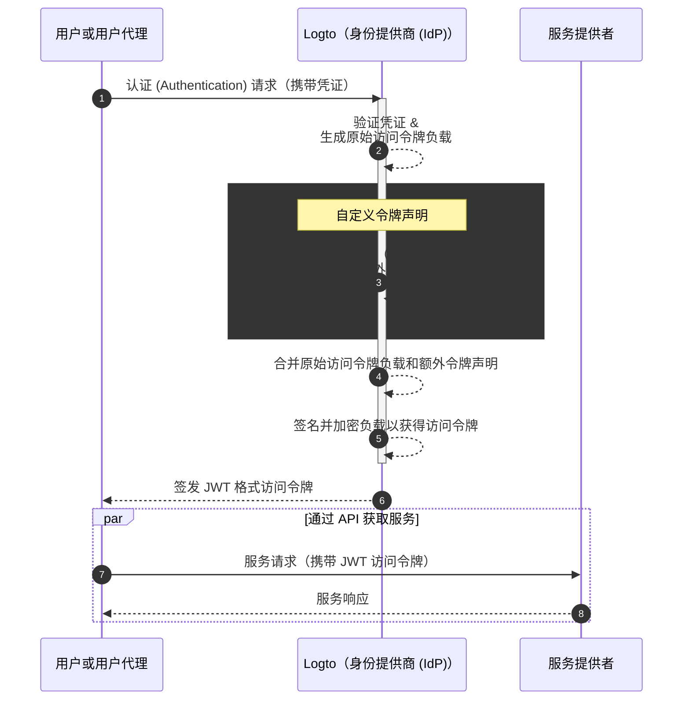

# 自定义令牌声明 (Custom token claims)

Logto 提供了在访问令牌（JWT / 不透明令牌）中添加自定义声明的灵活性。通过此功能，你可以为你的业务逻辑包含额外信息，这些信息会安全地传递在令牌中，并在不透明令牌的情况下通过内省检索。

## 简介 \{#introduction}

[访问令牌 (Access tokens)](https://auth.wiki/access-token) 在认证 (Authentication) 和授权 (Authorization) 过程中扮演着关键角色，携带主体的身份信息和权限，并在 [Logto 服务器](/concepts/core-service)（作为认证服务器或身份提供商 (IdP)）、你的 Web 服务服务器（资源提供者）和客户端应用程序（客户端）之间传递。

[令牌声明 (Token claims)](https://auth.wiki/claim) 是提供关于实体或令牌本身信息的键值对。声明可能包括用户信息、令牌过期时间、权限以及与认证 (Authentication) 和授权 (Authorization) 过程相关的其他元数据。

在 Logto 中有两种类型的访问令牌：

- **JSON Web Token：** [JSON Web Token (JWT)](https://auth.wiki/jwt) 是一种流行的格式，以安全且可被客户端读取的方式编码声明。常见声明如 `sub`、`iss`、`aud` 等，符合 OAuth 2.0 协议（详见 [此链接](https://datatracker.ietf.org/doc/html/rfc7519#section-4)）。JWT 允许消费者无需额外验证步骤即可直接访问声明。在 Logto 中，当客户端发起特定资源或组织的授权 (Authorization) 请求时，访问令牌默认以 JWT 格式签发。
- **不透明令牌 (Opaque token)：** [不透明令牌 (Opaque token)](http://localhost:3000/concepts/opaque-token) 不是自包含的，总是需要通过 [令牌内省 (token introspection)](https://auth.wiki/token-introspection) 端点进行额外验证。尽管其格式不透明，不透明令牌同样可以安全地在各方之间传递声明。令牌声明被安全地存储在 Logto 服务器中，并通过令牌内省端点由客户端应用程序访问。当授权 (Authorization) 请求中未包含特定资源或组织时，访问令牌将以不透明格式签发。这些令牌主要用于访问 OIDC `userinfo` 端点及其他通用用途。

在许多情况下，标准声明无法满足你的应用的特定需求，无论你使用的是 JWT 还是不透明令牌。为此，Logto 提供了在访问令牌中添加自定义声明的灵活性。通过此功能，你可以为你的业务逻辑包含额外信息，这些信息会安全地传递在令牌中，并在不透明令牌的情况下通过内省检索。

## 自定义令牌声明如何工作？\{#how-do-custom-token-claims-work}

Logto 允许你通过回调函数 `getCustomJwtClaims` 向 `访问令牌 (access token)` 中插入自定义声明。你可以实现自己的 `getCustomJwtClaims` 函数来返回一个自定义声明对象。返回值将与原始令牌负载合并，并签名生成最终的访问令牌。

:::warning
Logto 内置令牌声明不可被覆盖或修改。自定义声明将作为附加声明添加到令牌中。如果任何自定义声明与内置声明冲突，这些自定义声明将被忽略。
:::

## 相关资源 \{#related-resources}

<Url href="https://blog.logto.io/glance-on-custom-jwt-access-token-claims">
  使用 Logto 为 JWT 访问令牌添加自定义声明，提升你的授权 (Authorization)
</Url>
