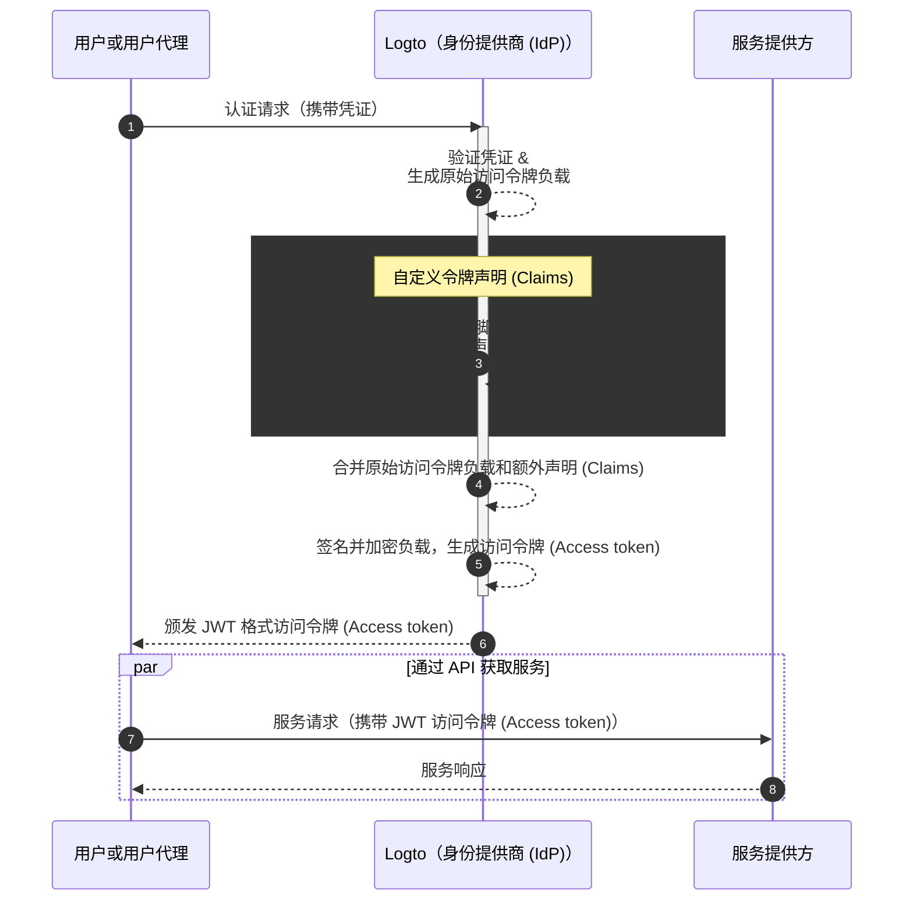

# 自定义访问令牌 (Access token)

Logto 提供了在访问令牌 (访问令牌 / 不透明令牌) 中添加自定义声明 (Claims) 的灵活性。通过此功能，你可以在令牌中安全地传递业务逻辑所需的额外信息，并在使用不透明令牌时通过内省接口获取这些信息。

## 简介 \{#introduction}

[访问令牌 (Access tokens)](https://auth.wiki/access-token) 在认证 (Authentication) 与授权 (Authorization) 流程中扮演着关键角色，携带主体的身份信息和权限，并在 [Logto 服务器](/concepts/core-service)（作为认证服务器或身份提供商 (IdP)）、你的 Web 服务服务器（资源提供方）和客户端应用程序（客户端）之间传递。

[令牌声明 (Token claims)](https://auth.wiki/claim) 是提供关于实体或令牌本身信息的键值对。声明 (Claims) 可能包括用户信息、令牌过期时间、权限以及与认证 (Authentication) 和授权 (Authorization) 流程相关的其他元数据。

在 Logto 中有两种类型的访问令牌 (Access tokens)：

- **JSON Web Token：** [JSON Web Token (JWT)](https://auth.wiki/jwt) 是一种流行的格式，以安全且可被客户端读取的方式编码声明 (Claims)。常见声明 (Claims) 如 `sub`、`iss`、`aud` 等，符合 OAuth 2.0 协议（详见 [此链接](https://datatracker.ietf.org/doc/html/rfc7519#section-4)）。JWT 允许使用者无需额外验证步骤即可直接访问声明 (Claims)。在 Logto 中，当客户端发起特定资源或组织的授权请求时，默认以 JWT 格式颁发访问令牌 (Access token)。
- **不透明令牌 (Opaque token)：** [不透明令牌 (Opaque token)](http://localhost:3000/concepts/opaque-token) 不是自包含的，总是需要通过 [令牌内省](https://auth.wiki/token-introspection) 端点进行额外的验证步骤。尽管其格式不透明，不透明令牌 (Opaque token) 也可以用于获取声明 (Claims)，并在各方之间安全传递。令牌声明 (Claims) 被安全地存储在 Logto 服务器中，并通过令牌内省端点由客户端应用程序访问。当授权请求中未包含特定资源或组织时，访问令牌 (Access token) 以不透明格式颁发。这些令牌主要用于访问 OIDC 的 `userinfo` 端点及其他通用用途。

在许多情况下，标准声明 (Claims) 并不能满足你的应用的特定需求，无论你使用的是 JWT 还是不透明令牌 (Opaque token)。为此，Logto 提供了在访问令牌 (Access token) 中自定义声明 (Claims) 的灵活性。通过此功能，你可以在令牌中安全地传递业务逻辑所需的额外信息，并在使用不透明令牌时通过内省接口获取这些信息。

## 自定义令牌声明 (Claims) 如何工作？\{#how-do-custom-token-claims-work}

Logto 允许你通过回调函数 `getCustomJwtClaims` 向 `访问令牌 (Access token)` 中插入自定义声明 (Claims)。你可以实现自己的 `getCustomJwtClaims` 函数，返回一个自定义声明 (Claims) 对象。返回值将与原始令牌负载合并，并签名生成最终的访问令牌 (Access token)。

```mermaid
sequenceDiagram
  participant U as 用户或用户代理
  participant IdP as Logto（身份提供商 (IdP)）
  participant SP as 服务提供方

  autonumber
  U ->> IdP: 认证请求（携带凭证）
  activate IdP
  IdP-->>IdP: 验证凭证 &<br/>生成原始访问令牌负载
  rect var(--mermaid-rect-fill)
  note over IdP: 自定义令牌声明 (Claims)
  IdP->>IdP: 运行自定义令牌声明 (Claims) 脚本（`getCustomJwtClaims`）&<br/>获取额外声明 (Claims)
  end
  IdP-->>IdP: 合并原始访问令牌负载和额外声明 (Claims)
  IdP-->>IdP: 签名并加密负载，生成访问令牌 (Access token)
  deactivate IdP
  IdP-->>U: 颁发 JWT 格式访问令牌 (Access token)
  par 通过 API 获取服务
  U->>SP: 服务请求（携带 JWT 访问令牌 (Access token)）
  SP-->>U: 服务响应
  end
```

:::info
Logto 内置的令牌声明 (Claims) 不能被覆盖或修改。自定义声明 (Claims) 会作为额外声明添加到令牌中。如果自定义声明 (Claims) 与内置声明 (Claims) 冲突，这些自定义声明 (Claims) 将被忽略。
:::

:::warning
安全提示：在自托管部署中，自定义 JWT 脚本以与 Logto 服务器进程相同的权限执行。此功能仅面向受信任的管理员。不要允许不受信任或低权限用户创建、修改或测试这些脚本。
:::

## 相关资源 \{#related-resources}

<Url href="https://blog.logto.io/glance-on-custom-jwt-access-token-claims">
  使用 Logto 为 JWT 访问令牌 (Access token) 添加自定义声明 (Claims)，提升你的授权 (Authorization)
</Url>
