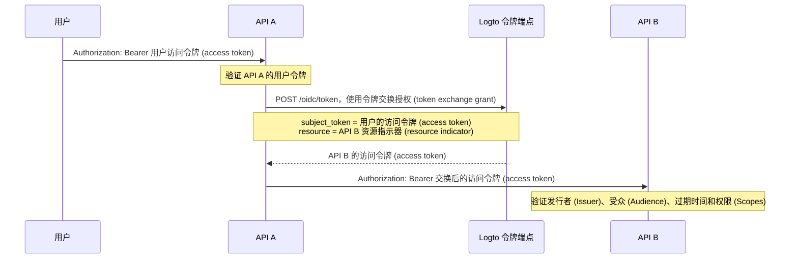

import TokenExchangePrerequisites from './fragments/_token-exchange-prerequisites.mdx';

# 服务到服务委托

在某些 API 架构中，后端服务会收到来自已登录用户的请求，并需要在保留用户身份的情况下调用另一个后端服务。

例如：

```text
用户 -> API A -> API B
```

API B 需要知道两件事：

1. 调用方是受信任的服务，例如 API A。
2. 操作是为原始用户执行的。

使用 Logto 的令牌交换授权 (token exchange grant)，可以将用户的访问令牌 (access token) 交换为以下游 API 资源为受众 (audience) 的新访问令牌 (access token)。这遵循 OAuth 2.0 令牌交换模式，并避免将原始用户令牌转发到下游服务。

## 何时使用此流程 \{#when-to-use-this-flow}

在以下情况下使用服务到服务委托：

- API A 是一个可以安全地向 Logto 令牌端点进行认证 (Authentication) 的后端服务。
- API A 收到 Logto 签发的用户访问令牌 (access token)。
- API A 需要以同一用户的身份调用 API B。
- API B 应该验证一个以自身 API 资源为受众 (audience) 的访问令牌 (access token)。

不要将此流程用于纯机器对机器 (machine-to-machine) 的无用户访问。在这种情况下，请使用 [客户端凭证流程](/quick-starts/m2m)。对于支持、管理员或代理场景，即一个用户临时以另一个用户身份操作，请使用 [用户模拟 (User impersonation)](/developers/user-impersonation)。

## 工作原理 \{#how-it-works}



交换后的访问令牌 (access token) 代表原始用户（`sub`），并绑定到下游 API 资源（`aud`）。下游 API 还可以检查 `client_id` 声明 (Claim) 以识别发起交换的应用程序。

## 前置条件 \{#prerequisites}

1. 为涉及的服务创建 API 资源。参见 [保护全局 API 资源](/authorization/global-api-resources)。
2. 配置 API B 的权限 (Permissions)，并通过角色 (Roles) 或组织角色分配给用户。
3. 对于 API A，使用服务器端应用程序，如机器对机器 (machine-to-machine) 应用或传统 Web 应用，以便可以通过应用密钥安全认证 (Authentication)。
4. 为 API A 的应用启用令牌交换。

<TokenExchangePrerequisites />

## 为下游 API 请求访问令牌 (Access token) \{#request-an-access-token-for-the-downstream-api}

当 API A 需要调用 API B 时，向 Logto 的 [令牌端点](/integrate-logto/application-data-structure#token-endpoint) 发起令牌交换请求。

对于带有应用密钥的传统 Web 应用或机器对机器 (machine-to-machine) 应用，在 `Authorization` 头中包含凭证：

```bash
POST /oidc/token HTTP/1.1
Host: tenant.logto.app
Content-Type: application/x-www-form-urlencoded
# highlight-next-line
Authorization: Basic <base64(api-a-app-id:api-a-app-secret)>

grant_type=urn:ietf:params:oauth:grant-type:token-exchange
&subject_token=<user_access_token_received_by_api_a>
&subject_token_type=urn:ietf:params:oauth:token-type:access_token
&resource=https://api-b.example.com
&scope=read:orders
```

参数说明：

1. `grant_type`：使用 `urn:ietf:params:oauth:grant-type:token-exchange`。
2. `subject_token`：API A 收到的原始 Logto 用户访问令牌 (access token)。
3. `subject_token_type`：使用 `urn:ietf:params:oauth:token-type:access_token`。
4. `resource`：API B 的 API 资源指示器 (resource indicator)。
5. `scope`：API A 为本次委托调用请求的下游权限 (Scopes)。Logto 仅会根据 RBAC 设置，为原始用户在该资源上可用的权限 (Scopes) 签发请求的权限 (Scopes)。

Logto 返回 API B 的访问令牌 (access token)：

```json
{
  "access_token": "eyJhbGci...<truncated>",
  "token_type": "Bearer",
  "expires_in": 3600,
  "scope": "read:orders"
}
```

解码后，访问令牌 (access token) 包含类似如下的声明 (Claims)：

```json
{
  "sub": "user_id",
  "client_id": "api_a_app_id",
  "iss": "https://tenant.logto.app/oidc",
  "aud": "https://api-b.example.com",
  "scope": "read:orders",
  "exp": 1760000000
}
```

然后 API A 使用交换后的令牌调用 API B：

```bash
GET /orders HTTP/1.1
Host: api-b.example.com
Authorization: Bearer <exchanged_access_token>
```

## 在 API B 中验证令牌 \{#validate-the-token-in-api-b}

API B 应像验证任何 Logto 签发的 API 资源访问令牌 (access token) 一样验证交换后的令牌：

1. 使用 Logto 的 JWKs 验证签名。
2. 检查发行者 (Issuer)（`iss`）。
3. 检查受众 (Audience)（`aud`）是否与 API B 的资源指示器 (resource indicator) 匹配。
4. 检查过期时间（`exp`）。
5. 检查所需的权限 (Scopes)。
6. 使用 `sub` 作为原始用户 ID。
7. 如只允许特定上游服务进行委托调用，可选检查 `client_id`。

实现指导参见 [在 API 中验证访问令牌 (Access tokens)](/authorization/validate-access-tokens)。

## 相关资源 \{#related-resources}

<Url href="/authorization/global-api-resources">保护全局 API 资源</Url>

<Url href="/authorization/validate-access-tokens">在 API 中验证访问令牌 (Access tokens)</Url>

<Url href="/developers/user-impersonation">用户模拟 (User impersonation)</Url>
