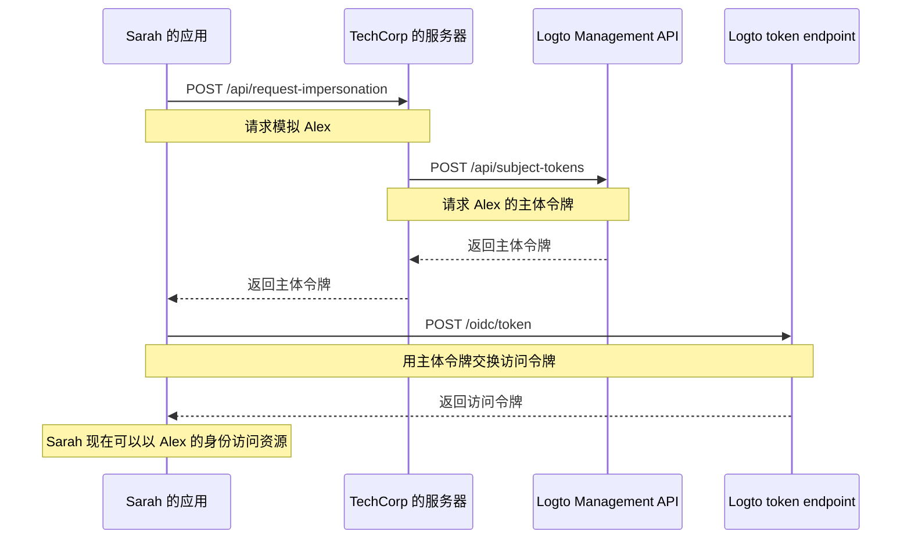

# 用户模拟

想象一下，TechCorp 的支持工程师 Sarah 收到了一张来自客户 Alex 的紧急工单，Alex 无法访问一个关键资源。为了高效地诊断和解决问题，Sarah 需要看到系统中 Alex 所看到的内容。这时，Logto 的用户模拟功能就派上用场了。

用户模拟允许像 Sarah 这样的授权用户在系统中临时代表其他用户（如 Alex）进行操作。这个强大的功能对于故障排除、提供客户支持和执行管理任务非常有价值。

## 它是如何工作的？



模拟过程涉及三个主要步骤：

1. Sarah 通过 TechCorp 的后端服务器请求模拟
2. TechCorp 的服务器从 Logto 的 Management API 获取一个主体令牌
3. Sarah 的应用将此主体令牌交换为一个访问令牌

让我们看看 Sarah 如何使用此功能来帮助 Alex。

### 步骤 1：请求模拟

首先，Sarah 的支持应用需要从 TechCorp 的后端服务器请求模拟。

**请求（Sarah 的应用到 TechCorp 的服务器）**

```bash
POST /api/request-impersonation HTTP/1.1
Host: api.techcorp.com
Authorization: Bearer <Sarah's_access_token>
Content-Type: application/json

{
  "userId": "alex123",
  "reason": "Investigating resource access issue",
  "ticketId": "TECH-1234"
}
```

在这个 API 中，后端应该执行适当的授权检查，以确保 Sarah 拥有模拟 Alex 的必要权限。

### 步骤 2：获取主体令牌

TechCorp 的服务器在验证 Sarah 的请求后，将调用 Logto 的 [Management API](/integrate-logto/interact-with-management-api) 以获取主体令牌。

**请求（TechCorp 的服务器到 Logto 的 Management API）**

```bash
POST /api/subject-tokens HTTP/1.1
Host: techcorp.logto.app
Authorization: Bearer <TechCorp_m2m_access_token>
Content-Type: application/json

{
  "userId": "alex123",
  "context": {
    "ticketId": "TECH-1234",
    "reason": "Resource access issue",
    "supportEngineerId": "sarah789"
  }
}
```

**响应（Logto 到 TechCorp 的服务器）**

```json
{
  "subjectToken": "sub_7h32jf8sK3j2",
  "expiresIn": 600
}
```

TechCorp 的服务器然后应将此主体令牌返回给 Sarah 的应用。

**响应（TechCorp 的服务器到 Sarah 的应用）**

```json
{
  "subjectToken": "sub_7h32jf8sK3j2",
  "expiresIn": 600
}
```

### 步骤 3：将主体令牌交换为访问令牌

现在，Sarah 的应用将此主体令牌交换为代表 Alex 的访问令牌，并指定令牌将用于的资源。

**请求（Sarah 的应用到 Logto 的 token endpoint）**

```bash
POST /oidc/token HTTP/1.1
Host: techcorp.logto.app
Content-Type: application/x-www-form-urlencoded

grant_type=urn:ietf:params:oauth:grant-type:token-exchange
&client_id=techcorp_support_app
&scope=resource:read
&subject_token=alx_7h32jf8sK3j2
&subject_token_type=urn:ietf:params:oauth:token-type:access_token
&resource=https://api.techcorp.com/customer-data
```

**响应（Logto 到 Sarah 的应用）**

```json
{
  "access_token": "eyJhbG...<truncated>",
  "issued_token_type": "urn:ietf:params:oauth:token-type:access_token",
  "token_type": "Bearer",
  "expires_in": 3600,
  "scope": "resource:read"
}
```

返回的 `access_token` 将绑定到指定的资源，确保它只能用于 TechCorp 的客户数据 API。

## 示例用法

以下是 Sarah 如何在 Node.js 支持应用中使用此功能：

```jsx
interface ImpersonationResponse {
  subjectToken: string;
  expiresIn: number;
}

interface TokenExchangeResponse {
  access_token: string;
  issued_token_type: string;
  token_type: string;
  expires_in: number;
  scope: string;
}

async function impersonateUser(
  userId: string,
  clientId: string,
  ticketId: string,
  resource: string
): Promise<string> {
  try {
    // 步骤 1 和 2：请求模拟并获取主体令牌
    const impersonationResponse = await fetch(
      'https://api.techcorp.com/api/request-impersonation',
      {
        method: 'POST',
        headers: {
          Authorization: "Bearer <Sarah's_access_token>",
          'Content-Type': 'application/json',
        },
        body: JSON.stringify({
          userId,
          reason: 'Investigating resource access issue',
          ticketId,
        }),
      }
    );

    if (!impersonationResponse.ok) {
      throw new Error(`HTTP error occurred. Status: ${impersonationResponse.status}`);
    }

    const { subjectToken } = (await impersonationResponse.json()) as ImpersonationResponse;

    // 步骤 3：将主体令牌交换为访问令牌
    const tokenExchangeBody = new URLSearchParams({
      grant_type: 'urn:ietf:params:oauth:grant-type:token-exchange',
      client_id: clientId,
      scope: 'openid profile resource.read',
      subject_token: subjectToken,
      subject_token_type: 'urn:ietf:params:oauth:token-type:access_token',
      resource: resource,
    });

    const tokenExchangeResponse = await fetch('https://techcorp.logto.app/oidc/token', {
      method: 'POST',
      headers: { 'Content-Type': 'application/x-www-form-urlencoded' },
      body: tokenExchangeBody,
    });

    if (!tokenExchangeResponse.ok) {
      throw new Error(`HTTP error! status: ${tokenExchangeResponse.status}`);
    }

    const tokenData = (await tokenExchangeResponse.json()) as TokenExchangeResponse;
    return tokenData.access_token;
  } catch (error) {
    console.error('Impersonation failed:', error);
    throw error;
  }
}

// Sarah 使用此函数模拟 Alex
async function performImpersonation(): Promise<void> {
  try {
    const accessToken = await impersonateUser(
      'alex123',
      'techcorp_support_app',
      'TECH-1234',
      'https://api.techcorp.com/customer-data'
    );
    console.log('Impersonation access token for Alex:', accessToken);
  } catch (error) {
    console.error('Failed to perform impersonation:', error);
  }
}

// 执行模拟
void performImpersonation()
```

:::note

1. 主体令牌是短期有效且一次性使用的。
2. 模拟访问令牌不附带刷新令牌。如果令牌在 Sarah 解决 Alex 的问题之前过期，她需要重复此过程。
3. TechCorp 的后端服务器必须实施适当的授权检查，以确保只有像 Sarah 这样的授权支持人员才能请求模拟。
   :::

## `act` 声明

在使用令牌交换流程进行模拟时，签发的访问令牌可以包含一个额外的 `act`（actor）声明。此声明表示“行动方”的身份——在我们的例子中，是执行模拟的 Sarah。

要包含 `act` 声明，Sarah 的应用需要在令牌交换请求中提供一个 `actor_token`。此令牌应是一个有效的 Sarah 的访问令牌，并具有 `openid` 权限。以下是如何在令牌交换请求中包含它：

```bash
POST /oidc/token HTTP/1.1
Host: techcorp.logto.app
Content-Type: application/x-www-form-urlencoded

grant_type=urn:ietf:params:oauth:grant-type:token-exchange
&client_id=techcorp_support_app
&scope=resource:read
&subject_token=alx_7h32jf8sK3j2
&subject_token_type=urn:ietf:params:oauth:token-type:access_token
&actor_token=sarah_access_token
&actor_token_type=urn:ietf:params:oauth:token-type:access_token
&resource=https://api.techcorp.com/customer-data
```

如果提供了 `actor_token`，生成的访问令牌将包含一个 `act` 声明，如下所示：

```json
{
  "aud": "https://api.techcorp.com",
  "iss": "https://techcorp.logto.app",
  "exp": 1443904177,
  "sub": "alex123",
  "act": {
    "sub": "sarah789"
  }
}
```

这个 `act` 声明清楚地表明 Sarah (sarah789) 正在代表 Alex (alex123) 行事。`act` 声明对于审计和跟踪模拟操作非常有用。

## 自定义令牌声明

Logto 允许你自定义模拟令牌的声明。这对于在模拟过程中添加额外的上下文或元数据非常有用，例如模拟的原因或相关的支持工单。

当 TechCorp 的服务器从 Logto 的 Management API 请求主体令牌时，可以包含一个 `context` 对象：

```json
{
  "userId": "alex123",
  "context": {
    "ticketId": "TECH-1234",
    "reason": "Resource access issue",
    "supportEngineerId": "sarah789"
  }
}
```

然后可以在 `getCustomJwtClaims()` 函数中使用此上下文来向最终访问令牌添加特定声明。以下是如何实现的示例：

```tsx
const getCustomJwtClaims = async ({ token, context, environmentVariables }) => {
  if (context.grant?.type === 'urn:ietf:params:oauth:grant-type:token-exchange') {
    const { ticketId, reason, supportEngineerId } = context.grant.subjectTokenContext;
    return {
      impersonation_context: {
        ticket_id: ticketId,
        reason: reason,
        support_engineer: supportEngineerId,
      },
    };
  }
  return {};
};
```

Sarah 接收到的最终访问令牌可能如下所示：

```json
{
  "sub": "alex123",
  "aud": "https://api.techcorp.com/customer-data",
  "impersonation_context": {
    "ticket_id": "TECH-1234",
    "reason": "Resource access issue",
    "support_engineer": "sarah789"
  }
  // ... 其他标准声明
}
```

通过这种方式自定义访问令牌声明，TechCorp 可以包含有关模拟上下文的有价值信息，使其更容易审计和理解系统中的模拟活动。

:::note
在向令牌添加自定义声明时要谨慎。避免包含敏感信息，如果令牌被截获或泄露，可能会带来安全风险。JWT 是签名的，但不是加密的，因此声明对任何有权访问令牌的人都是可见的。
:::
