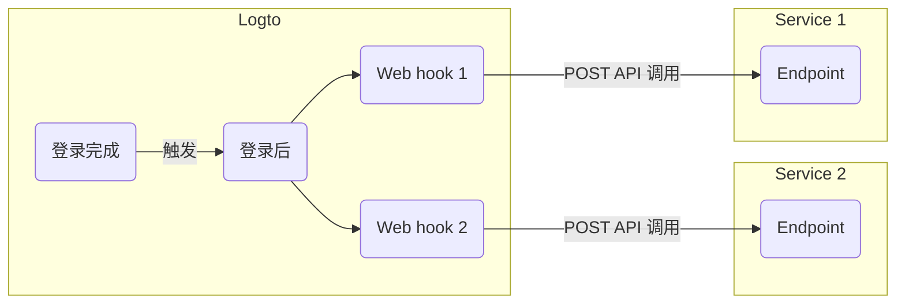

# Webhook

Logto [Webhook](https://auth.wiki/webhook) 为各种事件提供实时通知，包括用户账户、角色、权限、组织 (Organizations)、组织角色、组织权限以及 [用户交互](/end-user-flows) 的变更。

当事件被触发时，Logto 会向你提供的 Endpoint URL 发送 HTTP 请求，其中包含有关事件的详细信息，如用户 ID、用户名、邮箱及其他相关细节（关于 payload 和 header 中包含的数据，详见 [Webhook 请求](/developers/webhooks/webhooks-request)）。你的应用可以处理该请求并执行自定义操作，比如发送邮件或更新数据库中的数据。

我们会根据用户需求持续增加更多事件。如果你有特定的业务需求，请告知我们。

## 为什么要使用 Webhook？\{#why-use-webhook}

Webhook 在应用之间提供实时通信，无需轮询，能够实现即时数据更新。它们简化了应用集成和工作流自动化，无需复杂代码或专有 API。

以下是 CIAM 常见 Webhook 用例示例：

- **发送邮件：** 配置 Webhook，在新用户注册时发送欢迎邮件，或在用户从新设备或位置登录时通知管理员。
- **发送通知：** 配置 Webhook，当用户注册时，触发与你的 CRM 系统集成的虚拟助手，提供实时客户支持。
- **执行额外 API 调用：** 配置 Webhook，通过检查用户邮箱域名或 IP 地址来验证用户访问，然后使用 Logto Management API 分配带有资源权限的合适角色。
- **数据同步：** 配置 Webhook，保持应用关于用户账户暂停或删除等变更的实时更新。
- **生成报告：** 设置 Webhook 接收用户登录活动数据，并利用这些数据生成用户参与度或使用模式报告。

## 术语 \{#terms}

| Item                                                                                                        | Description                                                                                                                     |
| ----------------------------------------------------------------------------------------------------------- | ------------------------------------------------------------------------------------------------------------------------------- |
| Event                                                                                                       | 当执行特定操作时，会触发具有特定类型的 hook 事件。例如，当用户完成注册流程并创建新账户时，Logto 会发出 PostRegister hook 事件。 |
| Hook                                                                                                        | 挂载到特定事件上的一个或一系列操作。操作可以是调用 API、执行代码片段等。                                                        |
| Webhook                                                                                                     | hook 的一种子类型，表示用事件 payload 调用 API。                                                                                |
| 假设开发者希望在用户通过新设备登录时发送通知，可以为 PostSignIn 事件添加一个调用其安全服务 API 的 webhook。 |

以下是在 Logto 中为 `PostSignIn` 事件启用两个 web hook 的示例：

## 常见问题 \{#faqs}

### Logto 支持同步 webhook 吗？\{#does-logto-support-synced-webhooks}

虽然同步 webhook 能让用户登录流程更顺畅，但我们目前还不支持（未来会支持）。因此，目前依赖同步 webhook 的场景都需要不同的变通方案。如果你有任何疑问，欢迎随时联系我们。

### 如何处理用户权限变更？\{#how-to-deal-with-user-permission-change}

请参阅 [管理用户权限变更](/authorization/global-api-resources/#optional-handle-user-permission-change) 指南。

### 如何调试 webhook 超时？\{#how-to-debug-webhook-timeout}

对于接收 Webhook 的 endpoint，应尽快返回 2xx 响应，以告知 Logto Webhook 已被成功接收。由于不同用户对 Webhook 的处理逻辑差异很大，过于复杂的任务可能需要几秒钟，导致 Logto Webhook 超时。最佳实践是维护你自己的事件队列；收到 Logto Webhook 后，将事件插入队列，并立即向 Logto 返回 2xx 响应。然后让你自己的 worker 逐步处理队列中的任务。如果 worker 遇到错误，请在你自己的服务器上处理。

### 我可以从 `PostSignIn` webhook 获取客户端 IP 地址吗？\{#can-i-get-the-client-ip-address-from-postsignin-webhooks}

可以，你可以在 Webhook payload 中获取 IP 地址、user agent 等信息。如果你需要目前未支持的信息，可以在 GitHub issue 提交功能请求，或联系我们。

## 相关资源 \{#related-resources}

<Url href="https://blog.logto.io/webhooks-vs-polling">Webhooks 与轮询的对比</Url>
