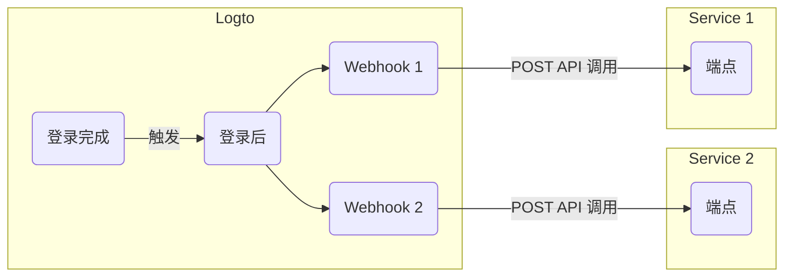

# Webhook

Logto [Webhook](https://auth.wiki/webhook) 为各种事件提供实时通知，包括用户账户、角色、权限、组织 (Organizations)、组织角色、组织权限以及 [用户交互](/end-user-flows) 的变更。

当事件被触发时，Logto 会异步向你提供的端点 URL 发送 HTTP 请求。该请求包含有关事件的详细信息，如用户、应用程序和请求上下文。有关请求体和头部的参考，请参阅 [Webhook 请求](/developers/webhooks/webhooks-request)。

Webhook 的投递发生在认证请求之外，无法改变当前流程的结果。对于必须在登录继续前完成的同步代码，请使用 [Actions](/developers/actions)。

我们会根据用户需求不断增加更多事件。如果你有特定的业务需求，请告知我们。

## 为什么使用 Webhook？\{#why-use-webhook}

Webhook 提供应用程序之间的实时通信，消除了轮询的需求，实现了即时数据更新。它们简化了应用集成和工作流自动化，无需复杂代码或专有 API。

以下是 CIAM 常见 Webhook 用例的一些示例：

- **发送邮件：** 配置 Webhook，在新用户注册时发送欢迎邮件，或在用户从新设备或位置登录时通知管理员。
- **发送通知：** 配置 Webhook，结合你的 CRM 系统触发虚拟助手，在用户注册时提供实时客户支持。
- **执行额外的 API 调用：** 配置 Webhook，通过检查用户的邮箱域名或 IP 地址来验证用户访问，然后使用 Logto Management API 分配带有资源权限的合适角色。
- **数据同步：** 配置 Webhook，及时同步如用户账户被暂停或删除等变更信息到应用程序。
- **生成报告：** 设置 Webhook 接收用户登录活动数据，并利用这些数据生成用户参与度或使用模式的报告。

## 术语 \{#terms}

| Item          | Description                                                     |
| ------------- | --------------------------------------------------------------- |
| Webhook event | Logto 可投递的支持事件类型，如 `PostSignIn` 或 `User.Created`。 |
| Webhook       | 订阅一个或多个事件并将其请求体发送到 HTTP 端点的配置。          |

例如，要在用户登录后通知安全服务，可以创建一个订阅 `PostSignIn` 的 Webhook。

以下是在 Logto 中为 `PostSignIn` 事件启用两个 Webhook 的示例：

```mermaid
graph LR
  subgraph Logto
    SF(登录完成)
    PS(登录后)
    WH2(Webhook 2)
    WH1(Webhook 1)
  end

  subgraph Service 2
    E2(端点)
  end

  subgraph Service 1
    E1(端点)
  end

  SF -->|触发| PS
  PS --> WH1
  PS --> WH2
  WH1 --->|POST API 调用| E1
  WH2 --->|POST API 调用| E2

```

## 常见问题 \{#faqs}

### Webhook 能做同步的认证 (Authentication) 决策吗？\{#does-logto-support-synced-webhooks}

不能。Webhook 是异步通知，因此它们的响应无法允许、阻止或修改当前的认证 (Authentication) 流程。

当 Logto 需要运行自定义代码、调用外部 API 或在登录继续前更新用户时，请使用 [Actions](/developers/actions)。由于 Actions 是同步的，请确保其外部依赖快速且可靠。

### 如何处理用户权限变更？\{#how-to-deal-with-user-permission-change}

请参阅 [管理用户权限变更](/authorization/global-api-resources/#optional-handle-user-permission-change) 指南。

### 如何调试 webhook 超时？\{#how-to-debug-webhook-timeout}

对于接收 Webhook 的端点，应尽快返回 2xx 响应，以告知 Logto Webhook 已被成功接收。由于不同用户对 Webhook 的处理逻辑差异很大，过于复杂的任务可能需要几秒钟，导致 Logto Webhook 超时。最佳实践是维护你自己的事件队列；收到 Logto Webhook 后，将事件插入队列并立即返回 2xx 响应给 Logto。然后让你自己的 worker 逐步处理队列中的任务。如果 worker 遇到错误，请在你自己的服务器上处理。

### 我可以从 `PostSignIn` webhook 获取客户端 IP 地址吗？\{#can-i-get-the-client-ip-address-from-postsignin-webhooks}

可以，你可以在 Webhook 请求体中获取 IP 地址、用户代理等信息。如果你需要目前未支持的信息，可以在 GitHub issues 提交功能需求，或联系我们。

## 相关资源 \{#related-resources}

<Url href="https://blog.logto.io/webhooks-vs-polling">Webhook 与轮询的对比</Url>
