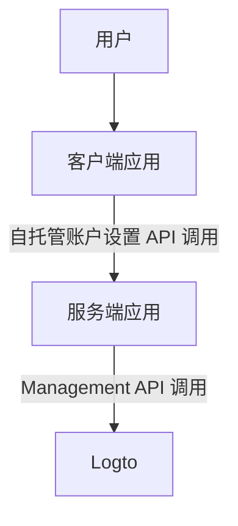
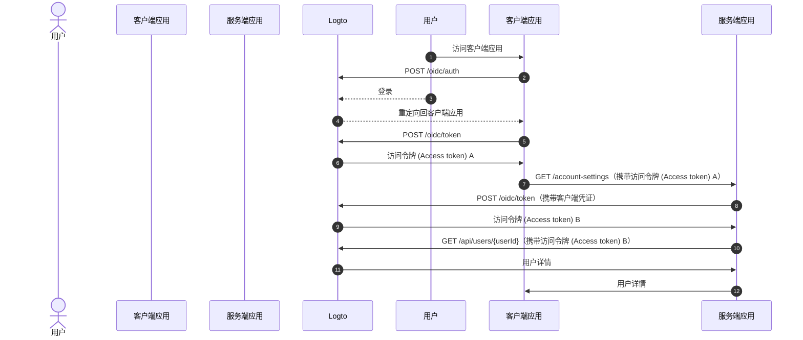
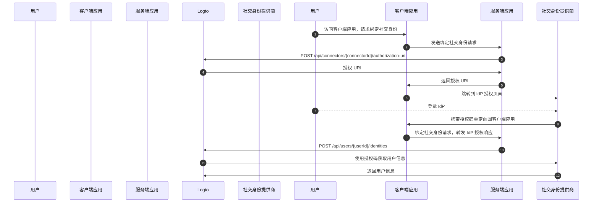

# 通过 Management API 进行账户设置

## 集成 \{#integrations}

Logto 提供了多种 Management API 用于管理用户账户。你可以使用这些 API 为终端用户构建自助账户设置页面。

### 架构 \{#architecture}

1. **用户**：已认证 (Authentication) 的终端用户，需要访问和管理自己的账户设置。
2. **客户端应用**：为用户提供账户设置页面的客户端应用。
3. **服务端应用**：为客户端提供账户设置 API 的服务端应用。与 Logto Management API 交互。
4. **Logto**：作为认证 (Authentication) 与授权 (Authorization) 服务的 Logto，提供用于管理用户账户的 Management API。

### 时序图 \{#sequence-diagram}

1. 用户访问客户端应用。
2. 客户端应用向 Logto 发送认证请求，并重定向用户到 Logto 登录页面。
3. 用户在 Logto 上完成登录。
4. 已认证 (Authentication) 用户被重定向回客户端应用，并携带授权码。
5. 客户端应用向 Logto 请求访问令牌 (Access token)，用于自托管账户设置 API 访问。
6. Logto 向客户端应用颁发访问令牌 (Access token)。
7. 客户端应用携带用户访问令牌 (Access token) 向服务端应用发起账户设置请求。
8. 服务端应用从用户访问令牌 (Access token) 验证请求者身份和权限，然后向 Logto 请求 Management API 访问令牌 (Access token)。
9. Logto 向服务端应用颁发 Management API 访问令牌 (Access token)。
10. 服务端应用使用 Management API 访问令牌 (Access token) 向 Logto 请求用户数据。
11. Logto 验证服务端身份和 Management API 权限后返回用户数据。
12. 服务端应用根据请求者权限处理用户数据，并将用户账户详情返回给客户端应用。

### 集成 Management API 到服务端应用 \{#integrate-management-api-to-server-side-application}

请查阅 [Management API](/integrate-logto/interact-with-management-api/) 章节，了解如何将 Management API 集成到服务端应用。

## 用户管理 API \{#user-management-apis}

### 用户数据结构 \{#user-data-schema}

请查阅 [用户数据与自定义数据](/user-management/user-data/) 章节，了解 Logto 中的用户数据结构。

### 用户资料与标识符管理 API \{#user-profile-and-identifiers-management-apis}

用户的资料和标识符是用户管理的核心。你可以使用以下 API 管理用户资料和标识符。

| method | path                                                                                                     | description                      |
| ------ | -------------------------------------------------------------------------------------------------------- | -------------------------------- |
| GET    | [/api/users/\{userId\}](https://openapi.logto.io/operation/operation-getuser)                            | 通过用户 ID 获取用户详情。       |
| PATCH  | [/api/users/\{userId\}](https://openapi.logto.io/operation/operation-updateuser)                         | 更新用户详情。                   |
| PATCH  | [/api/users/\{userId\}/profile](https://openapi.logto.io/operation/operation-updateuserprofile)          | 通过用户 ID 更新用户资料字段。   |
| GET    | [/api/users/\{userId\}/custom-data](https://openapi.logto.io/operation/operation-listusercustomdata)     | 通过用户 ID 获取用户自定义数据。 |
| PATCH  | [/api/users/\{userId\}/custom-data](https://openapi.logto.io/operation/operation-updateusercustomdata)   | 通过用户 ID 更新用户自定义数据。 |
| PATCH  | [/api/users/\{userId\}/is-suspended](https://openapi.logto.io/operation/operation-updateuserissuspended) | 通过用户 ID 更新用户封禁状态。   |

### 邮箱和手机号验证 \{#email-and-phone-number-verification}

在 Logto 系统中，邮箱地址和手机号都可以作为用户标识符，因此验证它们非常重要。为此，我们提供了一套验证码 API，帮助你验证提供的邮箱或手机号。

:::note
在用新邮箱或手机号更新用户资料前，请确保已完成邮箱或手机号的验证。
:::

| method | path                                                                                                                             | description                  |
| ------ | -------------------------------------------------------------------------------------------------------------------------------- | ---------------------------- |
| POST   | [/api/verifications/verification-code](https://openapi.logto.io/operation/operation-createverificationbyverificationcode)        | 发送邮箱或手机号验证码。     |
| POST   | [/api/verifications/verification-code/verify](https://openapi.logto.io/operation/operation-verifyverificationbyverificationcode) | 通过验证码验证邮箱或手机号。 |

### 用户密码管理 \{#user-password-management}

| method | path                                                                                                     | description                          |
| ------ | -------------------------------------------------------------------------------------------------------- | ------------------------------------ |
| POST   | [/api/users/\{userId\}/password/verify](https://openapi.logto.io/operation/operation-verifyuserpassword) | 通过用户 ID 验证当前用户密码。       |
| PATCH  | [/api/users/\{userId\}/password](https://openapi.logto.io/operation/operation-updateuserpassword)        | 通过用户 ID 更新用户密码。           |
| GET    | [/api/users/\{userId\}/has-password](https://openapi.logto.io/operation/operation-getuserhaspassword)    | 通过用户 ID 检查用户是否设置了密码。 |

:::note
在更新用户密码前，请确保已验证用户当前密码。
:::

### 用户社交身份管理 \{#user-social-identities-management}

| method | path                                                                                                                              | description                                                         |
| ------ | --------------------------------------------------------------------------------------------------------------------------------- | ------------------------------------------------------------------- |
| GET    | [/api/users/\{userId\}](https://openapi.logto.io/operation/operation-getuser)                                                     | 通过用户 ID 获取用户详情。社交身份可在 `identities` 字段中找到。    |
| POST   | [/api/users/\{userId\}/identities](https://openapi.logto.io/operation/operation-createuseridentity)                               | 通过用户 ID 绑定已认证 (Authentication) 的社交身份。                |
| DELETE | [/api/users/\{userId\}/identities](https://openapi.logto.io/operation/operation-deleteuseridentity)                               | 通过用户 ID 解绑社交身份。                                          |
| PUT    | [/api/users/\{userId\}/identities](https://openapi.logto.io/operation/operation-replaceuseridentity)                              | 通过用户 ID 直接更新已绑定的社交身份。                              |
| POST   | [/api/connectors/\{connectorId\}/authorization-uri](https://openapi.logto.io/operation/operation-createconnectorauthorizationuri) | 获取社交身份提供商的授权 URI。使用该 URI 发起新的社交身份绑定流程。 |

1. 用户访问客户端应用并请求绑定社交身份。
2. 客户端应用向服务端发送绑定社交身份请求。
3. 服务端向 Logto 请求获取社交身份提供商的授权 URI。你需要在请求中提供自定义的 `state` 参数和 `redirect_uri`，并确保已在社交身份提供商处注册该 `redirect_uri`。
4. Logto 返回授权 URI 给服务端。
5. 服务端将授权 URI 返回给客户端应用。
6. 客户端应用将用户重定向到 IdP 授权 URI。
7. 用户在 IdP 上完成登录。
8. IdP 使用 `redirect_uri` 携带授权码将用户重定向回客户端应用。
9. 客户端应用校验 `state` 并将 IdP 授权响应转发给服务端。
10. 服务端向 Logto 发送请求，将社交身份绑定到用户。
11. Logto 使用授权码从 IdP 获取用户信息。
12. IdP 返回用户信息给 Logto，Logto 完成社交身份绑定。

:::note
通过 Management API 绑定新社交身份时有以下限制：

- Management API 不具备任何会话上下文，任何需要活动会话以安全维护社交认证 (Authentication) 状态的社交连接器无法通过 Management API 绑定。不支持的连接器包括 apple、标准 OIDC 和标准 OAuth 2.0 连接器。
- 同样原因，Logto 无法校验授权响应中的 `state` 参数。请确保在客户端应用中存储 `state` 参数，并在收到授权响应时进行校验。
- 你需要提前在社交身份提供商处注册 `redirect_uri`，否则社交 IdP 不会将用户重定向回你的客户端应用。你的社交 IdP 必须支持多个回调 `redirect_uri`，一个用于用户登录，一个用于你的个人资料绑定页面。

:::

### 用户企业身份管理 \{#user-enterprise-identities-management}

| method | path                                                                                                    | description                                                                                                                  |
| ------ | ------------------------------------------------------------------------------------------------------- | ---------------------------------------------------------------------------------------------------------------------------- |
| GET    | [/api/users/\{userId\}?includeSsoIdentities=true](https://openapi.logto.io/operation/operation-getuser) | 通过用户 ID 获取用户详情。企业身份可在 `ssoIdentities` 字段中找到。添加 `includeSsoIdentities=true` 查询参数以包含企业身份。 |

目前，Management API 不支持为用户绑定或解绑企业身份。你只能展示已绑定到用户的企业身份。

### 个人访问令牌 (Personal access token) \{#personal-access-token}

| method | path                                                                                                                                 | description                                          |
| ------ | ------------------------------------------------------------------------------------------------------------------------------------ | ---------------------------------------------------- |
| GET    | [/api/users/\{userId\}/personal-access-tokens](https://openapi.logto.io/operation/operation-listuserpersonalaccesstokens)            | 获取用户的所有个人访问令牌 (Personal access token)。 |
| POST   | [/api/users/\{userId\}/personal-access-tokens](https://openapi.logto.io/operation/operation-createuserpersonalaccesstoken)           | 为用户添加新的个人访问令牌 (Personal access token)。 |
| DELETE | [/api/users/\{userId\}/personal-access-tokens/\{name\}](https://openapi.logto.io/operation/operation-deleteuserpersonalaccesstoken)  | 通过名称删除用户的令牌。                             |
| PATCH  | [/api/users/\{userId\s}/personal-access-tokens/\{name\}](https://openapi.logto.io/operation/operation-updateuserpersonalaccesstoken) | 通过名称更新用户的令牌。                             |

个人访问令牌 (Personal access token) 为用户提供了一种安全的方式，无需使用凭证和交互式登录即可授予 [访问令牌 (Access token)](https://auth.wiki/access-token)。了解更多关于[使用个人访问令牌](/user-management/personal-access-token)。

### 用户 MFA 设置管理 \{#user-mfa-settings-management}

| method | path                                                                                                                                 | description                     |
| ------ | ------------------------------------------------------------------------------------------------------------------------------------ | ------------------------------- |
| GET    | [/api/users/\{userId\}/mfa-verifications](https://openapi.logto.io/operation/operation-listusermfaverifications)                     | 通过用户 ID 获取用户 MFA 设置。 |
| POST   | [/api/users/\{userId\}/mfa-verifications](https://openapi.logto.io/operation/operation-createusermfaverification)                    | 通过用户 ID 设置用户 MFA 验证。 |
| DELETE | [/api/users/\{userId\}/mfa-verifications/\{verificationId\}](https://openapi.logto.io/operation/operation-deleteusermfaverification) | 通过 ID 删除用户 MFA 验证。     |

### 用户账户删除 \{#user-account-deletion}

| method | path                                                                             | description            |
| ------ | -------------------------------------------------------------------------------- | ---------------------- |
| DELETE | [/api/users/\{userId\}](https://openapi.logto.io/operation/operation-deleteuser) | 通过用户 ID 删除用户。 |
