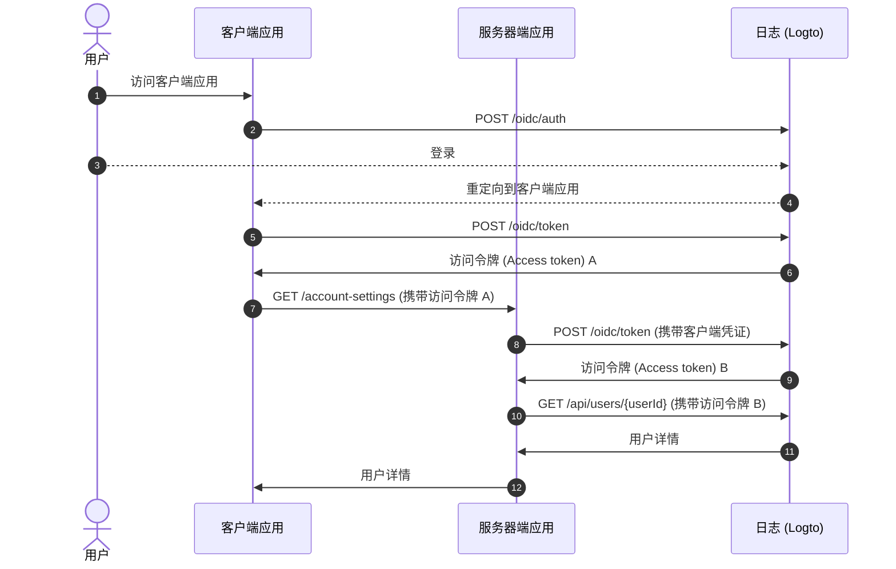
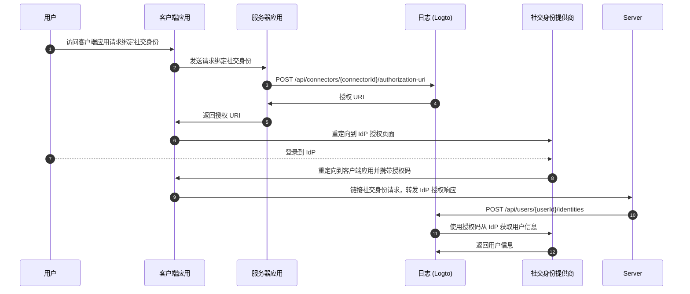

# 通过 Management API 进行账户设置

## 集成

日志 (Logto) 提供多种 Management API 来管理用户账户。你可以使用这些 API 为终端用户构建一个自助账户设置页面。

### 架构

```mermaid
  graph TB
    A[用户] --> B[客户端应用]
    B -->|自托管账户设置 API 调用|C[服务器端应用]
    C -->|Management API 调用| D[日志 (Logto)]
```

1. **用户**：需要访问和管理其账户设置的已认证终端用户。
2. **客户端应用**：为用户提供账户设置页面的客户端应用。
3. **服务器端应用**：为客户端提供账户设置 API 的服务器端应用。与日志 (Logto) Management API 交互。
4. **日志 (Logto)**：作为认证和授权服务的日志 (Logto)。提供用于管理用户账户的 Management API。

### 时序图



1. 用户访问客户端应用。
2. 客户端应用向日志 (Logto) 发送认证请求，并将用户重定向到日志 (Logto) 登录页面。
3. 用户登录到日志 (Logto)。
4. 已认证用户被重定向回客户端应用，并携带授权码。
5. 客户端应用请求日志 (Logto) 的访问令牌以访问自托管账户设置 API。
6. 日志 (Logto) 向客户端应用授予访问令牌。
7. 客户端应用使用用户访问令牌向服务器端应用发送账户设置请求。
8. 服务器端应用从用户访问令牌中验证请求者的身份和权限。然后请求日志 (Logto) 的 Management API 访问令牌。
9. 日志 (Logto) 向服务器端应用授予 Management API 访问令牌。
10. 服务器端应用使用 Management API 访问令牌从日志 (Logto) 请求用户数据。
11. 日志 (Logto) 验证服务器的身份和 Management API 权限，并返回用户数据。
12. 服务器端应用根据请求者的权限处理用户数据，并将用户账户详情返回给客户端应用。

### 将 Management API 集成到服务器端应用

查看 [Management API](/integrate-logto/interact-with-management-api/) 部分，了解如何将 Management API 集成到服务器端应用中。

## 用户管理 API

### 用户数据模式

查看 [用户数据和自定义数据](/user-management/user-data/) 部分，了解日志 (Logto) 中的用户模式。

### 用户资料和标识符管理 API

用户的资料和标识符是用户管理的关键。你可以使用以下 API 来管理用户资料和标识符。

| 方法  | 路径                                                                                                     | 描述                             |
| ----- | -------------------------------------------------------------------------------------------------------- | -------------------------------- |
| GET   | [/api/users/\{userId\}](https://openapi.logto.io/operation/operation-getuser)                            | 通过用户 ID 获取用户详情。       |
| PATCH | [/api/users/\{userId\}](https://openapi.logto.io/operation/operation-updateuser)                         | 更新用户详情。                   |
| PATCH | [/api/users/\{userId\}/profile](https://openapi.logto.io/operation/operation-updateuserprofile)          | 通过用户 ID 更新用户资料字段。   |
| GET   | [/api/users/\{userId\}/custom-data](https://openapi.logto.io/operation/operation-listusercustomdata)     | 通过用户 ID 获取用户自定义数据。 |
| PATCH | [/api/users/\{userId\}/custom-data](https://openapi.logto.io/operation/operation-updateusercustomdata)   | 通过用户 ID 更新用户自定义数据。 |
| PATCH | [/api/users/\{userId\}/is-suspended](https://openapi.logto.io/operation/operation-updateuserissuspended) | 通过用户 ID 更新用户暂停状态。   |

### 邮箱和电话号码验证

在日志 (Logto) 系统中，邮箱地址和电话号码都可以作为用户标识符，因此它们的验证至关重要。为此，我们提供了一组验证码 API 来帮助验证提供的邮箱或电话号码。

:::note
在使用新邮箱或电话号码更新用户资料之前，请确保验证邮箱或电话号码。
:::

| 方法 | 路径                                                                                                               | 描述                           |
| ---- | ------------------------------------------------------------------------------------------------------------------ | ------------------------------ |
| POST | [/api/verification/verification-codes](https://openapi.logto.io/operation/operation-createverificationcode)        | 发送邮箱或电话号码验证码。     |
| POST | [/api/verification/verification-codes/verify](https://openapi.logto.io/operation/operation-verifyverificationcode) | 通过验证码验证邮箱或电话号码。 |

### 用户密码管理

| 方法  | 路径                                                                                                     | 描述                             |
| ----- | -------------------------------------------------------------------------------------------------------- | -------------------------------- |
| POST  | [/api/users/\{userId\}/password/verify](https://openapi.logto.io/operation/operation-verifyuserpassword) | 通过用户 ID 验证当前用户密码。   |
| PATCH | [/api/users/\{userId\}/password](https://openapi.logto.io/operation/operation-updateuserpassword)        | 通过用户 ID 更新用户密码。       |
| GET   | [/api/users/\{userId\}/has-password](https://openapi.logto.io/operation/operation-getuserhaspassword)    | 通过用户 ID 检查用户是否有密码。 |

:::note
在更新用户密码之前，请确保验证用户的当前密码。
:::

### 用户社交身份管理

| 方法   | 路径                                                                                                                              | 描述                                                               |
| ------ | --------------------------------------------------------------------------------------------------------------------------------- | ------------------------------------------------------------------ |
| GET    | [/api/users/\{userId\}](https://openapi.logto.io/operation/operation-getuser)                                                     | 通过用户 ID 获取用户详情。社交身份可以在 `identities` 字段中找到。 |
| POST   | [/api/users/\{userId\}/identities](https://openapi.logto.io/operation/operation-createuseridentity)                               | 通过用户 ID 将已认证的社交身份链接到用户。                         |
| DELETE | [/api/users/\{userId\}/identities](https://openapi.logto.io/operation/operation-deleteuseridentity)                               | 通过用户 ID 从用户中取消链接社交身份。                             |
| PUT    | [/api/users/\{userId\}/identities](https://openapi.logto.io/operation/operation-replaceuseridentity)                              | 通过用户 ID 直接更新链接到用户的社交身份。                         |
| POST   | [/api/connectors/\{connectorId\}/authorization-uri](https://openapi.logto.io/operation/operation-createconnectorauthorizationuri) | 获取社交身份提供商的授权 URI。使用此 URI 启动新的社交身份连接。    |



1. 用户访问客户端应用并请求绑定社交身份。
2. 客户端应用向服务器发送请求以绑定社交身份。
3. 服务器向日志 (Logto) 发送请求以获取社交身份提供商的授权 URI。你需要在请求中提供自己的 `state` 参数和 `redirect_uri`。确保在社交身份提供商中注册 `redirect_uri`。
4. 日志 (Logto) 将授权 URI 返回给服务器。
5. 服务器将授权 URI 返回给客户端应用。
6. 客户端应用将用户重定向到 IdP 授权 URI。
7. 用户登录到 IdP。
8. IdP 使用 `redirect_uri` 和授权码将用户重定向回客户端应用。
9. 客户端应用验证 `state` 并将 IdP 授权响应转发给服务器。
10. 服务器向日志 (Logto) 发送请求以将社交身份链接到用户。
11. 日志 (Logto) 使用授权码从 IdP 获取用户信息。
12. IdP 将用户信息返回给日志 (Logto)，日志 (Logto) 将社交身份链接到用户。

:::note
在将新社交身份链接到用户时，需要考虑一些限制：

- Management API 没有任何会话上下文，任何需要活动会话以安全维护社交认证状态的社交连接器都不能通过 Management API 链接。不支持的连接器包括 apple、标准 OIDC 和标准 OAuth 2.0 连接器。
- 出于同样的原因，日志 (Logto) 无法验证授权响应中的 `state` 参数。确保在客户端应用中存储 `state` 参数，并在收到授权响应时进行验证。
- 你需要提前在社交身份提供商中注册 `redirect_uri`。否则，社交 IdP 将不会将用户重定向回你的客户端应用。你的社交 IdP 必须接受多个回调 `redirect_uri`，一个用于用户登录，一个用于你自己的资料绑定页面。

:::

### 用户企业身份管理

| 方法 | 路径                                                                                                    | 描述                                                                                                                                          |
| ---- | ------------------------------------------------------------------------------------------------------- | --------------------------------------------------------------------------------------------------------------------------------------------- |
| GET  | [/api/users/\{userId\}?includeSsoIdentities=true](https://openapi.logto.io/operation/operation-getuser) | 通过用户 ID 获取用户详情。企业身份可以在 `ssoIdentities` 字段中找到。将 `includeSsoIdentities=true` 查询参数添加到用户详情 API 中以包含它们。 |

目前，Management API 不支持将企业身份链接或取消链接到用户。你只能显示链接到用户的企业身份。

### 用户 MFA 设置管理

| 方法   | 路径                                                                                                                                 | 描述                            |
| ------ | ------------------------------------------------------------------------------------------------------------------------------------ | ------------------------------- |
| GET    | [/api/users/\{userId\}/mfa-verifications](https://openapi.logto.io/operation/operation-listusermfaverifications)                     | 通过用户 ID 获取用户 MFA 设置。 |
| POST   | [/api/users/\{userId\}/mfa-verifications](https://openapi.logto.io/operation/operation-createusermfaverification)                    | 通过用户 ID 设置用户 MFA 验证。 |
| DELETE | [/api/users/\{userId\}/mfa-verifications/\{verificationId\}](https://openapi.logto.io/operation/operation-deleteusermfaverification) | 通过 ID 删除用户 MFA 验证。     |

### 用户账户删除

| 方法   | 路径                                                                             | 描述                   |
| ------ | -------------------------------------------------------------------------------- | ---------------------- |
| DELETE | [/api/users/\{userId\}](https://openapi.logto.io/operation/operation-deleteuser) | 通过用户 ID 删除用户。 |
