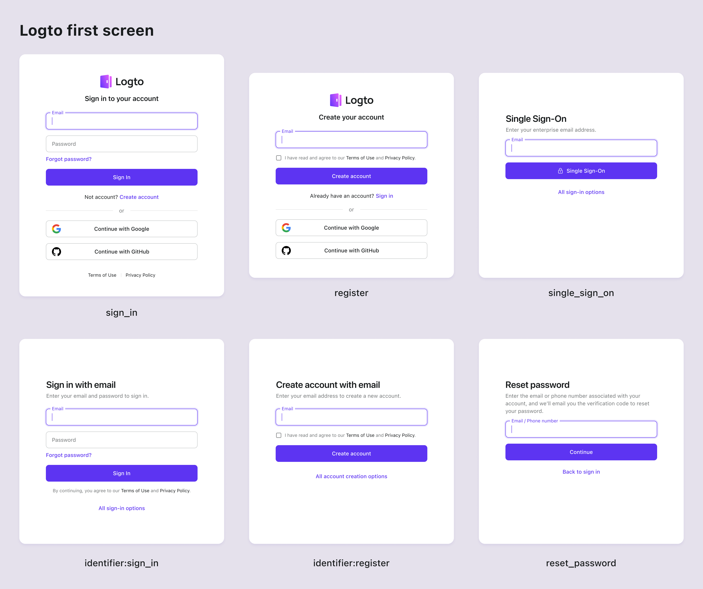

# 首屏参数

一组自定义认证参数，允许你为终端用户定制所需的首屏体验。

- `first_screen`：指定用户将看到的首屏。
- `identifier`：指定登录或注册表单将接受的标识符类型。
- `login_hint`：用用户的电子邮件地址或用户名填充标识符字段。（这是一个 OIDC 标准参数）

## first_screen

`first_screen` 参数是决定用户重定向到 Logto 登录页面时将看到的首屏的关键参数。默认情况下，将显示通用登录表单。使用此参数可以根据你的应用需求自定义首屏。支持的值有：

- `sign_in`：显示登录表单。（默认）
- `register`：显示注册表单。
- `reset_password`：显示密码重置表单。
- `single_sign_on`：显示企业单点登录 (SSO) 登录表单。（将询问电子邮件地址以确定启用的 SSO 提供商）
- `identifier:sign-in`：显示特定标识符的登录表单。可以使用 `identifier` 参数指定标识符类型。当你启用了多种标识符登录方法时，这很有用。
- `identifier:register`：显示特定标识符的注册表单。可以使用 `identifier` 参数指定标识符类型。当你启用了多种标识符注册方法时，这很有用。



例如，直接将用户发送到企业 SSO 登录表单：

```sh
curl --location \
--request GET 'https://<your-tenant>.logto.app/oidc/auth?client_id=<client_id>&...&first_screen=single_sign_on'
```

## identifier

`identifier` 参数用于指定登录或注册表单将接受的标识符类型。此参数仅在 `first_screen` 参数设置为 `identifier:sign-in`、`identifier:register` 或 `reset_password` 时适用。支持的值有：`username`、`email` 和 `phone`。用空格分隔多个值以允许多种标识符类型。

例如，直接将用户发送到电子邮件或电话号码注册页面：

```sh
curl --location \
--request GET 'https://<your-tenant>.logto.app/oidc/auth?client_id=<client_id>&...&first_screen=identifier:register&identifier=email phone'
```

此参数中指定的所有标识符类型必须在 Logto 控制台中的登录或注册设置中启用。

任何不支持或禁用的标识符类型将被忽略。如果所有指定的标识符都不支持，将使用默认的登录体验配置。

## login_hint

`login_hint` 参数在标准 [OpenID Connect 规范](https://openid.net/specs/openid-connect-core-1_0.html#AuthorizationEndpoint) 中定义，用于预填充登录表单中的用户标识符（如电子邮件、电话号码或用户名）。在 Logto 中，它可以与其他登录屏幕参数结合使用，以增强用户体验。此参数特别有用，如果你有一个自定义的预认证表单，可以提前收集用户的标识符，使他们在登录时无需重新输入。

例如，在登录表单中预填充收集到的电子邮件地址：

```sh
curl --location \
--request GET 'https://<your-tenant>.logto.app/oidc/auth?client_id=<client_id>&...&first_screen=identifier:sign_in&identifier=email&login_hint=example@logto.io
```

## SDK 支持

在支持的 Logto SDK 中，你可以在调用 `signIn` 方法时设置参数：

```javascript
logtoClient.signIn({
  redirectUri: 'https://your-app.com/callback',
  firstScreen: 'identifier:register',
  identifier: ['email', 'phone'],
  loginHint: 'example@logto.io',
});
```

:::note
我们正在逐步为所有 Logto SDK 添加对 `first_screen`、`identifier` 和 `login_hint` 参数的支持。如果你在你的 SDK 中没有看到它们，请提交问题或联系我们。
:::

:::note
对于 Logto OSS 用户，这些参数自版本 1.15.0 开始支持。如果你使用的是旧版本，请升级到最新版本。
:::
