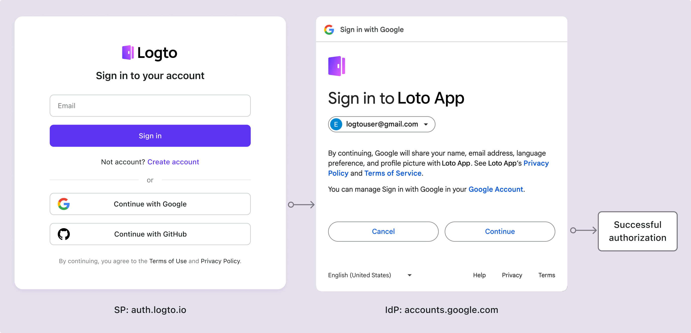

# 用户授权页面

## 什么是用户授权页面？

想象一下，你正在使用 Google 账户注册 Logto。当你点击“使用 Google 登录”按钮时，你会被重定向到 Google 的登录页面。在输入 Google 凭据后，你会被提示授予 Logto 访问你的 Google 账户信息的权限。这就是用户授权页面。

这个页面我们称之为用户 **授权页面** 或 **授权页**。它是一个标准的 [OIDC / OAuth 2.0 流程](/integrate-logto/third-party-applications/oidc-oauth-third-party-applications)，允许用户授予 [第三方应用程序](/integrate-logto/third-party-applications)权限，以代表他们访问他们的数据。其主要目的是告知用户其个人数据的收集、处理和使用情况，并寻求他们对这些活动的明确同意或授权。

在授权页面上，用户通常会看到有关将收集的数据类型、如何使用以及是否会与第三方共享的信息。这些信息对于透明度至关重要，使用户能够就其隐私和数据安全做出明智的决定。

在隐私法规的背景下，授权页面尤为重要，例如欧盟的《通用数据保护条例》（[GDPR](https://gdpr-info.eu/art-4-gdpr/)）或美国的《加州消费者隐私法》（[CCPA](https://oag.ca.gov/privacy/ccpa)），这些法规要求组织在处理用户个人信息之前获得用户的明确同意。

## 用户何时会在 Logto 中看到授权页面？

如前所述，当用户使用第三方身份提供商 (IdP)（如 Google、Facebook 或 Apple）登录 Logto 时，会出现授权页面。在这种设置中，Logto 作为服务提供商 (SP)，请求从 IdP 访问用户信息。当 [SP](https://auth.wiki/service-provider) 和 [IdP](https://auth.wiki/identity-provider) 是不同的组织时，通常会出现授权页面，需要用户授权以促进数据共享。

同样，在 Logto 中，当 Logto 作为 IdP 时，用户在登录与 Logto 集成的 [**OIDC / OAuth 第三方应用程序**](/integrate-logto/third-party-applications/oidc-oauth-third-party-applications)时会看到授权页面。此页面告知用户应用程序请求的数据，并寻求他们的许可以继续。用户可以查看请求的权限，并决定是否授予应用程序授权。

## 如何配置授权页面？

Logto 的授权流程允许你授权来自第三方应用程序的登录。你可以为每个 OIDC 第三方应用程序自定义品牌和权限请求。

了解更多关于在 Logto 中设置 [第三方应用程序](/integrate-logto/third-party-applications/)和配置 [授权页面](/integrate-logto/third-party-applications/oidc-oauth-third-party-applications/consent-screen-branding/)的信息。

## 相关资源

<Url href="https://www.youtube.com/watch?v=sW-C7SRt9OM">
  将你的服务转变为配备授权页面的安全 OIDC IdP。
</Url>
<Url href="https://blog.logto.io/user-consent-screen">用户授权页面介绍。</Url>

<Url href="https://blog.logto.io/introducing-oidc-prompt">OIDC Prompt 101：开发者的简单指南</Url>
