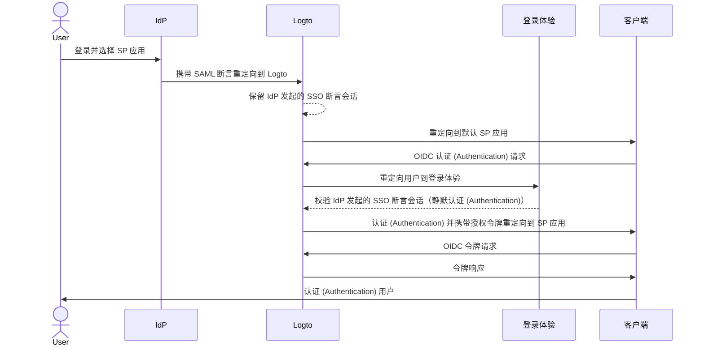
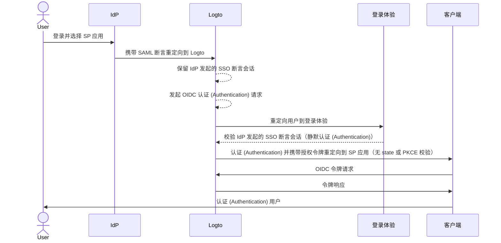

import Availability from '@components/Availability';

<Availability cloud="comingSoon" oss={false} />

# IdP 发起的单点登录 (SSO)（仅限 SAML）

IdP 发起的单点登录 (SSO) 是一种由身份提供商 (IdP) 主导认证 (Authentication) 流程的单点登录过程。该流程始于用户登录到 IdP 的平台，如公司门户或集中身份管理面板。认证 (Authentication) 成功后，IdP 会生成 SAML 断言，并将用户引导至服务提供商 (SP)，以访问应用或服务。


## 风险与注意事项 \{#risks-and-considerations}

IdP 发起的单点登录 (SSO) 可能带来一些安全漏洞，组织应予以重视。由于认证 (Authentication) 流程是由 IdP 发起，而非用户直接请求，因此容易受到多种攻击，包括 [跨站请求伪造 (CSRF)](https://blog.logto.io/csrf)。

这种非用户发起的认证 (Authentication) 可能导致未授权访问，若未采取适当防护措施。此外，依赖单一认证 (Authentication) 点会增加安全风险，一旦 IdP 被攻破，所有关联应用都可能被暴露。

因此，强烈建议使用 SP 发起的单点登录 (SSO)，它能提供更安全、可控的认证 (Authentication) 流程，确保用户明确请求访问服务。

## 将 IdP 发起的单点登录 (SSO) 与 Logto OIDC 应用对接 \{#connect-idp-initiated-sso-with-logto-oidc-applications}

Logto 作为 OpenID Connect (OIDC) 提供方，不支持 IdP 发起的单点登录 (SSO)。但你可以将 Logto 配置为 SP，通过 SAML 与企业 IdP 支持 IdP 发起的单点登录 (SSO)。这种配置可以让你利用 Logto 的认证 (Authentication) 能力，同时保持 IdP 对认证 (Authentication) 流程的控制权。

:::note
默认情况下，Logto 未启用此功能。如果你需要为租户启用 IdP 发起的单点登录 (SSO)，请联系 [支持团队](https://logto.io/contact?src=docs.sso)。
:::

### 前置条件 \{#prerequisites}

在配置 IdP 发起的单点登录 (SSO) 前，你需要先创建一个 SAML 连接器。前往 <CloudLink to="/enterprise-sso">控制台 > 企业单点登录 (SSO)</CloudLink>，按照分步指南设置与你的 IdP 对接的 [SAML](/integrations/saml-sso/) 连接器。

SAML 连接器配置完成后，你可以在 <CloudLink to="/sign-in-experience/sign-up-and-sign-in">登录与账户 > 注册与登录</CloudLink> 部分启用 SSO 登录方式，并测试 SP 发起的单点登录 (SSO) 流程，确保配置正确。请确保 SP 发起的单点登录 (SSO) 正常工作后再继续配置 IdP 发起的单点登录 (SSO)。

### 启用 IdP 发起的单点登录 (SSO) \{#enable-idp-initiated-sso}

当你的租户启用 IdP 发起的单点登录 (SSO) 功能后，你将在 SAML 连接器设置页面看到一个额外的标签页，名为 **IdP 发起的单点登录 (SSO)**。启用 **IdP 发起的单点登录 (SSO)** 开关，即可为该连接器激活此功能。

### 选择 SP 应用 \{#select-the-sp-application}

与 SP 发起的单点登录 (SSO) 不同，IdP 发起的单点登录 (SSO) 需要一个客户端 SP 应用，在认证 (Authentication) 流程后重定向用户。你可以在 **默认应用** 下拉列表中，从已注册的应用中选择 SP 应用。

IdP 发起的单点登录 (SSO) 仅支持 **传统 Web 应用** 和 **单页应用 (SPA)**。请根据你的实际场景选择合适的应用类型。

:::note
在 IdP 端，请将 `RelayState` 参数留空（**EMPTY**），以确保 IdP 发起的单点登录 (SSO) 流程正常。Logto 会根据所选默认 SP 应用处理重定向。
:::

## 配置 IdP 发起的认证 (Authentication) 流程 \{#configure-idp-initiated-authentication-flow}

为将 IdP 发起的 SAML 单点登录 (SSO) 与 OIDC 对接，Logto 提供了两种配置选项来处理认证 (Authentication) 请求。

### 方案 A：重定向到默认 SP 应用（推荐）\{#option-a-redirect-to-the-default-sp-application-recommended}

当 IdP 发起 SSO 流程并将 SAML 断言发送到 Logto 时，会创建一个 IdP 发起的 SSO 断言会话。Logto 会将用户重定向到默认 SP 应用，在客户端发起标准 OIDC 认证 (Authentication) 请求。


```mermaid
sequenceDiagram
    actor User
    participant IdP as IdP
    participant Logto as Logto
    participant Experience as 登录体验
    participant SP as 客户端

    User->>IdP: 登录并选择 SP 应用
    IdP->>Logto: 携带 SAML 断言重定向到 Logto
    Logto-->>Logto: 保留 IdP 发起的 SSO 断言会话
    Logto->>SP: 重定向到默认 SP 应用
    SP->>Logto: OIDC 认证 (Authentication) 请求
    Logto->>Experience: 重定向用户到登录体验
    Experience-->>Logto: 校验 IdP 发起的 SSO 断言会话（静默认证 (Authentication)）
    Logto->>SP: 认证 (Authentication) 并携带授权令牌重定向到 SP 应用
    SP->>Logto: OIDC 令牌请求
    Logto->>SP: 令牌响应
    SP->>User: 认证 (Authentication) 用户
```

要配置此方案，请在 SAML 连接器设置的 **IdP 发起的单点登录 (SSO)** 标签页中选择 **重定向到客户端进行 SP 发起认证 (Authentication)** 卡片。


1. 提供一个 **客户端重定向 URL**，用于在 IdP 发起的单点登录 (SSO) 流程后将用户重定向到默认 SP 应用。Logto 会在重定向 URL 后追加 `?ssoConnectorId={connectorId}` 查询参数。客户端应用需处理该重定向并发起 OIDC 认证 (Authentication) 请求。（建议在客户端应用中使用专用路由或页面处理 IdP 发起的 SSO 认证 (Authentication) 请求。）

2. 客户端需在本地使用 `ssoConnectorId` 查询参数识别发起 IdP 发起 SSO 认证 (Authentication) 流程的 SAML 连接器，并处理 OIDC 认证 (Authentication) 请求。

3. 在登录请求中向 Logto 传递 [direct sign-in](/end-user-flows/authentication-parameters/direct-sign-in/) 认证 (Authentication) 参数，以完成 SSO 认证 (Authentication) 流程。

```typescript
// React 示例
import { Prompt, useLogto } from '@logto/react';
import { useEffect } from 'react';
import { useNavigate, useSearchParams } from 'react-router-dom';

const SsoDirectSignIn = () => {
  const { signIn } = useLogto();
  const [searchParams] = useSearchParams();

  useEffect(() => {
    const ssoConnectorId = searchParams.get('ssoConnectorId');
    if (ssoConnectorId) {
      void signIn({
        redirectUri,
        prompt: Prompt.Login,
        directSignIn: {
          method: 'sso',
          target: ssoConnectorId,
        },
      });
    }
  }, [searchParams, signIn]);
};
```

- `redirectUri`：OIDC 认证 (Authentication) 流程完成后重定向用户的 `redirect_uri`。
- `prompt=login`：强制用户使用 IdP 发起的 SSO 身份登录。
- `directSignIn=sso:{connectorId}`：指定直接登录方式为 `sso`，并指定目标 SAML 连接器 ID。该参数会直接触发 SSO 认证 (Authentication) 流程，无需显示登录页。如果连接器 ID 匹配且会话有效，用户将自动通过保留的 IdP 发起 SSO 断言会话完成认证 (Authentication)。

此方法确保认证 (Authentication) 流程安全，并遵循标准 OIDC 协议，同时保持 IdP 对认证 (Authentication) 流程的控制。客户端应用可利用 IdP 发起的 SSO 断言会话，无需额外登录步骤即可认证 (Authentication) 用户，同时保证流程安全可控。客户端应用仍可校验 `state` 和 `PKCE` 参数，确保认证 (Authentication) 请求安全。

:::note
此方法适用于 **传统 Web 应用** 和 **单页应用 (SPA)**，并推荐所有场景使用。
:::

### 方案 B：直接使用 IdP 发起的 SSO 认证 (Authentication) 用户 \{#option-b-directly-authenticate-the-user-with-idp-initiated-sso}

在某些情况下，SP 可能无法处理 IdP 发起的 SSO 回调并发起 OIDC 认证 (Authentication) 请求。此时，Logto 提供了直接利用 IdP 发起的 SSO 断言会话认证 (Authentication) 用户的备选方案。

该方案安全性较低，不推荐使用。认证 (Authentication) 流程绕过了标准 OIDC 协议。由于认证 (Authentication) 请求由 IdP 发起，客户端应用可能无法安全校验认证 (Authentication) 请求。例如，客户端无法校验 `state` 和 `PKCE` 参数，无法确保认证 (Authentication) 请求安全。

:::warning
此方法不适用于 **单页应用 (SPA)**，因为 SPA 需要客户端通过 `PKCE` 参数安全处理认证 (Authentication) 请求。如果你需要为 SPA 应用实现 IdP 发起的单点登录 (SSO)，请使用上述方案。
:::


```mermaid
  sequenceDiagram

  actor User
  participant IdP as IdP
  participant Logto as Logto
  participant Experience as 登录体验
  participant SP as 客户端

  User->>IdP: 登录并选择 SP 应用
  IdP->>Logto: 携带 SAML 断言重定向到 Logto
  Logto-->>Logto: 保留 IdP 发起的 SSO 断言会话
  Logto-->>Logto: 发起 OIDC 认证 (Authentication) 请求
  Logto->>Experience: 重定向用户到登录体验
  Experience-->>Logto: 校验 IdP 发起的 SSO 断言会话（静默认证 (Authentication)）
  Logto->>SP: 认证 (Authentication) 并携带授权令牌重定向到 SP 应用（无 state 或 PKCE 校验）
  SP->>Logto: OIDC 令牌请求
  Logto->>SP: 令牌响应
  SP->>User: 认证 (Authentication) 用户
```

要配置此方案，请在 SAML 连接器设置的 **IdP 发起的单点登录 (SSO)** 标签页中选择 **直接使用 IdP 发起的 SSO 登录** 选项。


1. 选择 **登录后重定向 URI**，用于认证 (Authentication) 成功后将用户重定向回客户端应用。该 URL 会作为 OIDC 认证 (Authentication) 请求的 `redirect_uri`，且必须是客户端应用已注册的允许重定向 URI 之一。

   :::note
   强烈建议为 IdP 发起的单点登录 (SSO) 使用专用的 **重定向 URI**。鉴于认证 (Authentication) 请求为非预期请求，客户端应用应独立管理响应，与标准 SP 发起认证 (Authentication) 流程分离。
   :::

2. 如有需要，可通过 **附加认证 (Authentication) 参数** JSON 编辑器（类型为 `Map<string,string>`）自定义授权请求参数。

   例如，Logto 默认只请求 `openid` 和 `profile` 权限。你可以为认证 (Authentication) 请求添加额外的权限或参数。

   ```json
   {
     "scope": "email offline_access"
   }
   ```

   - 添加额外的 `email` 权限以请求用户邮箱地址。
   - 添加 `offline_access` 权限以请求刷新令牌 (Refresh token)。

   我们也建议你提供自定义的 `state` 参数，以安全校验认证 (Authentication) 响应。

   ```json
   {
     "state": "custom-state-value"
   }
   ```

   客户端应用应在授权码响应中校验 `state` 参数，确保认证 (Authentication) 请求有效。
