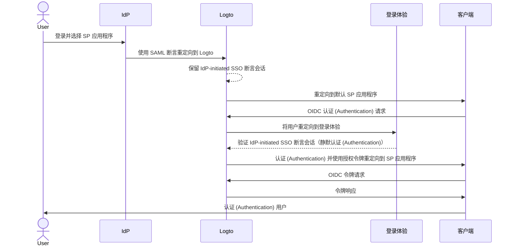
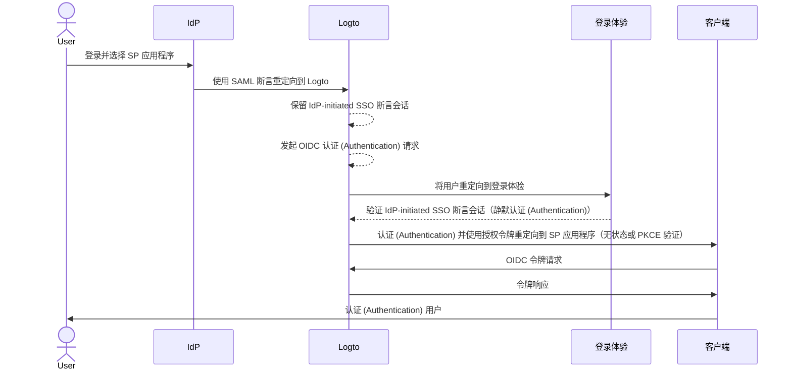

import Availability from '@components/Availability';
import idpInitiatedSsoPortalImage from '@site/docs/end-user-flows/enterprise-sso/assets/idp-initiated-sso-portal.png';
import idpInitiatedSsoRedirectImage from '@site/docs/end-user-flows/enterprise-sso/assets/idp-initiated-sso-redirect.png';
import idpInitiatedSsoSignInImage from '@site/docs/end-user-flows/enterprise-sso/assets/idp-initiated-sso-sign-in.png';

<Availability cloud="comingSoon" oss={false} />

# IdP-initiated SSO (仅限 SAML)

IdP-initiated SSO 是一种单点登录过程，其中身份提供商 (IdP) 主要控制认证 (Authentication) 流程。此过程始于用户登录到 IdP 的平台，例如公司门户或集中身份仪表板。一旦认证 (Authentication) 完成，IdP 会生成一个 SAML 断言并将用户引导到服务提供商 (SP) 以访问应用程序或服务。


## 风险和注意事项 \{#risks-and-considerations}

IdP-initiated SSO 可能引入一些安全漏洞，组织应当注意。由于认证 (Authentication) 过程是由 IdP 发起的，而不是用户直接请求的，它可能容易受到各种攻击，包括 [跨站请求伪造](https://blog.logto.io/csrf) (CSRF)。

这种缺乏用户发起的认证 (Authentication) 可能导致未经授权的访问，如果没有适当的安全措施。此外，依赖单一认证 (Authentication) 点增加了安全漏洞的风险，因为一旦 IdP 被攻破，所有连接的应用程序都可能暴露。

因此，强烈建议使用 SP-initiated SSO，它提供了更安全和可控的认证 (Authentication) 流程，确保用户明确请求访问服务。

## 将 IdP-initiated SSO 与 Logto OIDC 应用程序连接 \{#connect-idp-initiated-sso-with-logto-oidc-applications}

Logto 作为 OpenID Connect (OIDC) 提供商不支持 IdP-initiated SSO。然而，你可以将 Logto 配置为 SP，以使用 SAML 支持与企业 IdP 的 IdP-initiated SSO。这种设置允许你利用 Logto 的认证 (Authentication) 功能，同时保持 IdP 对认证 (Authentication) 流程的控制。

:::note
默认情况下，此功能在 Logto 中未启用。如果你需要为你的租户启用 IdP-initiated SSO，请联系我们的 [支持团队](https://logto.io/contact?src=docs.sso)。
:::

### 前提条件 \{#prerequisites}

在配置 IdP-initiated SSO 之前，你需要先创建一个 SAML 连接器。导航到 <CloudLink to="/enterprise-sso">控制台 > 企业 SSO</CloudLink> 并按照分步指南设置与你的 IdP 的 [SAML](/integrations/saml-sso/) 连接器。

一旦 SAML 连接器设置完成，你可以在 <CloudLink to="/sign-in-experience">登录体验</CloudLink> 部分启用 SSO 登录方法，并测试 SP-initiated SSO 流程以确保配置正确。在继续进行 IdP-initiated SSO 之前，请确保 SP-initiated SSO 正常工作。

### 启用 IdP-initiated SSO \{#enable-idp-initiated-sso}

一旦为你的租户启用了 IdP-initiated SSO 功能，你应该会在 SAML 连接器的设置页面看到一个额外的选项卡，称为 **IdP-initiated SSO**。启用 **IdP-initiated SSO** 切换以激活连接器的功能。

### 选择 SP 应用程序 \{#select-the-sp-application}

与 SP-initiated SSO 不同，IdP-initiated SSO 需要一个客户端 SP 应用程序在认证 (Authentication) 过程后重定向用户。你可以从 **默认应用程序** 下拉列表中选择已注册应用程序中的 SP 应用程序。

IdP-initiated SSO 仅支持 **传统 Web 应用程序** 和 **单页应用程序**。请确保根据你的使用场景选择合适的应用程序类型。

:::note
在你的 IdP 端，将 `RelayState` 参数留空以确保 IdP-initiated SSO 流程正常工作。Logto 将根据选择的默认 SP 应用程序处理重定向。
:::

## 配置 IdP-initiated 认证 (Authentication) 流程 \{#configure-idp-initiated-authentication-flow}

为了将 IdP-initiated SAML SSO 与 OIDC 连接，Logto 提供了两种配置选项来处理认证 (Authentication) 请求。

### 选项 A：重定向到默认 SP 应用程序（推荐） \{#option-a-redirect-to-the-default-sp-application-recommended}

当 IdP 发起 SSO 流程并将 SAML 断言发送到 Logto 时，将创建一个 IdP-initiated SSO 断言会话。Logto 将用户重定向到默认 SP 应用程序，以在客户端发起标准 OIDC 认证 (Authentication) 请求。



要设置此选项，请在 SAML 连接器设置的 **IdP-initiated SSO** 选项卡中选择 **重定向到客户端以进行 SP-initiated 认证 (Authentication)** 卡片。


1. 提供一个 **客户端重定向 URL**，在 IdP-initiated SSO 流程后将用户重定向到默认 SP 应用程序。Logto 将用户重定向到此 URL，并在 URL 后附加 `?ssoConnectorId={connectorId}` 查询参数。客户端应用程序应处理重定向并发起 OIDC 认证 (Authentication) 请求。（我们建议在你的客户端应用程序中使用专用路由或页面来处理 IdP-initiated SSO 认证 (Authentication) 请求。）

2. 在客户端使用 `ssoConnectorId` 查询参数处理 OIDC 认证 (Authentication) 请求，以识别发起 IdP-initiated SSO 认证 (Authentication) 流程的 SAML 连接器。

3. 在登录请求中传递 [直接登录](/end-user-flows/authentication-parameters/direct-sign-in/) 认证 (Authentication) 参数到 Logto 以完成 SSO 认证 (Authentication) 流程。

```typescript
// React 示例
import { Prompt, useLogto } from '@logto/react';
import { useEffect } from 'react';
import { useNavigate, useSearchParams } from 'react-router-dom';

const SsoDirectSignIn = () => {
  const { signIn } = useLogto();
  const [searchParams] = useSearchParams();

  useEffect(() => {
    const ssoConnectorId = searchParams.get('ssoConnectorId');
    if (ssoConnectorId) {
      void signIn({
        redirectUri,
        prompt: Prompt.Login,
        directSignIn: {
          method: 'sso',
          target: ssoConnectorId,
        },
      });
    }
  }, [searchParams, signIn]);
};
```

- `redirectUri`: 在 OIDC 认证 (Authentication) 流程完成后重定向用户的 `redirect_uri`。
- `prompt=login`: 强制用户使用 IdP-initiated SSO 身份登录。
- `directSignIn=sso:{connectorId}`: 指定直接登录方法为 `sso` 和目标 SAML 连接器 ID。此参数将直接触发 SSO 认证 (Authentication) 流程，而不显示登录页面。如果连接器 ID 匹配且会话有效，用户将自动通过保留的 IdP-initiated SSO 断言会话进行认证 (Authentication)。

此方法确保认证 (Authentication) 流程安全并遵循标准 OIDC 协议，同时保持 IdP 对认证 (Authentication) 过程的控制。客户端应用程序可以利用 IdP-initiated SSO 断言会话来认证 (Authentication) 用户，而无需额外的登录步骤，同时保持认证 (Authentication) 流程的安全和可控。客户端应用程序仍然可以验证 `state` 和 `PKCE` 参数以确保认证 (Authentication) 请求的安全。

:::note
此方法适用于 **传统 Web 应用程序** 和 **单页应用程序**。并且推荐用于所有使用场景。
:::

### 选项 B：直接使用 IdP-initiated SSO 认证 (Authentication) 用户 \{#option-b-directly-authenticate-the-user-with-idp-initiated-sso}

在某些情况下，SP 可能无法处理 IdP-initiated SSO 回调并发起 OIDC 认证 (Authentication) 请求。在这种情况下，Logto 提供了一种替代选项，直接使用 IdP-initiated SSO 断言会话认证 (Authentication) 用户。

此选项被认为不太安全，不推荐使用。认证 (Authentication) 流程绕过了标准 OIDC 协议。由于认证 (Authentication) 请求是由 IdP 发起的，客户端应用程序可能无法安全地验证认证 (Authentication) 请求。例如，客户端应用程序无法验证 `state` 和 `PKCE` 参数以确保认证 (Authentication) 请求的安全。

:::warning
此方法不适用于 **单页应用程序**，因为它要求客户端应用程序使用 `PKCE` 参数安全地处理认证 (Authentication) 请求。如果你需要为 SPA 应用程序实现 IdP-initiated SSO，请使用上述选项。
:::



要配置此选项，请在 SAML 连接器设置的 **IdP-initiated SSO** 选项卡中选择 **直接使用 IdP-initiated SSO 登录** 选项。


1. 选择 **登录后重定向 URI**，在成功认证 (Authentication) 后将用户重定向回客户端应用程序。此 URL 将用作 OIDC 认证 (Authentication) 请求中的 `redirect_uri`。URI 必须是客户端应用程序中注册的允许重定向 URI 之一。

   :::note
   强烈建议为 IdP-initiated SSO 使用专用的 **重定向 URI**。鉴于认证 (Authentication) 请求是未经请求的，客户端应用程序应独立管理响应，与标准 SP-initiated 认证 (Authentication) 流程分开。
   :::

2. 如果需要，可以使用 **附加认证 (Authentication) 参数** JSON 编辑器自定义授权请求参数（遵循类型 `Map<string,string>`）。

   例如，默认情况下 Logto 仅请求 `openid` 和 `profile` 权限。你可以在认证 (Authentication) 请求中添加其他权限或参数。

   ```json
   {
     "scope": "email offline_access"
   }
   ```

   - 添加额外的 `email` 权限以请求用户的电子邮件地址。
   - 添加 `offline_access` 权限以请求刷新令牌。

   我们还建议你提供一个自定义的 `state` 参数，以安全地验证认证 (Authentication) 响应。

   ```json
   {
     "state": "custom-state-value"
   }
   ```

   客户端应用程序应在授权代码响应中验证 `state` 参数，以确保认证 (Authentication) 请求有效。
