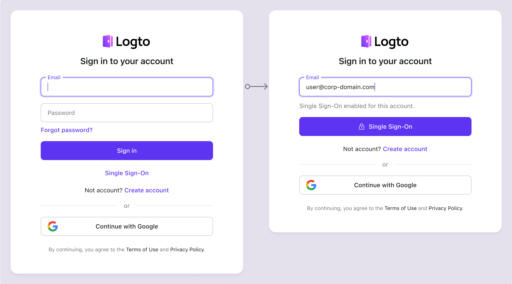

# SP 发起的单点登录 (SSO)

SP 发起的单点登录 (SSO) 是默认且比 IdP 发起的 SSO 更安全的方法，允许企业用户从 Logto 登录页面启动 SSO 登录过程。Logto 支持电子邮件域提示 SSO 和直接登录参数 SSO。

## 设置 SP 发起的 SSO

1. **启用企业单点登录 (SSO)** 在你的身份系统中

   要激活企业单点登录 (SSO)，请导航到 <CloudLink to="/sign-in-experience/sign-up-and-sign-in">控制台 > 登录体验 > 注册和登录</CloudLink> 并切换 "启用企业单点登录 (SSO)" 设置。启用后，"单点登录" 按钮将出现在你的登录页面上。具有 SSO 启用电子邮件域的企业用户可以通过他们的企业身份提供商访问你的服务。

2. **为不同的客户端创建企业连接器**

   接下来，你需要为你的客户端集成每个企业身份提供商。类似于社交登录，在 Logto 中创建一个新的企业连接器并配置所需的设置。导航到 <CloudLink to="/enterprise-sso">控制台 > 企业单点登录 (SSO)</CloudLink>，点击 "添加企业连接器" 按钮，并按照说明设置连接器。请参阅 [企业单点登录 (SSO) 连接器设置](/connectors/enterprise-connectors/)。

3. **为企业连接器设置电子邮件域**

   企业单点登录 (SSO) 身份通常通过公司电子邮件域识别。在每个企业连接器详细信息页面的 SSO 体验选项卡中，你可以指定相关的电子邮件域。

   具有指定电子邮件域的用户将被限制仅通过此企业单点登录 (SSO) 连接器登录，而其他登录方法（如电子邮件验证码或电子邮件密码认证）将对这些用户禁用。SSO 连接器将仅对具有指定电子邮件域的用户可见。

   :::note
   公共电子邮件域（例如，gmail.com，yahoo.com）不能链接到企业连接器。
   :::

## SP 发起的 SSO 体验

当用户尝试使用为 SSO 配置的企业电子邮件域登录时，SSO 被激活。此过程绕过了密码等标准验证方法。

1. **单点登录按钮**：

   当启用企业单点登录 (SSO) 登录方法时，"单点登录" 按钮将作为登录页面上的替代登录选项出现。通过点击此链接，用户将被提示输入他们的企业电子邮件地址以启动 SSO 过程。

   - 单个连接器：如果用户的电子邮件域仅关联一个企业单点登录 (SSO) 连接器，用户将直接重定向到 IdP 登录页面。
   - 多个连接器：如果用户的电子邮件域关联多个企业单点登录 (SSO) 连接器，用户将首先从列表中选择所需的 IdP，然后再重定向到 IdP 登录页面。

   

2. 通用电子邮件登录：

   在通用标识符登录表单中（启用电子邮件登录方法），企业单点登录 (SSO) 电子邮件域检测默认启用。当用户输入他们的电子邮件地址时，Logto 会自动识别该域是否关联企业单点登录 (SSO) 连接器。如果找到匹配项，默认登录表单将更新："登录" 按钮更改为 "单点登录" 按钮，限制用户仅通过企业单点登录 (SSO) 连接器登录。

   

## 常见问题

  
我可以使用组织名称 / 域而不是电子邮件域重定向到 IdP 吗？

目前，Logto 预构建的登录体验仅支持 **电子邮件域提示 SSO**，不支持 **组织域提示 SSO**。

你可以在客户端使用 `directSignIn:'sso:{connectorId}` 的认证参数创建自定义路由页面。此页面将根据其组织域将大型企业客户端重定向到适当的 IdP。了解更多关于 [直接登录参数](/end-user-flows/authentication-parameters/direct-sign-in/) 的信息。

  
我可以在登录页面上显示特定企业连接器按钮吗？

不同的企业客户端使用不同的身份提供商来管理他们的员工，并请求不同的权限 (OIDC) 或属性 (SAML)。因此，不建议在通用登录页面上显示针对特定客户端的企业连接器按钮。

但是，如果你正在开发 B2E 产品并希望为特定企业客户端显示按钮，你可以创建自定义登录页面并使用 `directSignIn:sso` 适当地路由按钮。了解更多关于 [直接登录参数](/end-user-flows/authentication-parameters/direct-sign-in/) 的信息。

