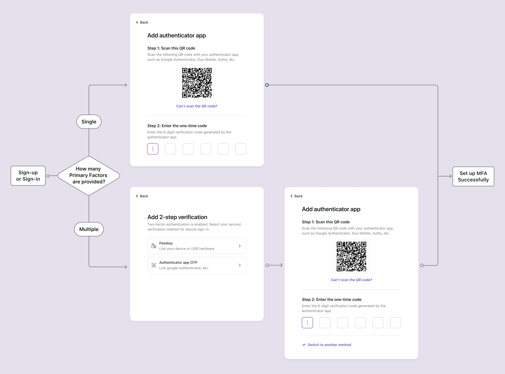

# 配置 MFA

## 在 Logto 中配置 MFA 设置

按照以下步骤在用户的 Logto 登录流程中启用 MFA：

1. 导航到：<CloudLink to="/mfa">Console > Multi-factor auth</CloudLink>。
2. 为你的用户启用支持的验证因素。
   1. 主因素：
      - [Authenticator App OTP](/end-user-flows/mfa/authenticator-app-otp)：最常见且广泛接受的方法。使用由身份验证应用程序（如 Google Authenticator 或 Authy）生成的基于时间的一次性密码 (TOTP)。
      - [Passkeys (WebAuthn)](/end-user-flows/mfa/webauthn)：适用于支持设备生物识别或安全密钥等的网络产品的高安全性选项，确保强大的保护。
   2. 备份因素：
      - [Backup codes](/end-user-flows/mfa/backup-codes)：当用户无法验证上述任何主因素时，这作为备份选项。启用此选项可以减少用户成功访问的摩擦。
3. 为用户选择 MFA 策略设置：
   - **用户控制的 MFA**：用户可以在注册流程中跳过 MFA 设置过程。他们可以选择稍后通过你的自助账户设置页面或 Logto 托管账户设置页面（即将推出）来设置 MFA。 [了解更多](/end-user-flows/account-settings/) 关于实现用户账户设置页面的信息。
   - **管理员强制的 MFA**：你可以为所有用户强制执行 MFA。用户将在登录过程中被提示设置 MFA，无法跳过。如果用户未能设置 MFA 或删除其 MFA 设置，他们将被锁定在其账户之外，直到他们再次设置 MFA。

## MFA 用户流程

### MFA 设置流程

一旦启用 MFA，用户将在登录和注册过程中被提示设置 MFA。只有在启用“用户控制的 MFA”策略时，用户才能选择跳过此设置过程。

1. **访问登录或注册页面**：用户导航到登录或注册页面。
2. **完成登录或注册**：用户在登录或注册流程中完成身份验证过程。
3. **设置 MFA 主因素**：用户被提示设置其主 MFA 因素（Authenticator app OTP 或 WebAuthn）。如果启用了多个主因素，他们可以选择自己喜欢的选项。如果启用了“用户控制的 MFA”策略，他们也可以通过选择“跳过”按钮来跳过此步骤。
4. **设置 MFA 备份因素**：如果启用了 **Backup codes**，用户将在成功配置其主认证因素后被提示设置备份代码。自动生成的备份代码将显示给用户，他们可以下载并安全存储。用户必须手动确认备份代码以完成 MFA 设置过程。

### MFA 验证流程

已设置 MFA 的用户将在登录过程中被提示使用其配置的 MFA 因素验证身份。验证因素将取决于 Logto 中的 MFA 配置和用户设置。

- 如果用户只设置了一个因素，他们将直接验证该因素。
- 如果用户设置了多个因素作为 2FA，他们需要选择一个进行验证。
- 如果所有启用的主因素对用户不可用，并且启用了备份代码，他们可以使用一次性备份代码来验证身份。

