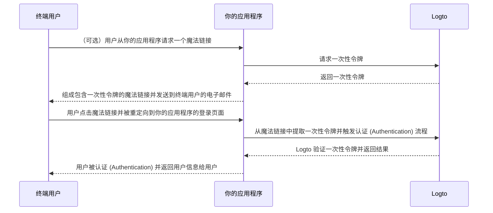

# 魔法链接（一次性令牌）

import Availability from '@components/Availability';

<Availability cloud oss="comingSoon" />

类似于一次性密码 (OTP)，一次性令牌是另一种无密码认证 (Authentication) 方法，可以用来验证用户的身份。
该令牌在有限的时间内有效，并与终端用户的电子邮件地址相关联。

有时你可能希望邀请新用户加入你的应用程序 / 组织，而不需要他们先创建账户。
或者你可能忘记了密码，希望通过电子邮件快速验证身份来登录 / 重置密码。
在这种情况下，应用程序可以向你的电子邮件发送一个“魔法链接”。当你点击链接时，你将立即被认证 (Authentication)。

应用程序开发者可以使用一次性令牌来组成一个魔法链接，并将其发送到终端用户的电子邮件地址。

## 一次性令牌流程 \{#one-time-token-flow}

以下是使用一次性令牌进行认证 (Authentication) 流程的时序图：



## 实现指南 \{#implementation-guide}

Logto 提供了一套 Management API 和 Experience API 来简化你的魔法链接的实现。

在开始之前，确保你有一个 Logto 实例，并已在你的应用程序服务器和 Logto 端点之间建立了机器对机器连接（Management API 所需）。了解更多关于 [Logto Management API](/integrate-logto/interact-with-management-api)。

### 步骤 1：请求一次性令牌 \{#step-1-request-one-time-token}

使用 Logto Management API 创建一次性令牌。

```bash
POST /api/one-time-tokens
```

请求体示例：

```json
{
  "email": "user@example.com",
  // 可选。默认为 600（10 分钟）。
  "expiresIn": 3600,
  // 可选。用户将在成功验证后被配置到指定的组织中。
  "context": {
    "jitOrganizationIds": ["abcdefgh1234"]
  }
}
```

### 步骤 2：组成你的魔法链接 \{#step-2-compose-your-magic-link}

获取一次性令牌后，你可以组成一个魔法链接并将其发送到终端用户的电子邮件地址。
魔法链接至少应包含令牌和用户电子邮件作为参数，并应导航到你自己应用程序中的一个登录页面。
例如 `https://yourapp.com/landing-page`。

以下是魔法链接可能的简单示例：

```
https://yourapp.com/landing-page?token=YHwbXSXxQfL02IoxFqr1hGvkB13uTqcd&email=user@example.com
```

:::note

魔法链接中的参数名称可以完全自定义。
你可以根据应用程序的要求向魔法链接添加附加信息，并对所有 URL 参数进行编码。

:::

### 步骤 3：通过 Logto SDK 触发认证 (Authentication) 流程 \{#step-3-trigger-the-authentication-flow-via-logto-sdk}

终端用户点击魔法链接并导航到你的应用程序后，你可以从 URL 中提取 `token` 和 `email` 参数，然后调用 Logto SDK 的 `signIn()` 函数来触发认证 (Authentication) 流程。

```typescript title="TokenLandingPage.tsx"
// React 示例
import { useLogto } from '@logto/react';
import { useEffect } from 'react';
import { useSearchParams } from 'react-router-dom';

const TokenLandingPage = () => {
  const { signIn } = useLogto();
  const [searchParams] = useSearchParams();

  useEffect(() => {
    // 从魔法链接中提取令牌和电子邮件
    const oneTimeToken = searchParams.get('token');
    const email = searchParams.get('email');

    // 假设这是你的登录重定向 URI
    const redirectUri = 'https://yourapp.com/callback';

    if (oneTimeToken && email) {
      signIn({
        redirectUri,
        clearTokens: false, // 可选。见下方警告信息
        extraParams: {
          'one_time_token': oneTimeToken,
          'login_hint': email,
        },
      });
    }
  }, [searchParams, signIn]);

  return <>请稍候...</>;
};
```

:::warning

如果用户已经登录，调用 SDK 的 `signIn()` 函数将自动清除客户端存储中的所有缓存令牌（ID 令牌、访问令牌和刷新令牌），
这将导致当前用户的认证 (Authentication) 状态丢失。

因此，你应该指定一个额外的登录参数 `clearTokens: false` 以避免清除现有令牌。
如果指定了此参数，你还需要在登录回调页面中手动清除令牌。

如果你的魔法链接不是为已认证 (Authentication) 用户设计的，请忽略此项。

:::

### 步骤 4：（可选）在登录回调页面中清除缓存令牌 \{#step-4-clear-cached-tokens-in-sign-in-callback-page}

如果你在登录函数中指定了 `clearTokens: false`，则需要在登录回调页面中手动清除令牌。

```typescript title="Callback.tsx"
// React 示例
import { useHandleSignInCallback, useLogto } from '@logto/react';
import { useEffect } from 'react';

const Callback = () => {
  const { clearAllTokens } = useLogto();

  useEffect(() => {
    void clearAllTokens();
  }, [clearAllTokens]);

  useHandleSignInCallback(() => {
    // 导航到你的主页
  });

  return <>请稍候...</>;
};
```

## 常见问题解答 \{#faqs}

<details>

<summary>

### 我可以使用魔法链接邀请新用户加入我的组织吗？ \{#can-i-use-the-magic-link-to-invite-new-users-to-my-organizations}

</summary>

是的，你可以使用魔法链接邀请新用户加入你的应用程序以及组织。
如果你想邀请新用户加入你的组织，只需在请求体中指定 `jitOrganizationIds`。

用户将在成功验证后自动加入组织，并分配默认的组织角色。
查看组织详细信息页面中的“即时供应”部分，并为你的组织配置默认角色。

</details>

<details>

<summary>

### 一次性令牌会过期吗？ \{#does-the-one-time-token-expire}

</summary>

是的，一次性令牌将在指定的 `expiresIn` 时间（以秒为单位）后过期。默认过期时间为 10 分钟。

</details>

<details>

<summary>

### 如果我在“登录体验”中禁用用户注册，我还能使用魔法链接邀请用户吗？ \{#if-i-disable-user-registration-in-sign-in-experience-can-i-still-use-magic-link-to-invite-users}

</summary>

是的，即使你在“登录体验”中禁用了用户注册，你仍然可以使用魔法链接邀请用户。

</details>

<details>

<summary>

### 如果用户已经登录，然后点击另一个魔法链接，会发生什么？ \{#what-will-happen-if-a-user-already-signed-in-and-then-click-another-magic-link}

</summary>

可能会有多种情况：

1. 用户已经登录，然后点击与当前用户账户关联的魔法链接。在这种情况下，Logto 仍将验证一次性令牌，并在需要时将用户配置到指定的组织。
2. 用户已经登录，然后点击与不同账户关联的魔法链接。在这种情况下，Logto 将提示用户继续使用新账户，或返回应用程序使用当前账户。
   1. 如果用户选择继续使用新账户，Logto 将在令牌验证成功后切换到新账户。
   2. 如果用户选择坚持使用当前账户，Logto 将不验证令牌并返回应用程序使用当前账户。
3. 如果你的登录提示设置为“login”或包含“login”，Logto 将自动登录与一次性令牌关联的账户，而不提示切换。

</details>
