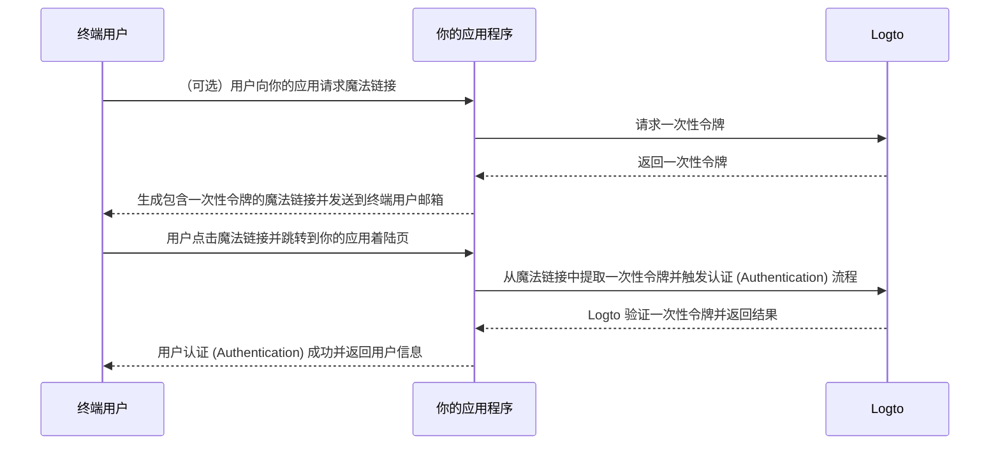

# 魔法链接（一次性令牌）

import Availability from '@components/Availability';

<Availability cloud oss={{ major: 1, minor: 27 }} />

类似于一次性密码（OTP），一次性令牌（one-time token）是另一种无密码认证 (Authentication) 方法，可用于验证用户身份。
该令牌在有限时间内有效，并与终端用户的电子邮件地址关联。

有时你可能希望邀请新用户加入你的应用程序 / 组织，而无需他们先创建账户。
或者你忘记了密码，希望通过电子邮件快速验证身份来登录 / 重置密码。
在这些情况下，应用程序可以向你的邮箱发送“魔法链接”。当你点击该链接时，将立即完成认证 (Authentication)。

应用开发者可以使用一次性令牌来生成魔法链接，并将其发送到终端用户的邮箱。

## 一次性令牌流程 \{#one-time-token-flow}

以下是使用一次性令牌进行认证 (Authentication) 流程的时序图：



## 实现指南 \{#implementation-guide}

Logto 提供了一套 Management API 和 Experience API，帮助你更轻松地实现魔法链接。

在开始之前，请确保你已准备好 Logto 实例，并已在你的应用服务器与 Logto 端点之间建立了机器对机器 (Machine-to-Machine) 连接（Management API 需要）。了解更多 [Logto Management API](/integrate-logto/interact-with-management-api)。

### 第一步：请求一次性令牌 \{#step-1-request-one-time-token}

使用 Logto Management API 创建一次性令牌。

```bash
POST /api/one-time-tokens
```

请求体示例：

```json
{
  "email": "user@example.com",
  // 可选。默认为 600（10 分钟）。
  "expiresIn": 3600,
  // 可选。用户验证成功后将被加入指定组织 (Organizations)。
  "context": {
    "jitOrganizationIds": ["abcdefgh1234"]
  }
}
```

### 第二步：生成你的魔法链接 \{#step-2-compose-your-magic-link}

获取一次性令牌后，你可以生成魔法链接并发送到终端用户的邮箱。
魔法链接至少应包含令牌和用户邮箱作为参数，并跳转到你自己应用中的着陆页。
例如：`https://yourapp.com/landing-page`。

以下是魔法链接的简单示例：

```
https://yourapp.com/landing-page?token=YHwbXSXxQfL02IoxFqr1hGvkB13uTqcd&email=user@example.com
```

:::note

魔法链接中的参数名可以完全自定义。
你可以根据应用需求在魔法链接中添加额外信息，并对所有 URL 参数进行编码。

:::

### 第三步：通过 Logto SDK 触发认证 (Authentication) 流程 \{#step-3-trigger-the-authentication-flow-via-logto-sdk}

终端用户点击魔法链接并跳转到你的应用后，你可以从 URL 中提取 `token` 和 `email` 参数，然后调用 Logto SDK 的 `signIn()` 方法触发认证 (Authentication) 流程。

```typescript title="TokenLandingPage.tsx"
// React 示例
import { useLogto } from '@logto/react';
import { useEffect } from 'react';
import { useSearchParams } from 'react-router-dom';

const TokenLandingPage = () => {
  const { signIn } = useLogto();
  const [searchParams] = useSearchParams();

  useEffect(() => {
    // 从魔法链接中提取 token 和 email
    const oneTimeToken = searchParams.get('token');
    const email = searchParams.get('email');

    // 假设这是你的 sign-in 重定向 URI
    const redirectUri = 'https://yourapp.com/callback';

    if (oneTimeToken && email) {
      signIn({
        redirectUri,
        clearTokens: false, // 可选。见下方警告说明
        extraParams: {
          'one_time_token': oneTimeToken,
          'login_hint': email,
        },
      });
    }
  }, [searchParams, signIn]);

  return <>请稍候...</>;
};
```

:::warning

如果用户已登录，调用 SDK 的 `signIn()` 方法会自动清除客户端存储中的所有缓存令牌（ID 令牌、访问令牌和刷新令牌），
从而导致当前用户的认证 (Authentication) 状态丢失。

因此，你应额外指定 sign-in 参数 `clearTokens: false`，以避免清除现有令牌。
如果指定了该参数，你还需要在 sign-in 回调页面手动清除令牌。

如果你的魔法链接不是为已认证 (Authentication) 用户设计，可以忽略此项。

:::

### 第四步：（可选）在 sign-in 回调页面清除缓存令牌 \{#step-4-clear-cached-tokens-in-sign-in-callback-page}

如果你在 sign-in 方法中指定了 `clearTokens: false`，则需要在 sign-in 回调页面手动清除令牌。

```typescript title="Callback.tsx"
// React 示例
import { useHandleSignInCallback, useLogto } from '@logto/react';
import { useEffect } from 'react';

const Callback = () => {
  const { clearAllTokens } = useLogto();

  useEffect(() => {
    void clearAllTokens();
  }, [clearAllTokens]);

  useHandleSignInCallback(() => {
    // 跳转到你的首页
  });

  return <>请稍候...</>;
};
```

## 常见问题 \{#faqs}

<details>

<summary>

### 我可以用魔法链接邀请新用户加入我的组织 (Organizations) 吗？ \{#can-i-use-the-magic-link-to-invite-new-users-to-my-organizations}

</summary>

可以，你可以用魔法链接邀请新用户加入你的应用程序，也可以加入组织 (Organizations)。
如果你想邀请新用户加入组织，只需在请求体中指定 `jitOrganizationIds`。

用户验证成功后会自动加入组织，并分配默认组织角色。
请在组织详情页的“即时供应”部分查看并配置组织的默认角色。

</details>

<details>

<summary>

### 我可以通过魔法链接为用户分配特定角色吗？ \{#can-i-assign-users-to-specific-roles-using-the-magic-link}

</summary>

魔法链接认证 (Authentication) 流程不支持为用户分配角色。但你始终可以使用 [Webhooks](/developers/webhooks) 和 [Management API](/user-management/manage-users#manage-roles-of-users) 在用户注册后更新其角色。

</details>

<details>

<summary>

### 一次性令牌会过期吗？ \{#does-the-one-time-token-expire}

</summary>

会，一次性令牌将在指定的 `expiresIn` 时间（秒）后过期。默认过期时间为 10 分钟。

</details>

<details>

<summary>

### 如果我在“登录体验”中禁用了用户注册，还能用魔法链接邀请用户吗？ \{#if-i-disable-user-registration-in-sign-in-experience-can-i-still-use-magic-link-to-invite-users}

</summary>

可以，即使你在“登录体验”中禁用了用户注册，仍然可以用魔法链接邀请用户。

</details>

<details>

<summary>

### 如果用户已经登录，又点击了另一个魔法链接会发生什么？ \{#what-will-happen-if-a-user-already-signed-in-and-then-click-another-magic-link}

</summary>

可能出现以下几种情况：

1. 用户已登录，然后点击了与当前账户关联的魔法链接。此时，Logto 仍会验证一次性令牌，并在需要时将用户加入指定组织 (Organizations)。
2. 用户已登录，然后点击了与其他账户关联的魔法链接。此时，Logto 会提示用户切换为新账户，或继续使用当前账户返回应用。
   1. 如果用户选择切换为新账户，Logto 会在令牌验证成功后切换到新账户。
   2. 如果用户选择继续使用当前账户，Logto 不会验证令牌，并以当前账户返回应用。
3. 如果你的 sign-in 提示设置为 "login" 或包含 "login"，Logto 会自动以一次性令牌关联的账户登录，无需切换提示。

</details>
