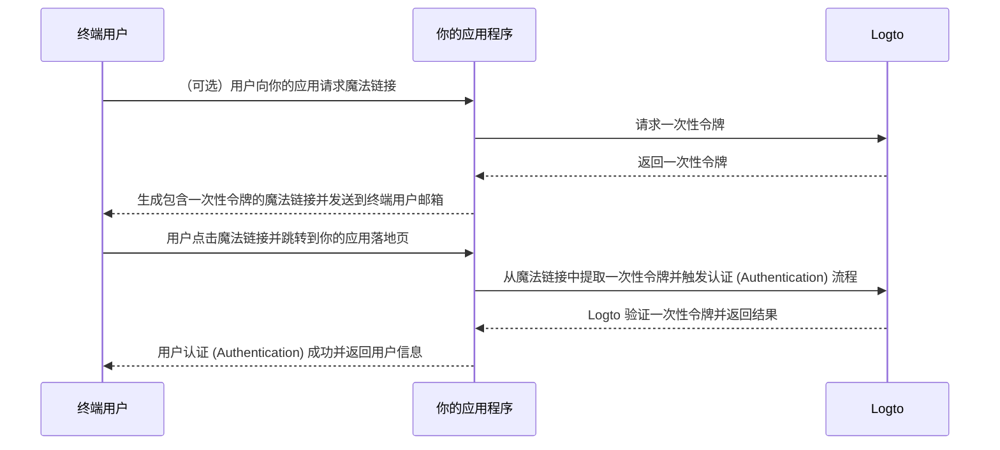

# 魔法链接（一次性令牌）

类似于一次性密码（OTP），一次性令牌是不需要密码的另一种认证 (Authentication) 方法，可用于验证用户身份。
该令牌在有限时间内有效，并与终端用户的电子邮件地址关联。

有时你可能希望邀请新用户加入你的应用程序 / 组织，而无需他们先创建账户。在这种情况下，应用程序可以向你的邮箱发送“魔法链接”。当你点击该链接时，将立即完成认证 (Authentication)。

应用开发者可以使用一次性令牌生成魔法链接，并将其发送到终端用户的邮箱。

## 使用场景 \{#use-cases}

Logto 支持以下使用魔法链接的场景：

- **仅限邀请注册**：对于内部工具或处于测试阶段的 AI 产品，你可以禁用公开注册，通过魔法链接邀请特定用户。
- **组织成员邀请**：对于 SaaS 产品，使用魔法链接邀请新成员加入组织，简化入职流程。
- **登录 / 注册**：通过电子邮件发送魔法链接，实现无密码登录或注册。
- **重置密码**：从你自己的应用发送重置密码魔法链接，让用户验证一次性令牌并在 Logto 中设置新密码。

例如，当你禁用公开注册时，可以将包含一次性令牌的魔法链接（如 `https://yourapp.com/landing-page?token=YHwbXSXxQfL02IoxFqr1hGvkB13uTqcd&email=user@example.com`）发送到用户邮箱，邀请其完成账户创建。你可以在自己的邮件发送服务中自定义邮件模板，例如：


当前不支持：

- 使用手机号或用户名作为标识符。

## 一次性令牌流程 \{#one-time-token-flow}

以下是使用一次性令牌进行认证 (Authentication) 流程的时序图：


```mermaid
sequenceDiagram
  participant U as 终端用户
  participant C as 你的应用程序
  participant L as Logto

  U ->> C: （可选）用户向你的应用请求魔法链接
  C ->> L: 请求一次性令牌
  L -->> C: 返回一次性令牌
  C -->> U: 生成包含一次性令牌的魔法链接并发送到终端用户邮箱
  U ->> C: 用户点击魔法链接并跳转到你的应用落地页
  C ->> L: 从魔法链接中提取一次性令牌并触发认证 (Authentication) 流程
  L -->> C: Logto 验证一次性令牌并返回结果
  C -->> U: 用户认证 (Authentication) 成功并返回用户信息
```

## 实现指南 \{#implementation-guide}

Logto 提供了一套 Management API 和 Experience API，帮助你轻松实现魔法链接。

在开始之前，请确保你已有可用的 Logto 实例，并已在你的应用服务器与 Logto 端点之间建立了机器对机器连接（Management API 需要）。了解更多 [Logto Management API](/integrate-logto/interact-with-management-api)。

### 步骤 1：请求一次性令牌 \{#step-1-request-one-time-token}

使用 Logto Management API 创建一次性令牌。

```bash
POST /api/one-time-tokens
```

请求体示例：

```json
{
  "email": "user@example.com",
  // 可选。默认为 600（10 分钟）。
  "expiresIn": 3600,
  // 可选。用户验证成功后将被加入指定组织。
  "context": {
    "jitOrganizationIds": ["abcdefgh1234"]
  }
}
```

对于重置密码魔法链接，可将令牌限制为忘记密码流程：

```json
{
  "email": "user@example.com",
  "expiresIn": 3600,
  "context": {
    "interactionEvent": "ForgotPassword"
  }
}
```

### 步骤 2：生成你的魔法链接 \{#step-2-compose-your-magic-link}

获得一次性令牌后，你可以生成魔法链接并发送到终端用户邮箱。
对于登录或注册魔法链接，链接中至少应包含 token 和用户邮箱参数。
对于重置密码魔法链接，email 参数为可选；如果省略，Logto 会在验证一次性令牌前要求用户输入邮箱。
魔法链接应跳转到你自己应用的落地页。
例如：`https://yourapp.com/landing-page`。

以下是魔法链接的简单示例：

```
https://yourapp.com/landing-page?token=YHwbXSXxQfL02IoxFqr1hGvkB13uTqcd&email=user@example.com
```

:::note

魔法链接中的参数名可以完全自定义。
你可以根据应用需求在魔法链接中添加额外信息，
并对所有 URL 参数进行编码。

:::

### 步骤 3：通过 Logto SDK 触发认证 (Authentication) 流程 \{#step-3-trigger-the-authentication-flow-via-logto-sdk}

#### 登录或注册 \{#sign-in-or-sign-up}

终端用户点击魔法链接并跳转到你的应用后，你可以从 URL 中提取 `token` 和 `email` 参数，然后调用 Logto SDK 的 `signIn()` 方法触发认证 (Authentication) 流程。

```typescript title="TokenLandingPage.tsx"
// React 示例
import { useLogto } from '@logto/react';
import { useEffect } from 'react';
import { useSearchParams } from 'react-router-dom';

const TokenLandingPage = () => {
  const { signIn } = useLogto();
  const [searchParams] = useSearchParams();

  useEffect(() => {
    // 从魔法链接中提取 token 和 email
    const oneTimeToken = searchParams.get('token');
    const email = searchParams.get('email');

    // 假设这是你的登录回调 URI
    const redirectUri = 'https://yourapp.com/callback';

    if (oneTimeToken && email) {
      signIn({
        redirectUri,
        clearTokens: false, // 可选。见下方警告说明
        extraParams: {
          'one_time_token': oneTimeToken,
          'login_hint': email,
        },
      });
    }
  }, [searchParams, signIn]);

  return <>请稍候...</>;
};
```

#### 重置密码 \{#reset-password}

对于重置密码魔法链接，发起认证 (Authentication) 请求时将 `first_screen` 设置为 `reset_password`。
通过 `one_time_token` 传递一次性令牌。
如果你已在落地页获取到用户邮箱，则通过 `login_hint` 传递；否则省略 `login_hint`，Logto 会在验证令牌前要求用户输入邮箱。

```typescript title="ResetPasswordTokenLandingPage.tsx"
// React 示例
import { useLogto } from '@logto/react';
import { useEffect } from 'react';
import { useSearchParams } from 'react-router-dom';

const ResetPasswordTokenLandingPage = () => {
  const { signIn } = useLogto();
  const [searchParams] = useSearchParams();

  useEffect(() => {
    const oneTimeToken = searchParams.get('token');
    const email = searchParams.get('email');

    if (oneTimeToken) {
      signIn({
        redirectUri: 'https://yourapp.com/callback',
        extraParams: {
          'one_time_token': oneTimeToken,
          'first_screen': 'reset_password',
          ...(email && { 'login_hint': email }),
        },
      });
    }
  }, [searchParams, signIn]);

  return <>请稍候...</>;
};
```

:::warning

如果用户已登录，调用 SDK 的 `signIn()` 方法会自动清除客户端存储的所有缓存令牌（ID 令牌、访问令牌和刷新令牌），
从而导致当前用户的认证 (Authentication) 状态丢失。

因此，你应额外指定 `clearTokens: false` 参数，以避免清除现有令牌。
如果指定了该参数，你还需要在登录回调页手动清除令牌。

如果你的魔法链接不是为已认证 (Authentication) 用户设计，可忽略此项。

:::

### 步骤 4：（可选）在登录回调页手动清除缓存令牌 \{#step-4-clear-cached-tokens-in-sign-in-callback-page}

如果你在登录方法中指定了 `clearTokens: false`，则需要在登录回调页手动清除令牌。

```typescript title="Callback.tsx"
// React 示例
import { useHandleSignInCallback, useLogto } from '@logto/react';
import { useEffect } from 'react';

const Callback = () => {
  const { clearAllTokens } = useLogto();

  useEffect(() => {
    void clearAllTokens();
  }, [clearAllTokens]);

  useHandleSignInCallback(() => {
    // 跳转到你的首页
  });

  return <>请稍候...</>;
};
```

## 常见问题 \{#faqs}

<details>

<summary>

### 我可以用魔法链接邀请新用户加入我的组织吗？ \{#can-i-use-the-magic-link-to-invite-new-users-to-my-organizations}

</summary>

可以，你可以用魔法链接邀请新用户加入你的应用，也可以加入组织。
如果你想邀请新用户加入组织，只需在请求体中指定 `jitOrganizationIds`。

用户验证成功后会自动加入组织，并分配默认组织角色。
请在组织详情页的“即时供应”部分配置组织的默认角色。

</details>

<details>

<summary>

### 我可以通过魔法链接为用户分配特定角色吗？ \{#can-i-assign-users-to-specific-roles-using-the-magic-link}

</summary>

魔法链接认证 (Authentication) 流程不支持为用户分配角色。但你可以通过 [Webhooks](/developers/webhooks) 和 [Management API](/user-management/manage-users#manage-roles-of-users) 在用户注册后更新其角色。

</details>

<details>

<summary>

### 一次性令牌会过期吗？ \{#does-the-one-time-token-expire}

</summary>

会的，一次性令牌会在指定的 `expiresIn` 时间（秒）后过期。默认过期时间为 10 分钟。

</details>

<details>

<summary>

### 如果我在“注册与登录”中禁用了用户注册，还能用魔法链接邀请用户吗？ \{#if-i-disable-user-registration-in-sign-in-experience-can-i-still-use-magic-link-to-invite-users}

</summary>

可以，即使你在“注册与登录”中禁用了用户注册，仍然可以用魔法链接邀请用户。

</details>

<details>

<summary>

### 如果用户已登录，再点击另一个魔法链接会发生什么？ \{#what-will-happen-if-a-user-already-signed-in-and-then-click-another-magic-link}

</summary>

可能出现以下几种情况：

1. 用户已登录，然后点击与当前账户关联的魔法链接。此时，Logto 仍会验证一次性令牌，并在需要时将用户加入指定组织。
2. 用户已登录，然后点击与其他账户关联的魔法链接。此时，Logto 会提示用户切换为新账户，或返回应用继续使用当前账户。
   1. 如果用户选择切换为新账户，Logto 会在令牌验证成功后切换到新账户。
   2. 如果用户选择继续使用当前账户，Logto 不会验证令牌，并返回应用继续使用当前账户。
3. 如果你的登录提示设置为 "login" 或包含 "login"，Logto 会自动使用一次性令牌关联的账户登录，而不会提示切换。这是因为 "login" 提示表示明确的认证 (Authentication) 意图，会优先于当前会话。

</details>
