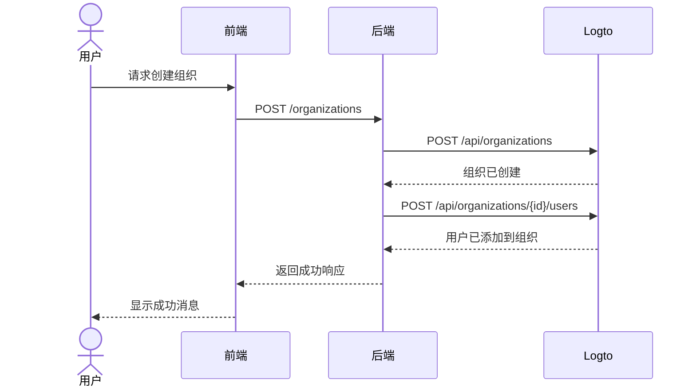

import GearIcon from '@site/src/assets/gear.svg';
import OrganizationIcon from '@site/src/assets/organization.svg';

# 组织 (Organization) 体验

[组织 (Organization)](/organizations) 体验是你的企业客户及其员工所使用的一系列界面和流程——尤其是在[多租户应用](https://auth.wiki/multi-tenancy)中。本指南将展示如何通过 Logto Management API 将其集成到你的应用中。

本节帮助你为终端用户设计**组织 (Organization) 体验**，例如：

1. 管理员可以创建自己的组织 (Organization)。
2. 管理员可以管理组织成员。
3. 管理员可以邀请成员加入他们的组织 (Organization)。
4. 以及更多功能。

  

## 理解认证 (Authentication) 流程 \{#understand-the-authentication-flow}

要集成 Logto Management API，首先需要理解基本的认证 (Authentication) 流程。它有两个关键要求：

### 保护你的后端 API \{#protect-your-backend-api}

- 前端调用你的后端 API 时需要认证 (Authentication)。
- 通过验证用户的 Logto 访问令牌 (Access token) 来保护 API 端点。
- 确保只有经过认证 (Authentication) 的用户才能访问你的服务。

### 访问 Logto Management API \{#access-the-logto-management-api}

- 你的后端服务安全地调用 Logto Management API。
- 按照 [与 Management API 交互](/integrate-logto/interact-with-management-api) 指南进行设置。
- 使用机器对机器认证 (Authentication) 获取访问凭证。

接下来的章节将介绍如何设置 Logto Management API，并逐步讲解构建组织 (Organization) 体验的常见用例。

## 组织 (Organization) 体验功能 \{#features-for-organization-experience}

<DocCardList
  items={[
    {
      type: 'link',
      label: '创建组织 (Organization)',
      href: '/end-user-flows/organization-experience/create-organization',
      description: '使用 Logto Management API 让终端用户在产品中自行创建组织 (Organization)。',
      customProps: {
        icon: <OrganizationIcon />,
      },
    },
    {
      type: 'link',
      label: '邀请成员加入组织 (Organization)',
      href: '/end-user-flows/organization-experience/invite-organization-members',
      description:
        '使用 Logto Management API 让组织 (Organization) 管理员邀请成员加入他们的组织 (Organization)。',
      customProps: {
        icon: <OrganizationIcon />,
      },
    },
    {
      type: 'link',
      label: '组织 (Organization) 管理',
      href: '/end-user-flows/organization-experience/organization-management',
      description:
        '使用 Logto Management API 让组织 (Organization) 管理员在组织 (Organization) 内管理成员。',
      customProps: {
        icon: <GearIcon />,
      },
    },
  ]}
/>

有关组织 (Organization) 定义、成员概念和组织模板的详细说明，请参阅 [了解组织 (Organization) 的工作原理](/organizations/understand-how-organizations-work)。

## 相关资源 \{#related-resources}

<Url href="https://blog.logto.io/build-multi-tenant-saas-application">
  构建多租户 SaaS 应用：从设计到实现的完整指南
</Url>
