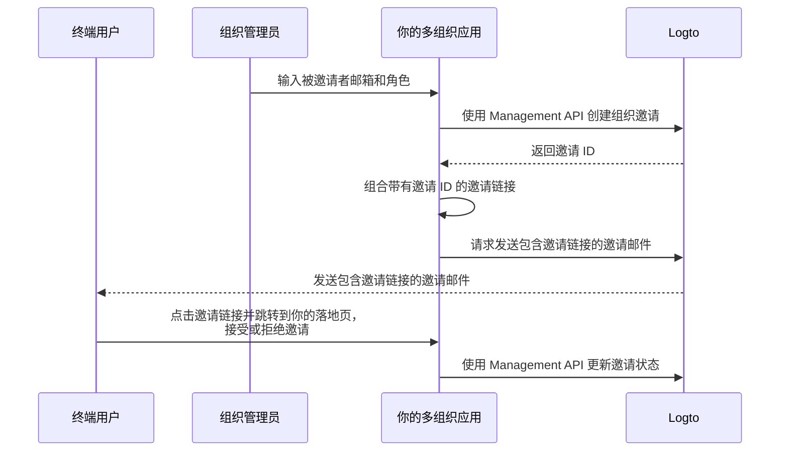

# 邀请组织成员

在多组织应用中，一个常见需求是邀请成员加入组织。本指南将介绍实现此功能的步骤和技术细节。

## 流程概览 \{#flow-overview}

整体流程如下图所示：



## 创建组织角色 \{#create-organization-roles}

在邀请成员之前，需要创建组织角色。参见 [组织模板](/authorization/organization-template) 了解更多关于角色和权限的信息。

在本指南中，我们依然创建两个典型的组织角色：`admin` 和 `member`。

`admin` 角色拥有对组织内所有资源的完全访问权限，而 `member` 角色的访问权限有限。例如：

- `admin` 角色：
  - `read:data` - 读取所有组织数据资源的权限。
  - `write:data` - 写入所有组织数据资源的权限。
  - `delete:data` - 删除所有组织数据资源的权限。
  - `invite:member` - 邀请成员加入组织。
  - `manage:member` - 管理组织成员。
  - `delete:member` - 移除组织成员。
- `member` 角色：
  - `read:data` - 读取所有组织数据资源的权限。
  - `write:data` - 写入所有组织数据资源的权限。
  - `invite:member` - 邀请成员加入组织。

你可以在 [Logto Console](https://cloud.logto.io/) 中轻松完成这些操作。也可以使用 [Logto Management API](https://openapi.logto.io/operation/operation-createorganizationrole) 以编程方式创建组织角色。

## 配置你的邮件连接器 \{#configure-your-email-connector}

由于邀请是通过邮件发送的，请确保你的 [邮件连接器](/connectors/email-connectors) 已正确配置。要发送邀请，请配置一个用法类型为 `OrganizationInvitation` 的 [邮件模板](/connectors/email-connectors/email-templates#email-template-types)。你可以在内容中包含组织（如名称、Logo）和邀请人（如邮箱、姓名）的 [变量](/connectors/email-connectors/email-templates#email-template-variables)，并根据需要自定义 [本地化模板](/connectors/email-connectors/email-templates#email-template-localization)。

以下是 `OrganizationInvitation` 用法类型的邮件模板示例：

```json
{
  "subject": "欢迎加入我的组织",
  "content": "<p>通过此 <a href=\"{{link}}\" target=\"_blank\">链接</a> 加入 {{organization.name}}。</p>",
  "usageType": "OrganizationInvitation",
  "type": "text/html"
}
```

邮件内容中的 `{{link}}` 占位符将在发送邮件时被实际的邀请链接替换。

:::note

Logto Cloud 内置的 “Logto email service” 目前不支持 `OrganizationInvitation` 用法类型。请配置你自己的邮件连接器（如 SendGrid），并设置 `OrganizationInvitation` 模板。

:::

## 使用 Logto Management API 处理邀请 \{#handle-invitations-with-logto-management-api}

:::note

如果你还没有设置 Logto Management API，请参见 [与 Management API 交互](/integrate-logto/interact-with-management-api) 获取详细信息。

:::

### 使用 Logto Management API 创建组织邀请 \{#create-an-organization-invitation-with-logto-management-api}

在组织功能中有一组与邀请相关的 Management API。通过这些 API，你可以：

- `POST /api/organization-invitations`：创建带有指定组织角色的组织邀请。
- `POST /api/one-time-tokens`：为被邀请者创建一次性令牌，用于其接受邀请时认证 (Authentication)。[了解更多](/end-user-flows/one-time-token)
- `POST /api/organization-invitations/{id}/message`：通过邮件将组织邀请发送给被邀请者。
  注意：请求体支持 `link` 属性，因此你可以基于邀请 ID 组合自己的邀请链接。例如：

  ```json
  {
    "link": "https://your-app.com/invitation/join?id=your-invitation-id&token=your-one-time-token&email=invitee-email"
  }
  ```
