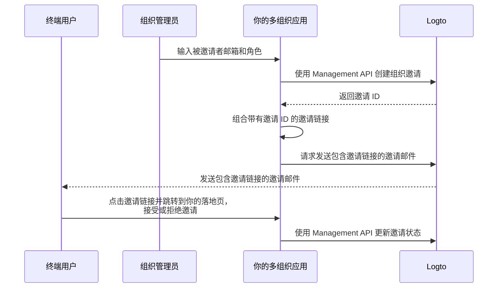

# 邀请组织成员

作为一个多组织应用，一个常见需求是邀请成员加入你的组织。在本指南中，我们将带你了解在应用中实现此功能的步骤和技术细节。

## 流程概览 \{#flow-overview}

整体流程如下图所示：



## 创建组织角色 \{#create-organization-roles}

在邀请成员加入组织之前，你需要先创建组织角色。查看 [组织模板](/authorization/organization-template) 以了解更多关于组织角色和权限的信息。

在本指南中，我们创建两个典型的组织角色：`admin` 和 `member`。

`admin` 角色拥有对组织内所有资源的完全访问权限，而 `member` 角色的访问权限有限。例如，每个角色可以拥有如下权限集：

- `admin` 角色：
  - `read:data` - 读取所有组织数据资源的权限。
  - `write:data` - 写入所有组织数据资源的权限。
  - `delete:data` - 删除所有组织数据资源的权限。
  - `invite:member` - 邀请成员加入组织。
  - `manage:member` - 管理组织成员。
  - `delete:member` - 移除组织成员。
- `member` 角色：
  - `read:data` - 读取所有组织数据资源的权限。
  - `write:data` - 写入所有组织数据资源的权限。
  - `invite:member` - 邀请成员加入组织。

你可以在 [Logto 控制台](https://cloud.logto.io/) 轻松完成上述操作。你也可以使用 [Logto Management API](https://openapi.logto.io/operation/operation-createorganizationrole) 以编程方式创建组织角色。

## 配置你的邮件连接器 \{#configure-your-email-connector}

由于邀请是通过邮件发送的，请确保你的 [邮件连接器](/connectors/email-connectors) 已正确配置。要发送邀请，你需要配置一个 [邮件模板](/connectors/email-connectors/email-templates#email-template-types) 用法类型 - `OrganizationInvitation`。你还可以在内容中包含组织（如组织名称、Logo）和邀请人（如邀请人邮箱、姓名）[变量](/connectors/email-connectors/email-templates#email-template-variables)，或根据需要自定义 [多语言模板](/connectors/email-connectors/email-templates#email-template-localization)。

下面是一个 `OrganizationInvitation` 用法类型的邮件模板示例：

```json
{
  "subject": "欢迎加入我的组织",
  "content": "<p>通过此 <a href=\"{{link}}\" target=\"_blank\">链接</a> 加入 {{organization.name}}。</p>",
  "usageType": "OrganizationInvitation",
  "type": "text/html"
}
```

邮件内容中的 `{{link}}` 占位符会在发送邮件时被实际的邀请链接替换。在本指南中，假设它为 `https://your-app.com/invitation/accept/{your-invitation-id}`。

:::note

Logto Cloud 内置的“Logto 邮件服务”目前不支持 `OrganizationInvitation` 用法类型。你需要配置自己的邮件连接器（如 Sendgrid）并设置 `OrganizationInvitation` 模板。

:::

## 使用 Logto Management API 处理邀请 \{#handle-invitations-with-logto-management-api}

:::note

如果你还没有设置 Logto Management API，请参考 [与 Management API 交互](/integrate-logto/interact-with-management-api) 获取详细信息。

:::

我们在组织功能中提供了一组与邀请相关的 Management API。通过这些 API，你可以：

- `POST /api/organization-invitations` 创建带有指定组织角色的组织邀请。
- `POST /api/organization-invitations/{id}/message` 通过邮件向被邀请者发送组织邀请。
  注意：此 API 的 payload 支持 `link` 属性，你可以基于邀请 ID 组合你的邀请链接。例如：

  ```json
  {
    "link": "https://your-app.com/invitation/accept/{your-invitation-id}"
  }
  ```

  相应地，你需要实现一个落地页，当被邀请者通过邀请链接跳转到你的应用时进行处理。

- `GET /api/organization-invitations` & `GET /api/organization-invitations/{id}` 获取你所有的邀请或根据 ID 获取特定邀请。
  在你的落地页上，使用这些 API 列出用户收到的所有邀请或某个邀请的详细信息。
- `PUT /api/organization-invitations/{id}/status` 通过更新邀请状态来接受或拒绝邀请。
  使用此 API 处理用户对邀请的响应。

## 使用基于组织角色的访问控制 (RBAC) 管理用户权限 \{#use-organization-role-based-access-control-rbac-to-manage-user-permissions}

通过上述设置，你现在可以通过邮件发送邀请，被邀请者可以以分配的角色加入组织。

拥有不同组织角色的用户将在其组织令牌 (Organization token) 中拥有不同的权限 (Scopes)。因此，你的客户端应用和后端服务都应检查这些权限 (Scopes) 以确定可见功能和允许的操作。

## 处理组织令牌 (Organization token) 中的权限 (Scope) 更新 \{#handle-scope-updates-in-organization-tokens}

:::note
本节涉及组织模板和授权 (Authorization) 场景的高级主题。如果你不熟悉这些概念，请先阅读 [授权 (Authorization)](/authorization) 和 [组织模板](/authorization/organization-template)。
:::

管理组织令牌 (Organization token) 中权限 (Scope) 的更新包括：

### 撤销已有权限 (Revoking existing scopes) \{#revoking-existing-scopes}

例如，将管理员降级为非管理员成员时，应移除该用户的权限 (Scopes)。此时，你只需清除缓存的组织令牌 (Organization token)，并使用刷新令牌 (Refresh token) 获取新的组织令牌 (Organization token)。收缩后的权限 (Scopes) 会立即反映在新签发的组织令牌 (Organization token) 中。

### 授予新权限 (Granting new scopes) \{#granting-new-scopes}

这又可以细分为两种场景：

#### 授予已在认证系统中定义的新权限 (Grant new scopes that already defined in your auth system) \{#grant-new-scopes-that-already-defined-in-your-auth-system}

与撤销权限 (Scopes) 类似，如果新授予的权限 (Scope) 已在认证服务器注册，你只需签发新的组织令牌 (Organization token)，新权限 (Scopes) 会立即生效。

#### 授予认证系统中新引入的权限 (Grant new scopes that are newly introduced your auth system) \{#grant-new-scopes-that-are-newly-introduced-your-auth-system}

此时，你需要触发重新登录或重新授权流程，以更新用户的组织令牌 (Organization token)。例如，调用 Logto SDK 中的 `signIn` 方法。

### 实现实时权限检查并更新组织令牌 (Organization token) \{#implement-real-time-permission-check-and-update-organization-token}

Logto 提供了 Management API 用于获取用户在组织中的实时权限 (Permissions)。

- `GET /api/organizations/{id}/users/{userId}/scopes` ([API 参考](https://openapi.logto.io/operation/operation-listorganizationuserscopes))

你可以将用户组织令牌 (Organization token) 中的权限 (Scopes) 与实时权限 (Permissions) 进行对比，以判断用户是否被提升或降级。

- 如果被降级，你只需清除缓存的组织令牌 (Organization token)，SDK 会自动签发带有更新权限 (Scopes) 的新令牌 (Organization token)。

  ```ts
  const { clearAccessToken } = useLogto();

  ...
  // 如果获取到的实时权限 (Scopes) 少于组织令牌 (Organization token) 中的权限 (Scopes)
  await clearAccessToken();
  ```

  这不需要重新登录或重新授权流程。Logto SDK 会自动签发新的组织令牌 (Organization token)。

- 如果你的认证系统中引入了新的权限 (Scope)，则需触发重新登录或重新授权流程以更新用户的组织令牌 (Organization token)。以 React SDK 为例：

  ```ts
  const { clearAllTokens, signIn } = useLogto();

  ...
  // 如果获取到的实时权限 (Scopes) 比组织令牌 (Organization token) 中的权限 (Scopes) 多
  await clearAllTokens();
  signIn({
    redirectUri: '<your-sign-in-redirect-uri>',
    prompt: 'consent',
  });
  ```

  上述代码会触发页面跳转到用户授权页面 (Consent screen)，并自动重定向回你的应用，用户组织令牌 (Organization token) 中的权限 (Scopes) 会被更新。

## 相关资源 \{#related-resources}

<Url href="https://blog.logto.io/implement-user-collaboration-in-your-app">
  我们如何在多租户应用中实现用户协作
</Url>
