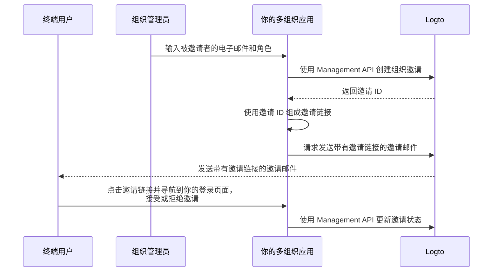

# 邀请组织成员

作为一个多组织应用程序，一个常见的需求是邀请成员加入你的组织。在本指南中，我们将引导你完成在应用程序中实现此功能的步骤和技术细节。

## 流程概览 \{#flow-overview}

整体流程如下图所示：



## 创建组织角色 \{#create-organization-roles}

在邀请成员加入你的组织之前，你需要创建组织角色。查看 [配置组织模板](/authorization/organization-template/configure-organization-template)指南以获取详细说明。

在本指南中，我们将创建两个典型的组织角色：`admin` 和 `member`。

`admin` 角色对组织中的所有资源具有完全访问权限，而 `member` 角色具有有限的访问权限。例如，每个角色可以拥有以下权限集：

- `admin` 角色：
  - `read:data` - 读取所有组织数据资源的权限。
  - `write:data` - 写入所有组织数据资源的权限。
  - `delete:data` - 删除所有组织数据资源的权限。
  - `invite:member` - 邀请成员加入组织。
  - `manage:member` - 管理组织中的成员。
  - `delete:member` - 从组织中移除成员。
- `member` 角色：
  - `read:data` - 读取所有组织数据资源的权限。
  - `write:data` - 写入所有组织数据资源的权限。
  - `invite:member` - 邀请成员加入组织。

这可以在 [Logto Console](https://cloud.logto.io/) 中轻松完成。你也可以使用 [Logto Management API](https://openapi.logto.io/operation/operation-createorganizationrole) 以编程方式创建组织角色。

## 配置你的电子邮件连接器 \{#configure-your-email-connector}

由于邀请是通过电子邮件发送的，请确保你的 [电子邮件连接器](/connectors/email-connectors)已正确配置。要发送邀请，你需要配置一个 [电子邮件模板](/connectors/email-connectors/email-templates#email-template-types) 使用类型 - `OrganizationInvitation`。你还可以在内容中包含组织（例如，组织名称、徽标）和邀请者（例如，邀请者电子邮件、姓名）[变量](/connectors/email-connectors/email-templates#email-template-variables)，或根据需要自定义[多语言模板](/connectors/email-connectors/email-templates#email-template-localization)。

以下是 `OrganizationInvitation` 使用类型的示例电子邮件模板：

```json
{
  "subject": "欢迎加入我的组织",
  "content": "<p>通过此 <a href=\"{{link}}\" target=\"_blank\">链接</a> 加入 {{organization.name}}。</p>",
  "usageType": "OrganizationInvitation",
  "type": "text/html"
}
```

电子邮件内容中的 `{{link}}` 占位符将在发送电子邮件时替换为实际的邀请链接。在本指南中，假设它是 `https://your-app.com/invitation/accept/{your-invitation-id}`。

:::note

Logto Cloud 内置的“Logto 电子邮件服务”目前不支持 `OrganizationInvitation` 使用类型。相反，你需要配置你的电子邮件连接器（例如 Sendgrid）并设置 `OrganizationInvitation` 模板。

:::

## 使用 Logto Management API 处理邀请 \{#handle-invitations-with-logto-management-api}

:::note

如果你尚未设置 Logto Management API，请查看 [与 Management API 交互](/integrate-logto/interact-with-management-api)以获取详细信息。

:::

我们在组织功能中提供了一组与邀请相关的 Management API。使用这些 API，你可以：

- `POST /api/organization-invitations` 创建具有分配的组织角色的组织邀请。
- `POST /api/organization-invitations/{id}/message` 通过电子邮件将组织邀请发送给被邀请者。
  注意：此 API 负载支持 `link` 属性，你可以根据邀请 ID 组成你的邀请链接。例如：

  ```json
  {
    "link": "https://your-app.com/invitation/accept/{your-invitation-id}"
  }
  ```

  相应地，你需要实现一个登录页面，当被邀请者通过邀请链接导航到你的应用程序时。

- `GET /api/organization-invitations` 和 `GET /api/organization-invitations/{id}` 获取所有邀请或通过 ID 获取特定邀请。
  在你的登录页面上，使用这些 API 列出用户收到的所有邀请或邀请的详细信息。
- `PUT /api/organization-invitations/{id}/status` 通过更新邀请状态来接受或拒绝邀请。
  使用此 API 处理用户对邀请的响应。

请注意，上述所有 API 都需要有效的“组织令牌”。[查看本指南](/authorization/organization-template/protect-organization-resources#step-2-fetch-organization-token)以了解如何获取组织令牌。

## 使用组织基于角色的访问控制 (RBAC) 管理用户权限 \{#use-organization-role-based-access-control-rbac-to-manage-user-permissions}

通过上述设置，你现在可以通过电子邮件发送邀请，被邀请者可以以分配的角色加入组织。

具有不同组织角色的用户将在其组织令牌中拥有不同的权限 (Scopes)。因此，你的客户端应用程序和后端服务都应检查这些权限以确定可见功能和允许的操作。

## 处理组织令牌中的权限更新 \{#handle-scope-updates-in-organization-tokens}

:::note

确保你已将组织集成到你的应用程序中。查看 [集成指南](/authorization/organization-template/protect-organization-resources)以获取更多详细信息。

:::

管理组织令牌中的权限更新涉及：

### 撤销现有权限 \{#revoking-existing-scopes}

例如，将管理员降级为非管理员成员应从用户中移除权限。在这种情况下，你可以简单地清除缓存的组织令牌并使用刷新令牌获取新的令牌。缩减的权限将立即反映在新颁发的组织令牌中。

### 授予新权限 \{#granting-new-scopes}

这可以进一步分为两种情况：

#### 授予已在你的认证系统中定义的新权限 \{#grant-new-scopes-that-already-defined-in-your-auth-system}

类似于撤销权限，如果新授予的权限已在认证服务器中注册，你可以简单地颁发一个新的组织令牌，新权限将立即反映。

#### 授予在你的认证系统中新引入的权限 \{#grant-new-scopes-that-are-newly-introduced-your-auth-system}

在这种情况下，你需要触发重新登录或重新授权过程以更新用户的组织令牌。例如，在 Logto SDK 中调用 `signIn` 方法。

了解更多关于[颁发组织令牌](/authorization/organization-template/protect-organization-resources/#fetch-the-organization-token)的信息。

### 实现实时权限检查并更新组织令牌 \{#implement-real-time-permission-check-and-update-organization-token}

Logto 提供 Management API 来获取组织中用户的实时权限。

- `GET /api/organizations/{id}/users/{userId}/scopes` ([API 参考](https://openapi.logto.io/operation/operation-listorganizationuserscopes))

然后，你可以将用户组织令牌中的权限与实时权限进行比较，以确定用户是否已被提升或降级。

- 如果降级，你可以简单地清除缓存的组织令牌，SDK 将自动颁发一个带有更新权限的新令牌。

  ```ts
  const { clearAccessToken } = useLogto();

  ...
  // 如果获取的实时权限少于组织令牌权限
  await clearAccessToken();
  ```

  这不需要重新登录或重新授权过程。新的组织令牌将由 Logto SDK 自动颁发。

- 如果在你的认证系统中引入了新权限，触发重新登录或重新授权过程以更新用户的组织令牌。以 React SDK 为例：

  ```ts
  const { clearAllTokens, signIn } = useLogto();

  ...
  // 如果获取的实时权限比组织令牌权限有新分配的权限
  await clearAllTokens();
  signIn({
    redirectUri: '<your-sign-in-redirect-uri>',
    prompt: 'consent',
  });
  ```

  上述代码将触发页面导航到用户授权页面，并自动重定向回你的应用程序，用户组织令牌中的权限将更新。

## 相关资源 \{#related-resources}

<Url href="https://blog.logto.io/implement-user-collaboration-in-your-app">
  我们如何在多租户应用中实现用户协作
</Url>