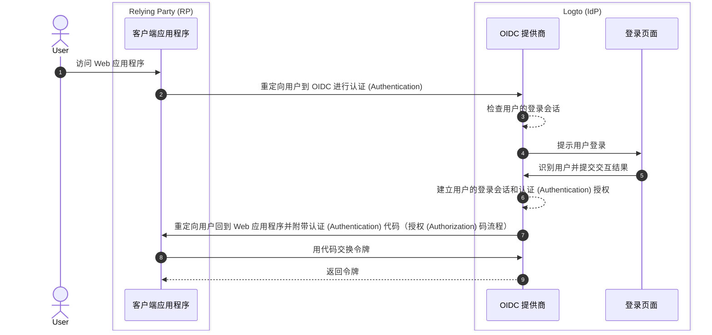

# 登出

在 Logto（作为基于 OIDC 的身份提供商）中，登出过程是一个多方面的概念，因为它涉及到由 Logto 管理的集中式登录会话和由客户端应用程序管理的分布式认证 (Authentication) 状态。

## 登录会话

为了更好地理解登出过程，首先需要了解 Logto 中用户登录会话及其认证 (Authentication) 状态是如何管理的。



1. 用户访问 Web 应用程序（RP）。
2. 客户端应用程序将用户重定向到 Logto（IdP）进行[认证 (Authentication)](https://auth.wiki/authentication)。
3. OIDC 提供商检查用户的登录会话状态。如果没有会话或会话已过期，用户将被提示登录。
4. 用户与登录页面交互以进行认证 (Authentication)。
5. 登录成功后，Logto 为用户创建一个新会话，并重定向回客户端应用程序并附带授权 (Authorization) 码。
6. OIDC 提供商为用户创建一个新的登录会话和认证 (Authentication) 授权。
7. OIDC 提供商将用户重定向回客户端并附带认证 (Authentication) 代码（[授权 (Authorization) 码流程](https://auth.wiki/authorization-code-flow)）。
8. 客户端接收认证 (Authentication) 代码并用其交换令牌以访问用户信息。
9. 向客户端应用程序授予令牌。

## 组件

### 由 Logto 管理的集中式登录会话

在上述流程中，集中式登录会话由 Logto 管理。用户成功登录时会创建会话，用户登出时会销毁会话。用户的会话过期时也会销毁会话。

Logto 登录会话使用会话 Cookie 管理。用户登录时会设置会话 Cookie。所有的认证 (Authentication) 请求都会根据会话 Cookie 进行验证。如果会话 Cookie 存在且有效，用户将自动认证 (Authentication) 并直接重定向到客户端应用程序并附带授权 (Authorization) 码。否则，用户将被提示登录。

1. 共享的 Logto 会话 Cookie
   对于从同一用户代理（例如浏览器）登录多个客户端应用程序的用户，用户将在 Logto 域下拥有一个共享的会话 Cookie。这意味着用户只需登录一次即可自动认证 (Authentication) 其他客户端应用程序。

   ```mermaid
    flowchart TD
    subgraph User [用户代理 A]
      U[用户]

      subgraph Layer1 [客户端域 A]
        A[客户端应用程序 A]
      end

      subgraph Layer1 [客户端域 B]
        B[客户端应用程序 B]
      end

      subgraph Layer2 [Logto 域]
          C{{Logto 登录会话？}}
          D[登录页面]
      end
    end

    U --> |登录| A
    A --> |重定向到 Logto| C
    U --> |登录| B
    B --> |重定向到 Logto| C
    C --> |否| D
    D --> |创建会话| C
   ```

2. 独立的 Logto 会话 Cookie
   对于从不同设备或浏览器登录不同客户端应用程序的用户，用户将在 Logto 域下拥有独立的会话 Cookie。这意味着用户需要分别为每个客户端应用程序登录。

   ```mermaid
    flowchart TD
    U[用户]

    subgraph DeviceA [用户代理 A]
      subgraph Layer1 [客户端域 A]
        A[客户端应用程序 A]
      end

      subgraph Layer2 [Logto 域]
          C{{Logto 登录会话？}}
          D[登录页面]
      end
    end

    subgraph DeviceB [用户代理 B]
      subgraph Layer3 [客户端域 B]
        B[客户端应用程序 B]
      end

      subgraph Layer4 [Logto 域]
          E{{Logto 登录会话？}}
          F[登录页面]
      end
    end

    U --> |登录| A
    A --> |重定向到 Logto| C
    U --> |登录| B
    B --> |重定向到 Logto| E
    C --> |否| D
    E --> |否| F
    D --> |创建会话| C
    F --> |创建会话| E
   ```

## 由客户端应用程序管理的分布式认证 (Authentication) 状态

每个客户端应用程序维护其自己的认证 (Authentication) 状态。无论是原生应用、SPA 还是 Web 应用程序，都有其自己的方式来管理用户的认证 (Authentication) 状态。

登录成功后，客户端应用程序可能会收到一个 [ID 令牌](https://auth.wiki/id-token) 和一个 [访问令牌](https://auth.wiki/access-token)。客户端应用程序可以使用 ID 令牌来确定用户的身份，并使用访问令牌来访问用户的资源。用户的认证 (Authentication) 状态由访问令牌的过期时间表示。

- 原生和 SPA 应用程序：
  客户端应用程序需要安全地存储和管理这些令牌以维护用户的认证 (Authentication) 状态。例如，将令牌存储在本地存储或会话存储中，并在用户登出时清除令牌。
- Web 应用程序：
  像使用 Next.js 等框架构建的 Web 应用程序通常会在管理用户登录会话的同时管理 Logto 发放的令牌。一旦用户登录，Web 应用程序从 Logto 接收到令牌后，可以像 SPA 应用程序一样在客户端存储令牌，或者在服务器端存储令牌并使用 Cookie 或其他机制管理会话。

## 登出机制

### 清除客户端的令牌和本地会话

在客户端，简单的登出涉及清除本地会话并从本地存储或会话存储中移除令牌（ID 令牌、访问令牌、刷新令牌）。这会导致仅在客户端的登出，而集中式会话仍然保持不变。以这种方式登出的用户可能仍然能够访问同一授权 (Authorization) 服务器会话下的其他应用程序，直到集中式会话过期或被主动销毁。

### 清除 Logto 的登录会话

为了明确地登出用户并清除 Logto 的会话，客户端应用程序需要将用户重定向到 Logto 的 **结束会话端点**。

例如：`https://{your-logto-domain}/oidc/session/end`

**结束会话端点**是一个标准的 OIDC 端点，允许客户端应用程序通知授权 (Authorization) 服务器用户已登出。该端点将清除 Logto 的集中式登录会话。

一旦会话被清除，任何后续的授权 (Authorization) 请求都将要求用户重新登录。

如果提供了 **登出后重定向 URI**，用户将在会话清除后被重定向到指定的 URI。否则，用户将被重定向到 Logto 托管的默认登出后页面。

## 联邦登出：后端通道登出

为了更一致地管理登出，Logto 支持[后端通道登出](https://openid.net/specs/openid-connect-backchannel-1_0-final.html)。后端通道登出是一种机制，允许 Logto 在用户登出时通知同一登录会话下的所有客户端应用程序。

这在用户从一个客户端应用程序登出并期望从同一 Logto 登录会话下的所有其他客户端应用程序登出时特别有用。

要为你的客户端应用程序启用后端通道登出，请转到 Logto 仪表板中的应用程序详细信息页面，并注册一个后端通道登出 URI。当用户从任何客户端应用程序发起登出请求时，Logto 将向所有注册的 URI 发送一个登出令牌。

如果你的客户端应用程序需要在登出令牌中包含登录会话，请在后端通道登出配置中打开 `Is session required` 设置。一个 `sid` 声明将包含在登出令牌中，以识别 Logto 中用户的登录会话。

1. 用户从一个客户端应用程序发起登出请求。
2. Logto 接收到结束会话请求，生成一个登出令牌，并将登出令牌发送到所有注册的后端通道登出 URI。
3. 每个客户端应用程序接收到登出令牌并执行登出操作。

每个客户端应用程序在接收到登出令牌时的登出操作：

- 验证登出令牌。
- 清除本地会话并从本地存储或会话存储中移除令牌。

## Logto SDK 中的登出方法

如果你正在使用 Logto 的 SDK 将 Logto 集成到你的客户端应用程序中：

- 对于 SPA 和 Web 应用程序，`client.signOut()` 方法将清除本地令牌存储，并将用户重定向到 Logto 的结束会话端点。你可以指定一个 **登出后重定向 URI**，以便在会话清除后重定向用户。
- 对于原生应用程序（包括 **React Native** 和 **Flutter** 等混合应用程序），仅清除本地令牌存储。这是因为在原生应用程序中，我们使用无会话 Webview 处理登录过程。原生浏览器中没有存储会话 Cookie，因此无需清除 Logto 的登录会话。每个认证 (Authentication) 请求都是一个独立的请求，不携带任何会话 Cookie。

:::note
对于不支持无会话 Webview 或不识别 `emphasized` 设置的原生应用程序（使用 **React Native** 或 **Flutter** SDK 的 Android 应用程序），你可以通过在授权 (Authorization) 请求中传递 `prompt=login` 参数来强制用户再次登录。
:::

## 常见问题解答

<details>
  <summary> 我没有收到后端通道登出通知。</summary>

- 确保后端通道登出 URI 已正确注册在 Logto 仪表板中。
- 确保你的客户端应用程序有一个有效的活动登录会话，并且与发起登出请求的会话相同。

</details>

## 相关资源

<Url href="https://blog.logto.io/oidc-back-channel-logout/">理解 OIDC 后端通道登出。</Url>
