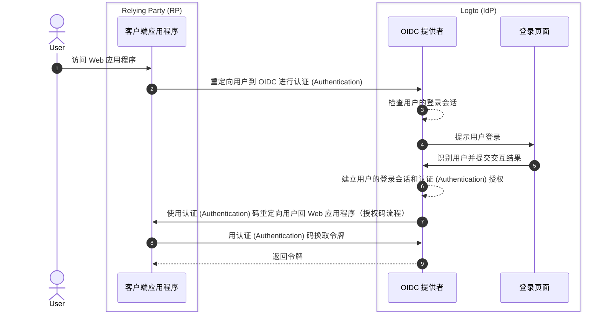

# 登出

在 Logto（作为基于 OIDC 的身份提供商）中，登出流程是一个多层面的概念，因为它涉及到由 Logto 管理的集中式登录会话以及由客户端应用程序管理的分布式认证 (Authentication) 状态。

## 登录会话 \{#sign-in-session}

为了更好地理解登出流程，首先需要了解 Logto 中用户登录会话及其认证 (Authentication) 状态的管理方式。



1. 用户访问 Web 应用程序（RP）。
2. 客户端应用程序将用户重定向到 Logto（IdP）进行[认证 (Authentication)](https://auth.wiki/authentication)。
3. OIDC 提供者检查用户的登录会话状态。如果没有会话或会话已过期，则提示用户登录。
4. 用户与登录页面交互以完成认证 (Authentication)。
5. 登录成功后，Logto 为用户创建新的会话，并带着授权码重定向回客户端应用程序。
6. OIDC 提供者为用户创建新的登录会话和认证 (Authentication) 授权。
7. OIDC 提供者带着认证 (Authentication) 码将用户重定向回客户端（[授权码流程](https://auth.wiki/authorization-code-flow)）。
8. 客户端收到认证 (Authentication) 码并用其换取令牌以访问用户信息。
9. 向客户端应用程序授予令牌。

## 组件 \{#components}

### 由 Logto 管理的集中式登录会话 \{#centralized-sign-in-session-managed-by-logto}

在上述流程中，集中式登录会话由 Logto 管理。用户成功登录时会创建会话，用户登出时会销毁会话。用户会话过期时也会销毁会话。

Logto 登录会话通过会话 Cookie 管理。用户登录时会设置会话 Cookie。所有认证 (Authentication) 请求都会根据会话 Cookie 进行校验。如果会话 Cookie 存在且有效，用户将被自动认证 (Authentication) 并直接重定向到客户端应用程序并带上授权码。否则，用户会被提示登录。

1. 共享 Logto 会话 Cookie  
   对于从同一用户代理（如浏览器）登录多个客户端应用程序的用户，用户会在 Logto 域下拥有一个共享的会话 Cookie。这意味着用户只需登录一次，便可自动认证 (Authentication) 其他客户端应用程序。

   ```mermaid
    flowchart TD
    subgraph User [用户代理 A]
      U[用户]

      subgraph Layer1 [客户端域名 A]
        A[客户端应用程序 A]
      end

      subgraph Layer1 [客户端域名 B]
        B[客户端应用程序 B]
      end

      subgraph Layer2 [Logto 域名]
          C{{Logto 登录会话？}}
          D[登录页面]
      end
    end

    U --> |登录| A
    A --> |重定向到 Logto| C
    U --> |登录| B
    B --> |重定向到 Logto| C
    C --> |否| D
    D --> |创建会话| C
   ```

2. 隔离的 Logto 会话 Cookie  
   对于从不同设备或浏览器登录不同客户端应用程序的用户，用户会在 Logto 域下拥有隔离的会话 Cookie。这意味着用户需要分别为每个客户端应用程序登录。

   ```mermaid
    flowchart TD
    U[用户]

    subgraph DeviceA [用户代理 A]
      subgraph Layer1 [客户端域名 A]
        A[客户端应用程序 A]
      end

      subgraph Layer2 [Logto 域名]
          C{{Logto 登录会话？}}
          D[登录页面]
      end
    end

    subgraph DeviceB [用户代理 B]
      subgraph Layer3 [客户端域名 B]
        B[客户端应用程序 B]
      end

      subgraph Layer4 [Logto 域名]
          E{{Logto 登录会话？}}
          F[登录页面]
      end
    end

    U --> |登录| A
    A --> |重定向到 Logto| C
    U --> |登录| B
    B --> |重定向到 Logto| E
    C --> |否| D
    E --> |否| F
    D --> |创建会话| C
    F --> |创建会话| E
   ```

## 由客户端应用程序管理的分布式认证 (Authentication) 状态 \{#distributed-authentication-status-managed-by-the-client-applications}

每个客户端应用程序都维护自己的认证 (Authentication) 状态。无论是 Native、SPA 还是 Web 应用程序，都有各自管理用户认证 (Authentication) 状态的方式。

登录成功后，客户端应用程序可能会收到 [ID 令牌](https://auth.wiki/id-token) 和 [访问令牌](https://auth.wiki/access-token)。客户端应用程序可以使用 ID 令牌来确定用户身份，使用访问令牌访问用户资源。用户的认证 (Authentication) 状态由访问令牌的过期时间表示。

- Native 和 SPA 应用程序：  
  客户端应用程序需要安全地存储和管理这些令牌，以维持用户的认证 (Authentication) 状态。例如，将令牌存储在本地存储或会话存储中，用户登出时清除令牌。
- Web 应用程序：  
  例如使用 Next.js 等框架构建的 Web 应用通常会在本地会话中管理已登录用户，同时结合 Logto 下发的令牌。用户登录后，Web 应用收到 Logto 的令牌，可以像 SPA 应用一样在客户端存储令牌，或在服务端存储令牌并通过 Cookie 或其他机制管理会话。

## 登出机制 \{#sign-out-mechanisms}

### 清除客户端本地令牌和会话 \{#clear-tokens-and-local-session-at-the-client-side}

在客户端，简单的登出操作包括清除本地会话并从本地存储或会话存储中移除令牌（ID 令牌、访问令牌、刷新令牌）。这种方式只会在客户端登出，集中式会话仍然存在。以这种方式登出的用户，仍然可以在同一授权服务器会话下访问其他应用，直到集中式会话过期或被主动销毁。

### 清除 Logto 登录会话 \{#clear-sign-in-session-at-logto}

如需显式登出用户并清除 Logto 端的会话，客户端应用程序需要将用户重定向到 Logto 的 **end session endpoint**。

例如：`https://{your-logto-domain}/oidc/session/end`

**end session endpoint** 是标准的 OIDC 端点，允许客户端应用程序通知授权服务器用户已登出。该端点会清除 Logto 的集中式登录会话。

会话清除后，任何后续的授权请求都需要用户重新登录。

如果提供了 **post-logout redirect URI**，会话清除后用户会被重定向到指定的 URI。否则，用户会被重定向到 Logto 托管的默认登出后页面。

## 联邦登出：后端通道登出（Back-channel logout）\{#federated-sign-out-back-channel-logout}

为实现更一致的登出管理，Logto 支持 [后端通道登出（back-channel logout）](https://openid.net/specs/openid-connect-backchannel-1_0-final.html)。后端通道登出是一种机制，允许 Logto 在用户登出时通知同一登录会话下的所有客户端应用程序。

这在用户从某个客户端应用程序登出并希望同时退出同一 Logto 登录会话下所有其他客户端应用程序时尤为有用。

要为你的客户端应用程序启用后端通道登出，请前往 Logto 控制台的应用详情页，注册后端通道登出 URI。当用户从任一客户端应用程序发起登出请求时，Logto 会向所有已注册的 URI 发送登出令牌。

如果你的客户端应用程序需要在登出令牌中包含登录会话，可在后端通道登出配置中开启 `Is session required` 设置。此时，登出令牌中会包含 `sid` 声明，用于标识 Logto 上用户的登录会话。

1. 用户从某个客户端应用程序发起登出请求。
2. Logto 收到 end session 请求，生成登出令牌，并将其发送到所有已注册的后端通道登出 URI。
3. 每个客户端应用程序收到登出令牌并执行登出操作。

客户端应用程序收到登出令牌后的登出操作：

- 校验登出令牌。
- 清除本地会话并从本地存储或会话存储中移除令牌。

## Logto SDK 中的登出方法 \{#sign-out-methods-in-logto-sdks}

如果你通过 Logto 的 SDK 集成客户端应用程序：

- 对于 SPA 和 Web 应用，`client.signOut()` 方法会清除本地令牌存储，并将用户重定向到 Logto 的 end session endpoint。你可以指定 **post-logout redirect URI**，以便会话清除后重定向用户。
- 对于原生应用（包括 **React Native** 和 **Flutter** 等混合应用），只会清除本地令牌存储。这是因为在原生应用中，我们使用无会话 webview 处理登录流程。原生浏览器中不会存储会话 Cookie，因此无需清除 Logto 的登录会话。每次认证 (Authentication) 请求都是独立的，不携带任何会话 Cookie。

:::note
对于不支持无会话 webview 或无法识别 `emphasized` 设置的原生应用（如使用 **React Native** 或 **Flutter** SDK 的 Android 应用），你可以在授权请求中传递 `prompt=login` 参数，强制用户重新登录。
:::

## 强制每次访问都重新认证 (Authentication) \{#enforce-re-authentication-on-every-access}

在高安全场景下——如在敏感操作前验证用户身份——你可能希望每次访问都要求用户重新认证 (Authentication)。要强制此行为，请在认证 (Authentication) 请求中包含 `prompt=login`。

设置 `prompt=login` 会强制 Logto 始终显示登录页面，无论用户是否有活动会话或最近登录过。这会绕过单点登录 (SSO) 行为，确保用户每次都需输入凭据。

如果你的应用请求了 offline_access scope（以获取刷新令牌），OpenID Connect 规范要求你同时包含 `prompt=consent`。
大多数情况下，为了同时强制重新认证 (Authentication) 并确保刷新令牌下发，应设置：

```
prompt=login consent
```

这样可确保用户被重新认证 (Authentication) 并明确同意离线访问。

## 常见问题 \{#faqs}

<details>
  <summary>

### 我没有收到后端通道登出通知 \{#im-not-receiving-the-back-channel-logout-notifications}

</summary>

- 请确保后端通道登出 URI 已在 Logto 控制台正确注册。
- 请确保你的客户端应用程序有一个有效的活动登录会话，并且与发起登出请求的是同一个会话。

</details>

## 相关资源 \{#related-resources}

<Url href="https://blog.logto.io/oidc-back-channel-logout/">理解 OIDC 后端通道登出。</Url>
