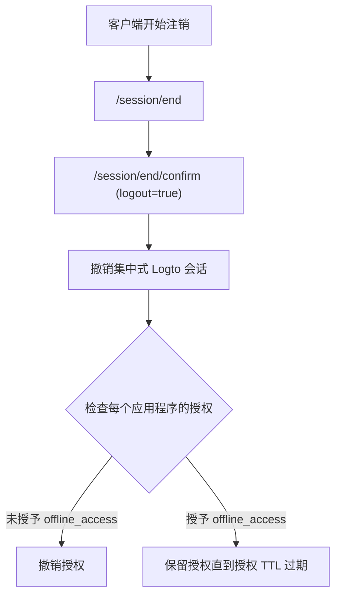

# 注销

在 Logto 中，注销涉及两个层面：

- **Logto 会话注销**：结束 Logto 域下的集中登录会话。
- **应用程序注销**：清除客户端应用程序中的本地会话状态和令牌。

要更好地理解 Logto 中会话的工作原理，请参阅 [会话](/sessions)。

## 注销机制 \{#sign-out-mechanisms}

### 1) 仅客户端注销 \{#1-client-side-only-sign-out}

客户端应用程序清除其自身的本地会话和令牌（ID 令牌 / 访问令牌 / 刷新令牌）。这仅将用户从该应用程序的本地状态中注销。

- Logto 会话可能仍然活跃。
- 其他在同一 Logto 会话下的应用程序可能仍然可以单点登录 (SSO)。

### 2) 在 Logto 结束会话（当前 Logto 实现中的全局注销） \{#2-end-session-at-logto-global-sign-out-in-current-logto-implementation}

要清除集中式 Logto 会话，应用程序将用户重定向到结束会话端点，例如：

`https://{your-logto-domain}/oidc/session/end`

在当前 Logto SDK 行为中：

1. `signOut()` 重定向到 `/session/end`。
2. 然后它进入 `/session/end/confirm`。
3. 默认确认表单自动提交 `logout=true`。

因此，当前 SDK 注销被视为**全局注销**。

:::note

- **全局注销**：撤销集中式 Logto 会话。

:::

### 全局注销期间发生了什么 \{#what-happens-during-global-sign-out}


```mermaid
flowchart TD
  A["客户端开始注销"] --> B["/session/end"]
  B --> C["/session/end/confirm (logout=true)"]
  C --> D["撤销集中式 Logto 会话"]
  D --> E{"检查每个应用程序的授权"}
  E -->|"未授予 offline_access"| F["撤销授权"]
  E -->|"授予 offline_access"| G["保留授权直到授权 TTL 过期"]
```

在全局注销期间：

- 集中式 Logto 会话被撤销。
- 相关应用程序授权根据每个应用程序的授权状态进行处理：
  - 如果未授予 `offline_access`，相关授权将被撤销。
  - 如果授予了 `offline_access`，授权不会被结束会话撤销。
- 对于 `offline_access` 情况，刷新令牌和授权在授权过期前仍然有效。

## 授权生命周期和 `offline_access` 影响 \{#grant-lifetime-and-offline-access-impact}

- 默认 Logto 授权 TTL 为 **180 天**。
- 如果授予了 `offline_access`，结束会话默认不会撤销该应用程序授权。
- 与该授权相关的刷新令牌链可以继续，直到授权过期（或被显式撤销）。

## 联邦注销：后端通道注销 \{#federated-sign-out-back-channel-logout}

为了跨应用程序的一致性，Logto 支持 [后端通道注销](https://openid.net/specs/openid-connect-backchannel-1_0-final.html)。

当用户从一个应用程序注销时，Logto 可以通过向每个应用程序注册的后端通道注销 URI 发送注销令牌来通知参与同一会话的所有应用程序。

如果在应用程序后端通道设置中启用了 `Is session required`，则注销令牌将包含 `sid` 以标识 Logto 会话。

典型流程：

1. 用户从一个应用程序启动注销。
2. Logto 处理结束会话并向注册的后端通道注销 URI 发送注销令牌。
3. 每个应用程序验证注销令牌并清除其自身的本地会话 / 令牌。

## Logto SDK 中的注销方法 \{#sign-out-methods-in-logto-sdks}

- **SPA 和 Web**：`client.signOut()` 清除本地令牌存储并重定向到 Logto 结束会话端点。你可以提供一个注销后重定向 URI。
- **原生应用（包括 React Native / Flutter）**：通常仅清除本地令牌存储。无会话的 webview 意味着没有持久的 Logto 浏览器 cookie 需要清除。

:::note
对于不支持无会话 webview 或不识别 `emphasized` 设置的原生应用程序（使用 **React Native** 或 **Flutter** SDK 的 Android 应用程序），你可以通过在授权请求中传递 `prompt=login` 参数来强制用户再次登录。
:::

## 强制每次访问重新认证 (Authentication) \{#enforce-re-authentication-on-every-access}

对于高安全性操作，在认证请求中包含 `prompt=login` 以绕过 SSO 并每次强制输入凭据。

如果请求 `offline_access`（以接收刷新令牌），还需包含 `consent`，即 `prompt=login consent`。

典型的组合设置：

```txt
prompt=login consent
```

## 常见问题解答 \{#faqs}

<details>
  <summary>

### 我没有收到后端通道注销通知。 \{#im-not-receiving-the-back-channel-logout-notifications}

</summary>

- 确保后端通道注销 URI 在 Logto 仪表板中正确注册。
- 确保你的应用程序对同一用户 / 会话上下文具有活动的登录状态。

</details>

## 相关资源 \{#related-resources}

<Url href="https://blog.logto.io/oidc-back-channel-logout/">理解 OIDC 后端通道注销。</Url>
