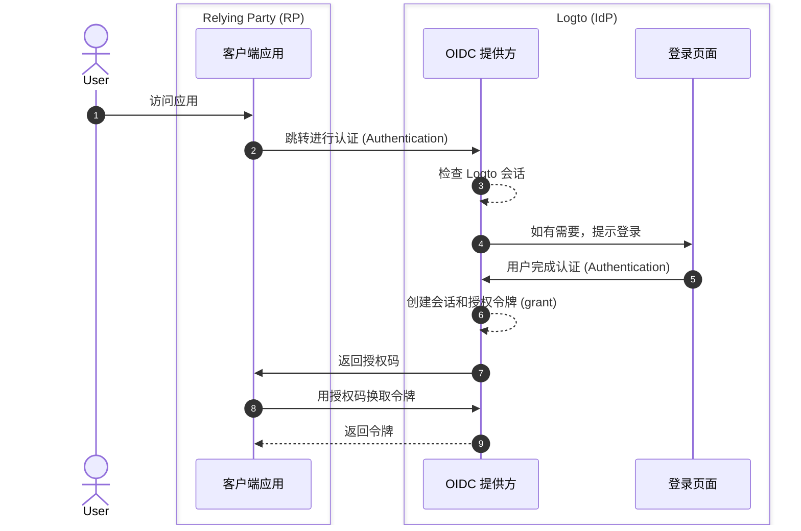
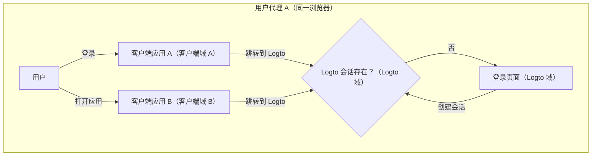
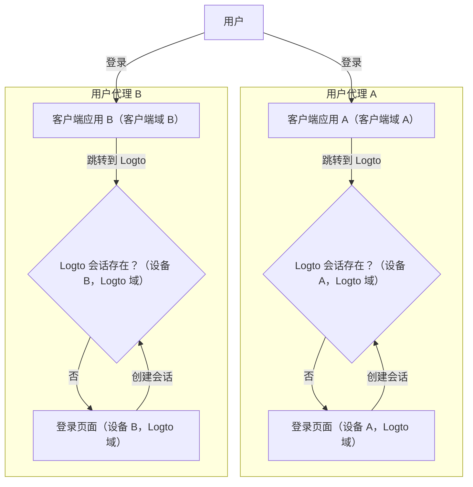
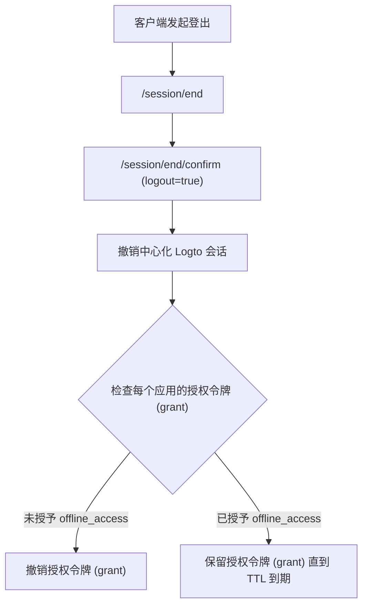

# 登出

在 Logto（作为 OIDC 身份提供商 (IdP)）中，登出涉及以下两个部分：

- **中心化的 Logto 会话**（Logto 域下的浏览器 Cookie），以及
- **分布式客户端认证 (Authentication) 状态**（每个应用中的令牌和本地应用会话）。

为了理解登出行为，建议将这两个层次分开，然后了解**授权令牌 (grant)** 如何连接它们。

## 核心概念 \{#core-concepts}

### 什么是 Logto 会话？\{#what-is-a-logto-session}

Logto 会话是由 Logto 管理的中心化登录状态。它在认证 (Authentication) 成功后创建，并通过 Logto 域下的 Cookie 表示。

如果会话 Cookie 有效，用户可以在信任同一 Logto 租户的多个应用间实现静默认证 (Authentication)（单点登录 (SSO)）。

如果没有有效会话，Logto 会显示登录页面。

### 什么是授权令牌 (grant)？\{#what-are-grants}

**授权令牌 (grant)** 表示特定用户 + 客户端应用的授权 (Authorization) 状态。

- 一个 Logto 会话可以拥有多个客户端应用的授权令牌 (grant)。
- 授权令牌 (grant) 是已颁发令牌所关联的对象。
- 在本文档中，**授权令牌 (grant)** 用作跨应用授权 (Authorization) 单元。

### 会话、授权令牌 (grant) 和客户端认证 (Authentication) 状态的关系 \{#how-session-grants-and-client-auth-status-relate}

```mermaid
flowchart LR
  subgraph Logto [Logto 域]
    S[Logto 会话]
    G1[App A 的授权令牌 (grant)]
    G2[App B 的授权令牌 (grant)]
  end

  subgraph AppA [客户端域 A]
    A[本地会话 / 令牌]
  end

  subgraph AppB [客户端域 B]
    B[本地会话 / 令牌]
  end

  S --> G1
  S --> G2
  G1 --> A
  G2 --> B
```

- **Logto 会话** 控制中心化的单点登录 (SSO) 体验。
- **客户端本地会话 / 令牌** 控制每个应用当前是否将用户视为已登录。
- **授权令牌 (grant)** 通过表示应用特定的授权 (Authorization) 状态连接这两个世界。

## 登录回顾（为什么登出是多层次的）\{#sign-in-recap-why-sign-out-is-multi-layered}


```mermaid
sequenceDiagram
  autonumber
  actor User

  box Relying Party (RP)
    participant Client as 客户端应用
  end

  box Logto (IdP)
    participant OIDC as OIDC 提供方
    participant SignIn as 登录页面
  end

  User ->> Client: 访问应用
  Client ->> OIDC: 跳转进行认证 (Authentication)
  OIDC -->> OIDC: 检查 Logto 会话
  OIDC ->> SignIn: 如有需要，提示登录
  SignIn ->> OIDC: 用户完成认证 (Authentication)
  OIDC -->> OIDC: 创建会话和授权令牌 (grant)
  OIDC ->> Client: 返回授权码
  Client ->> OIDC: 用授权码换取令牌
  OIDC -->> Client: 返回令牌
```

## 跨应用 / 设备的会话拓扑结构 \{#session-topology-across-apps-devices}

### 共享会话 Cookie（同一浏览器 / 用户代理）\{#shared-session-cookie-same-browser-user-agent}

如果用户在同一浏览器中登录多个应用，这些应用可以复用同一个 Logto 会话 Cookie，并应用单点登录 (SSO) 行为。


```mermaid
flowchart TD
  U[用户]
  A["客户端应用 A（客户端域 A）"]
  B["客户端应用 B（客户端域 B）"]
  C{"Logto 会话存在？（Logto 域）"}
  D["登录页面（Logto 域）"]

  subgraph UA["用户代理 A（同一浏览器）"]
    U
    A
    B
    C
    D
  end

  U -->|登录| A
  A -->|跳转到 Logto| C
  U -->|打开应用| B
  B -->|跳转到 Logto| C
  C -->|否| D
  D -->|创建会话| C
```

### 隔离的会话 Cookie（不同设备 / 浏览器）\{#isolated-session-cookies-different-devices-browsers}

不同浏览器 / 设备持有不同的 Logto Cookie，因此登录会话状态是隔离的。


```mermaid
flowchart TD
  U[用户]
  A["客户端应用 A（客户端域 A）"]
  C{"Logto 会话存在？（设备 A，Logto 域）"}
  D["登录页面（设备 A，Logto 域）"]

  subgraph DeviceA["用户代理 A"]
    A
    C
    D
  end

  B["客户端应用 B（客户端域 B）"]
  E{"Logto 会话存在？（设备 B，Logto 域）"}
  F["登录页面（设备 B，Logto 域）"]

  subgraph DeviceB["用户代理 B"]
    B
    E
    F
  end

  U -->|登录| A
  A -->|跳转到 Logto| C
  U -->|登录| B
  B -->|跳转到 Logto| E
  C -->|否| D
  E -->|否| F
  D -->|创建会话| C
  F -->|创建会话| E
```

## 登出机制 \{#sign-out-mechanisms}

### 1）仅客户端登出 \{#1-client-side-only-sign-out}

客户端应用清除自身的本地会话和令牌（ID / 访问令牌 / 刷新令牌）。这只会让用户在该应用的本地状态下登出。

- Logto 会话可能仍然有效。
- 其他在同一 Logto 会话下的应用仍可单点登录 (SSO)。

### 2）在 Logto 端结束会话（当前 Logto 实现下的全局登出）\{#2-end-session-at-logto-global-sign-out-in-current-logto-implementation}

要清除中心化的 Logto 会话，应用需将用户重定向到结束会话端点，例如：

`https://{your-logto-domain}/oidc/session/end`

在当前 Logto SDK 行为中：

1. `signOut()` 会重定向到 `/session/end`。
2. 然后跳转到 `/session/end/confirm`。
3. 默认确认表单会自动提交 `logout=true`。

因此，当前 SDK 的登出被视为**全局登出**。

### 全局登出时发生了什么 \{#what-happens-during-global-sign-out}


```mermaid
flowchart TD
  A["客户端发起登出"] --> B["/session/end"]
  B --> C["/session/end/confirm (logout=true)"]
  C --> D["撤销中心化 Logto 会话"]
  D --> E{"检查每个应用的授权令牌 (grant)"}
  E -->|"未授予 offline_access"| F["撤销授权令牌 (grant)"]
  E -->|"已授予 offline_access"| G["保留授权令牌 (grant) 直到 TTL 到期"]
```

在全局登出过程中：

- 中心化的 Logto 会话被撤销。
- 相关应用的授权令牌 (grant) 根据应用授权 (Authorization) 状态处理：
  - 如果**未**授予 `offline_access`，相关授权令牌 (grant) 会被撤销。
  - 如果**已**授予 `offline_access`，结束会话不会撤销该授权令牌 (grant)。
- 对于 `offline_access` 情况，刷新令牌和授权令牌 (grant) 会一直有效，直到授权令牌 (grant) 过期。

## 授权令牌 (grant) 生命周期与 `offline_access` 影响 \{#grant-lifetime-and-offline-access-impact}

- Logto 授权令牌 (grant) 默认 TTL 为 **180 天**。
- 如果授予了 `offline_access`，结束会话默认不会撤销该应用的授权令牌 (grant)。
- 与该授权令牌 (grant) 关联的刷新令牌链可持续有效，直到授权令牌 (grant) 过期（或被显式撤销）。

## 联邦登出：后端通道登出 \{#federated-sign-out-back-channel-logout}

为实现跨应用一致性，Logto 支持 [后端通道登出](https://openid.net/specs/openid-connect-backchannel-1_0-final.html)。

当用户从某个应用登出时，Logto 会向所有参与同一会话的应用发送登出令牌，通知它们的已注册后端通道登出 URI。

如果在应用后端通道设置中启用了 `Is session required`，则登出令牌会包含 `sid` 以标识 Logto 会话。

典型流程：

1. 用户从某个应用发起登出。
2. Logto 处理结束会话，并向已注册的后端通道登出 URI 发送登出令牌。
3. 每个应用验证登出令牌并清除自身的本地会话 / 令牌。

## Logto SDK 中的登出方式 \{#sign-out-methods-in-logto-sdks}

- **SPA 和 Web**：`client.signOut()` 会清除本地令牌存储，并重定向到 Logto 结束会话端点。你可以提供登出后的重定向 URI。
- **原生（包括 React Native / Flutter）**：通常只清除本地令牌存储。无会话的 webview 意味着没有持久化的 Logto 浏览器 Cookie 需要清除。

:::note
对于不支持无会话 webview 或无法识别 `emphasized` 设置的原生应用（如使用 **React Native** 或 **Flutter** SDK 的 Android 应用），你可以在认证 (Authentication) 请求中传递 `prompt=login` 参数，强制用户再次登录。
:::

## 强制每次访问都重新认证 (Authentication) \{#enforce-re-authentication-on-every-access}

对于高安全性操作，在认证 (Authentication) 请求中包含 `prompt=login`，以绕过单点登录 (SSO)，每次都强制输入凭证。

如果请求 `offline_access`（以获取刷新令牌），还需包含 `consent`，即 `prompt=login consent`。

典型组合设置：

```txt
prompt=login consent
```

## 常见问题 \{#faqs}

<details>
  <summary>

### 我没有收到后端通道登出通知。 \{#im-not-receiving-the-back-channel-logout-notifications}

</summary>

- 请确保后端通道登出 URI 已在 Logto 控制台正确注册。
- 请确保你的应用在相同用户 / 会话上下文下有活跃的登录状态。

</details>

## 相关资源 \{#related-resources}

<Url href="https://blog.logto.io/oidc-back-channel-logout/">理解 OIDC 后端通道登出。</Url>
