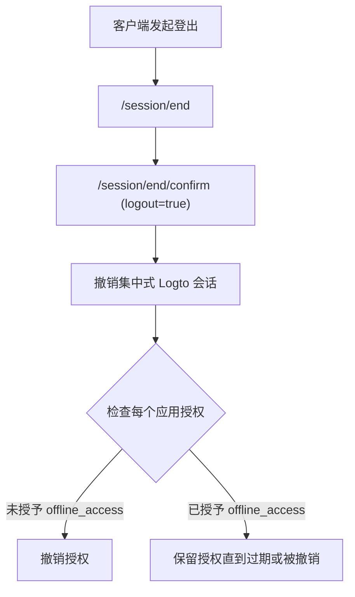

# 登出

在 Logto 中，登出涉及两个层面：

- **Logto 会话登出**：结束 Logto 域下的集中式登录会话。
- **应用登出**：清除客户端应用中的本地会话状态和令牌。

要更好地理解 Logto 中会话的工作方式，请参阅[会话](/sessions)。

## 登出机制 \{#sign-out-mechanisms}

### 1) 仅客户端登出 \{#1-client-side-only-sign-out}

客户端应用清除自身的本地会话和令牌（ID / 访问令牌 / 刷新令牌）。这只会将用户从该应用的本地状态中登出。

- Logto 会话可能仍然有效。
- 同一 Logto 会话下的其他应用可能仍可单点登录 (SSO)。

### 2) 在 Logto 端结束会话（当前 Logto 实现中的全局登出）\{#2-end-session-at-logto-global-sign-out-in-current-logto-implementation}

要清除集中式 Logto 会话，应用会将用户重定向到结束会话端点，例如：

`https://{your-logto-domain}/oidc/session/end`

在当前 Logto SDK 行为中：

1. `signOut()` 会重定向到 `/session/end`。
2. 然后跳转到 `/session/end/confirm`。
3. 默认确认表单会自动提交 `logout=true`。

因此，当前 SDK 的登出被视为**全局登出**。

:::note

- **全局登出**：撤销集中式 Logto 会话。

:::

### 全局登出期间发生了什么 \{#what-happens-during-global-sign-out}


```mermaid
flowchart TD
  A["客户端发起登出"] --> B["/session/end"]
  B --> C["/session/end/confirm (logout=true)"]
  C --> D["撤销集中式 Logto 会话"]
  D --> E{"检查每个应用授权"}
  E -->|"未授予 offline_access"| F["撤销授权"]
  E -->|"已授予 offline_access"| G["保留授权直到过期或被撤销"]
```

在全局登出期间：

- 集中式 Logto 会话被撤销。
- 相关应用授权根据每个应用的授权状态处理：
  - 如果**未**授予 `offline_access`，相关授权会被撤销。
  - 如果**已**授予 `offline_access`，结束会话不会撤销授权。
- 对于 `offline_access` 情况，刷新令牌和授权会一直有效，直到授权过期、刷新令牌过期或被明确撤销，以最早发生者为准。

## 授权生命周期与 `offline_access` 的影响 \{#grant-lifetime-and-offline-access-impact}

- Logto 授权默认 TTL 为**180 天**。
- 如果授予了 `offline_access`，结束会话默认不会撤销该应用授权。
- 与该授权相关的刷新令牌链可以持续使用，直到授权过期、刷新令牌过期或授权被明确撤销。
- 对于单页应用（SPA），刷新令牌轮换不会延长刷新令牌 TTL，因此刷新令牌可能会在授权过期前失效。

## 联邦登出：后端通道登出 \{#federated-sign-out-back-channel-logout}

为实现跨应用一致性，Logto 支持[后端通道登出](https://openid.net/specs/openid-connect-backchannel-1_0-final.html)。

当用户从某个应用登出时，Logto 会向所有参与同一会话的应用发送登出令牌，通知它们的已注册后端通道登出 URI。

如果在应用后端通道设置中启用了 `Is session required`，则登出令牌会包含 `sid` 以标识 Logto 会话。

典型流程：

1. 用户从某个应用发起登出。
2. Logto 处理结束会话，并向已注册的后端通道登出 URI 发送登出令牌。
3. 每个应用验证登出令牌并清除自身的本地会话 / 令牌。

## Logto SDK 中的登出方法 \{#sign-out-methods-in-logto-sdks}

- **SPA 和 Web**：`client.signOut()` 会清除本地令牌存储并重定向到 Logto 结束会话端点。你可以提供登出后的重定向 URI。
- **原生（包括 React Native / Flutter）**：通常只清除本地令牌存储。无会话 WebView 意味着没有持久化的 Logto 浏览器 Cookie 需要清除。

:::note
对于不支持无会话 WebView 或无法识别 `emphasized` 设置的原生应用（如使用 **React Native** 或 **Flutter** SDK 的 Android 应用），你可以在授权请求中传递 `prompt=login` 参数，强制用户再次登录。
:::

## 强制每次访问都重新认证 (Authentication) \{#enforce-re-authentication-on-every-access}

对于高安全性操作，在认证 (Authentication) 请求中包含 `prompt=login`，以绕过单点登录 (SSO)，每次都强制输入凭据。

如果请求 `offline_access`（以获取刷新令牌），还需包含 `consent`，即 `prompt=login consent`。

典型组合设置：

```txt
prompt=login consent
```

## 常见问题解答 \{#faqs}

<details>
  <summary>

### 我没有收到后端通道登出通知。 \{#im-not-receiving-the-back-channel-logout-notifications}

</summary>

- 请确保后端通道登出 URI 已在 Logto 控制台正确注册。
- 请确保你的应用对同一用户 / 会话上下文有活跃的登录状态。

</details>

## 相关资源 \{#related-resources}

<Url href="https://blog.logto.io/oidc-back-channel-logout/">理解 OIDC 后端通道登出。</Url>
