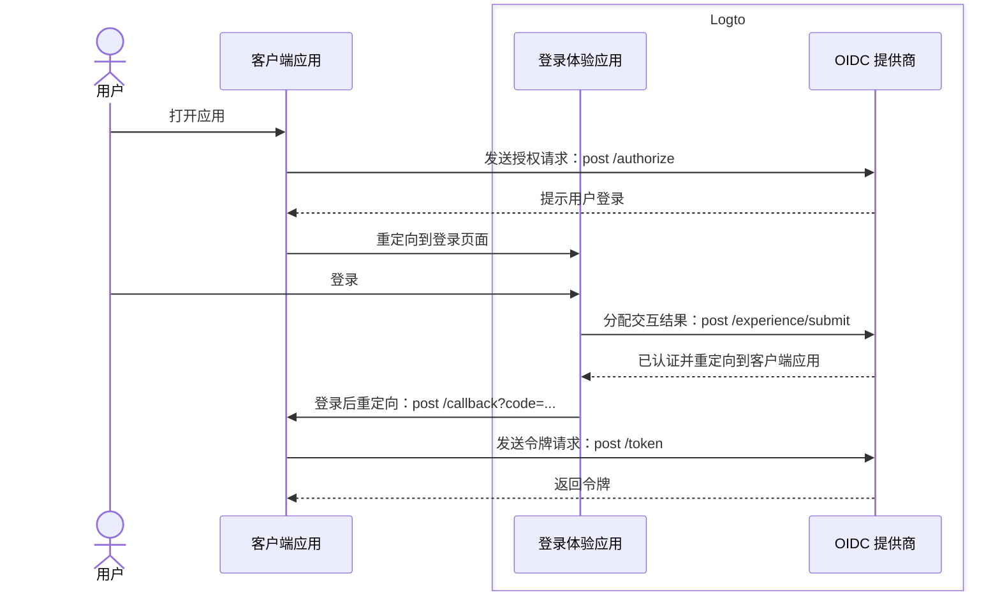
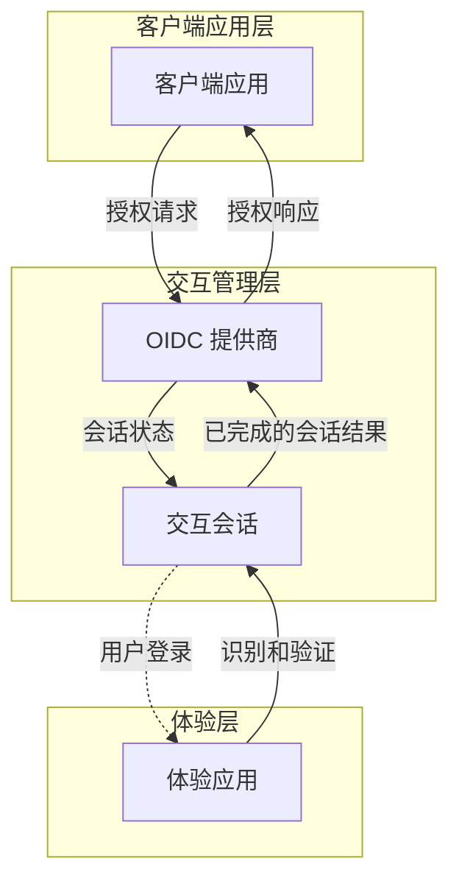

# 注册和登录

注册和登录是终端用户对客户端应用进行认证和授权访问的核心交互过程。作为一个基于 OIDC 的集中式 CIAM 平台，Logto 为用户在多个客户端应用和平台上提供统一的登录体验。

## 用户流程

在典型的 OIDC 认证流程中，用户首先打开客户端应用。客户端应用向 Logto OIDC 提供商发送一个授权请求。如果用户没有活跃的会话，Logto 将提示用户进入 Logto 托管的登录体验页面。用户与 Logto 体验页面进行交互，通过提供必要的凭据进行认证。一旦用户成功认证，Logto 将使用授权码将用户重定向回客户端应用。客户端应用随后使用授权码向 Logto OIDC 提供商发送令牌请求以获取令牌。

## 用户交互

当客户端应用发起授权请求时，会为每次用户交互创建一个**交互会话**。此会话集中管理多个客户端应用的用户交互状态，使 Logto 能够提供一致的登录体验。当用户在客户端应用之间切换时，交互会话保持一致，维护用户的认证状态，减少跨平台重复登录的需要。一旦建立了**交互会话**，用户将被提示登录 Logto。

Logto 中的**体验应用**是一个专门的托管应用，用于促进登录体验。当用户需要认证时，他们会被引导到**体验应用**，在此完成登录并与 Logto 进行交互。**体验应用**利用活跃的交互会话来跟踪和支持用户的交互进度。

为了支持和控制这一用户旅程，Logto 提供了一组基于会话的**体验 API**。这些 API 使**体验应用**能够通过实时更新和访问交互会话状态来处理各种用户识别和验证方法。

一旦用户满足所有验证和核实要求，交互会话将以向 OIDC 提供商提交结果而结束，此时用户已完全认证并提供了授权，完成安全的登录过程。

## 登录体验定制

Logto 为各种业务需求提供灵活且可定制的用户体验，包括自定义品牌、用户界面和用户交互流程。**体验应用**可以根据客户端应用的品牌和安全要求进行定制。

继续了解 Logto 中登录体验的 [设置](/end-user-flows/sign-up-and-sign-in/sign-up) 和 [定制](/customization)。

## 常见问题

  
每个应用的登录体验方法或品牌

对于需要不同登录体验或品牌的应用，Logto 也支持每个应用的定制。查看 [应用设置](/customization/match-your-brand/#app-specific-branding) 以获取更多详细信息。

  
限制电子邮件域 / IP 地址 / 地区

对于基于属性的访问控制，例如，基于电子邮件域、IP 地址或地区限制登录，你可以使用 Logto 中的 [自定义令牌声明](/developers/custom-token-claims/) 功能，根据用户的属性拒绝或允许授权请求。

  
无头 API 用于登录和注册

目前，Logto 不提供用于登录和注册的无头 API。不过，你可以使用 [自定义 UI](/customization/bring-your-ui/) 来定制登录和注册体验。

