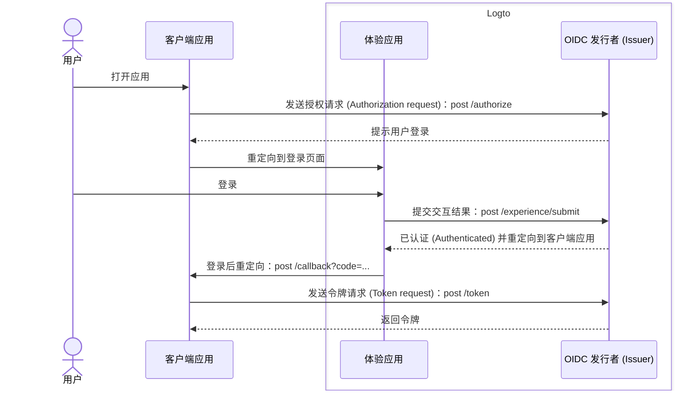

# 注册与登录

注册与登录是终端用户进行认证 (Authentication) 和授权 (Authorization) 访问客户端应用程序的核心交互流程。作为一个基于 OIDC 的集中式 [CIAM](https://auth.wiki/iam) 平台，Logto 为用户在多个客户端应用和平台之间提供统一的登录体验。

## 用户流程 \{#user-flow}

在典型的 [OIDC](https://auth.wiki/openid-connect) 认证 (Authentication) 流程中，用户首先打开客户端应用。客户端应用向 Logto OIDC 发行者 (Issuer) 发送 [授权请求 (Authorization request)](https://auth.wiki/authorization-request)。如果用户没有活动会话，Logto 会引导用户进入 Logto 托管的登录体验页面。用户与 Logto 体验页面交互，并通过提供必要的凭证完成认证 (Authentication)。一旦用户成功认证 (Authentication)，Logto 会将用户重定向回客户端应用，并携带 [授权码 (Authorization code)](https://auth.wiki/authorization-code-flow#how-does-authorization-code-flow-work)。客户端应用随后使用授权码向 Logto OIDC 发行者 (Issuer) 发送 [令牌请求 (Token request)](https://auth.wiki/token-request) 以获取令牌。

```mermaid
sequenceDiagram
  actor user as 用户
  participant client as 客户端应用

  box Logto
    participant experience as 体验应用
    participant oidc as OIDC 发行者 (Issuer)
  end

  user ->> client: 打开应用
  client ->> oidc: 发送授权请求 (Authorization request)：post /authorize
  oidc -->> client: 提示用户登录
  client ->> experience: 重定向到登录页面
  user ->> experience: 登录
  experience ->> oidc: 提交交互结果：post /experience/submit
  oidc -->> experience: 已认证 (Authenticated) 并重定向到客户端应用
  experience ->> client: 登录后重定向：post /callback?code=...
  client ->> oidc: 发送令牌请求 (Token request)：post /token
  oidc -->> client: 返回令牌
```

## 用户交互 \{#user-interaction}

每当客户端应用发起授权请求 (Authorization request) 时，都会为每次用户交互创建一个**交互会话**。该会话在多个客户端应用之间集中管理用户交互状态，使 Logto 能够提供一致的登录体验。当用户在不同客户端应用之间切换时，交互会话保持一致，维护用户的认证 (Authentication) 状态，减少跨平台重复登录的需求。一旦**交互会话**建立，用户将被提示登录 Logto。

Logto 中的**体验应用**是一个专用的托管应用，用于实现登录体验。当用户需要认证 (Authentication) 时，他们会被引导至**体验应用**，在此完成登录并与 Logto 交互。**体验应用**利用活动交互会话来跟踪和支持用户的交互进度。

为支持和控制这一用户流程，Logto 提供了一组基于会话的**体验 API (Experience API)**。这些 API 使**体验应用**能够通过实时更新和访问交互会话状态，处理多种用户身份识别和验证方式。

一旦用户满足所有验证和校验要求，交互会话将以结果提交至 OIDC 发行者 (Issuer) 结束，此时用户已完全认证 (Authentication) 并完成授权 (Authorization)，安全登录流程最终完成。

```mermaid
flowchart TD
  %% 层级
  subgraph Layer1 [客户端应用层]
      A[客户端应用]
  end

  subgraph Layer2 [交互管理层]
      B[OIDC 发行者 (Issuer)]
      C[交互会话]
  end

  subgraph Layer3 [体验层]
      D[体验应用]
  end

  %% 连接
  A --> |授权请求 (Authorization Request)| B
  B --> |会话状态| C
  C -.-> |用户登录| D
  D --> |身份识别与验证| C
  C --> |最终会话结果| B
  B --> |授权响应| A
```

:::note
体验页面仅设计为通过认证 (Authentication) 流程访问。为防止搜索引擎索引这些页面并避免直接访问，Logto 会自动在体验 HTML 页面中添加 `<meta name="robots" content="noindex, nofollow" />`。
:::

## 登录体验自定义 \{#sign-in-experience-customization}

Logto 为各种业务需求提供灵活且可定制的用户体验，包括自定义品牌、用户界面和用户交互流程。**体验应用**可以根据客户端应用的品牌和安全需求进行定制。

继续了解 Logto 中登录体验的[设置](/end-user-flows/sign-up-and-sign-in/sign-up)和[自定义](/customization)。

## 常见问题 \{#faqs}

  

### 按应用自定义登录方式或品牌 \{#per-app-sign-in-experience-method-or-branding}

对于需要不同**登录界面**的应用或组织，Logto 支持[应用特定品牌](/customization/match-your-brand#app-specific-branding)和[组织特定品牌](/customization/match-your-brand#organization-specific-branding)自定义。

如果你需要根据用户类型或站点提供不同的**登录方式**，只需使用[认证 (Authentication) 参数](/end-user-flows/authentication-parameters)（如 `first_screen` 和 `direct_sign_in`）将用户路由到带有定制登录选项的终端用户页面。

  

### 限制邮箱域名 / IP 地址 / 地区 \{#limit-email-domain--ip-address--region}

对于基于属性的访问控制，例如根据邮箱域名、IP 地址或地区限制登录，你可以使用 Logto 的[自定义令牌声明 (Custom token claims)](/developers/custom-token-claims/)功能，根据用户属性拒绝或允许授权请求 (Authorization request)。

  

### 登录与注册的无头 API \{#headless-api-for-sign-in-and-sign-up}

目前，Logto 不提供登录与注册的无头 API。不过，你可以通过[自定义界面](/customization/bring-your-ui/)自定义登录与注册体验。

## 相关资源 \{#related-resources}

<Url href="https://blog.logto.io/deprecated-ropc-grant-type">
  为什么你应该弃用资源所有者密码凭证 (ROPC) 授权类型
</Url>

<Url href="https://blog.logto.io/implicit-flow-is-dead">
  为什么你应该使用授权码流程 (Authorization code flow) 而不是隐式流程 (Implicit flow)？
</Url>

<Url href="https://blog.logto.io/token-based-authentication-vs-session-based-authentication">
  令牌 (Token) 认证 (Authentication) 与会话 (Session) 认证 (Authentication) 对比
</Url>
