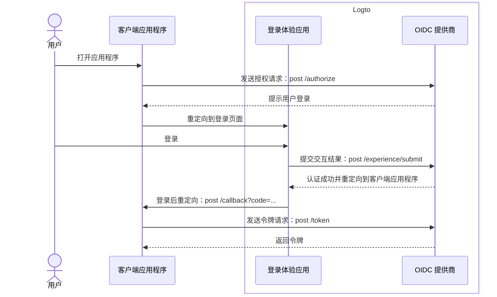
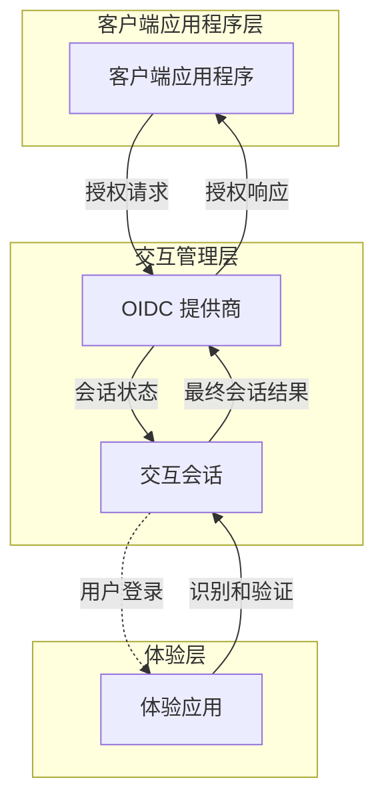

# 注册和登录

注册和登录是终端用户认证 (Authentication) 和授权 (Authorization) 访问客户端应用程序的核心交互过程。作为一个基于 OIDC 的集中式 [CIAM](https://auth.wiki/iam) 平台，Logto 为用户在多个客户端应用程序和平台上提供统一的登录体验。

## 用户流程

在典型的 [OIDC](https://auth.wiki/openid-connect) 认证 (Authentication) 流程中，用户首先打开客户端应用程序。客户端应用程序向 Logto OIDC 提供商发送一个[授权请求 (Authorization request)](https://auth.wiki/authorization-request)。如果用户没有活跃的会话，Logto 将提示用户进入 Logto 托管的登录体验页面。用户与 Logto 体验页面进行交互，并通过提供必要的凭据进行认证 (Authentication)。一旦用户成功认证 (Authentication)，Logto 将用户重定向回客户端应用程序，并附带[授权代码 (Authorization code)](https://auth.wiki/authorization-code-flow#how-does-authorization-code-flow-work)。客户端应用程序随后向 Logto OIDC 提供商发送[令牌请求 (Token request)](https://auth.wiki/token-request)，以获取令牌。

## 用户交互

当客户端应用程序发起授权请求时，会为每次用户交互创建一个**交互会话**。此会话集中管理多个客户端应用程序的用户交互状态，使 Logto 能够提供一致的登录体验。当用户在客户端应用程序之间切换时，交互会话保持一致，维护用户的认证 (Authentication) 状态，减少跨平台重复登录的需要。一旦建立了**交互会话**，用户将被提示登录到 Logto。

Logto 中的**体验应用**是一个专用的托管应用程序，用于促进登录体验。当用户需要认证 (Authentication) 时，他们会被引导到**体验应用**，在这里完成登录并与 Logto 交互。**体验应用**利用活跃的交互会话来跟踪和支持用户的交互进程。

为了支持和控制这一用户旅程，Logto 提供了一组基于会话的**体验 API**。这些 API 使**体验应用**能够通过实时更新和访问交互会话状态来处理各种用户识别和验证方法。

一旦用户满足所有验证和核实要求，交互会话将以向 OIDC 提供商提交结果而结束，此时用户已完全认证 (Authentication) 并提供了同意，完成安全的登录过程。

## 登录体验定制

Logto 为各种业务需求提供灵活且可定制的用户体验，包括自定义品牌、用户界面和用户交互流程。**体验应用**可以根据客户端应用程序的品牌和安全要求进行定制。

继续了解 Logto 中登录体验的[设置](/end-user-flows/sign-up-and-sign-in/sign-up)和[定制](/customization)。

## 常见问题解答

  
每个应用程序的登录体验方法或品牌

对于需要不同登录体验或品牌的应用程序，Logto 还支持每个应用程序的定制。查看[应用程序设置](/customization/match-your-brand/#app-specific-branding)以获取更多详细信息。

  
限制电子邮件域 / IP 地址 / 地区

对于基于属性的访问控制，例如基于电子邮件域、IP 地址或地区限制登录，你可以使用 Logto 的[自定义令牌声明](/developers/custom-token-claims/)功能，根据用户的属性拒绝或允许授权请求。

  
无头 API 用于登录和注册

目前，Logto 不提供用于登录和注册的无头 API。然而，你可以使用[自定义 UI](/customization/bring-your-ui/)来自定义登录和注册体验。

## 相关资源

<Url href="https://blog.logto.io/deprecated-ropc-grant-type">
  为什么你应该弃用资源所有者密码凭证 (ROPC) 授权类型
</Url>

<Url href="https://blog.logto.io/implicit-flow-is-dead">
  为什么你应该使用授权代码流而不是隐式流？
</Url>

<Url href="https://blog.logto.io/token-based-authentication-vs-session-based-authentication">
  比较基于令牌的认证 (Authentication) 和基于会话的认证 (Authentication)
</Url>
