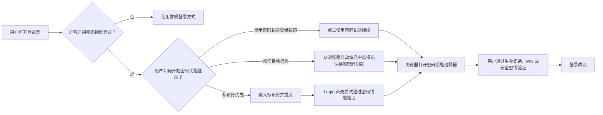
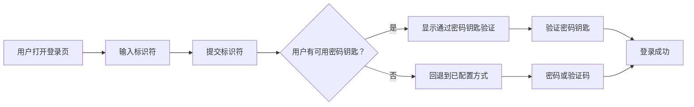
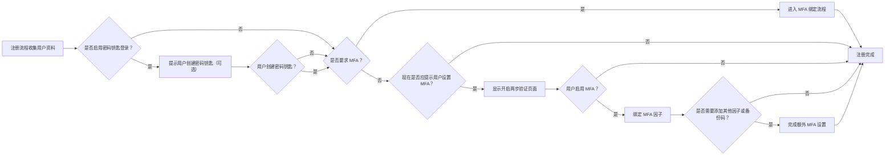

# 密码钥匙登录

密码钥匙登录允许用户在登录时直接使用 WebAuthn 凭据进行认证 (Authentication)，无需先输入密码或验证码。在 Logto 中，用于密码钥匙登录的凭据与 MFA 使用的 WebAuthn 凭据模型相同，因此登录和 MFA 体验紧密相关。

本文档将解释密码钥匙登录在 Logto 内置登录体验中的工作方式、终端用户的不同入口路径，以及它与 MFA 的交互方式。

## 密码钥匙登录的工作原理 \{#how-passkey-sign-in-works}

要使用密码钥匙登录，你需要先在 <CloudLink to="/sign-in-experience/sign-up-and-sign-in">登录体验</CloudLink> 配置中启用该功能。启用后，Logto 可以在登录页以三种方式提供密码钥匙登录：

- 在首屏显示专用的 `使用密码钥匙继续` 按钮。
- 标识符优先流程，在用户输入邮箱、手机号或用户名后尝试 `通过密码钥匙验证`。
- 在标识符输入框支持浏览器自动填充，浏览器可直接从当前设备建议可用的密码钥匙。

整体体验如下所示：

## 三种密码钥匙登录路径 \{#three-passkey-sign-in-paths}

### 1. 启用“显示‘使用密码钥匙继续’按钮” \{#1-show-continue-with-passkey-button-enabled}

当启用 `显示“使用密码钥匙继续”按钮` 选项时，登录页首屏底部会显示一个 `使用密码钥匙继续` 按钮。

用户流程如下：

1. 打开登录页。
2. 点击 `使用密码钥匙继续`。
3. 从浏览器或操作系统弹窗中选择密码钥匙。
4. 完成生物识别、PIN 或硬件密钥验证。
5. 登录成功。

这是最直接的路径，适合已经知道自己保存了密码钥匙并希望一步登录的用户。

### 2. 禁用“显示‘使用密码钥匙继续’按钮” \{#2-show-continue-with-passkey-button-disabled}

当禁用 `显示“使用密码钥匙继续”按钮` 选项时，Logto 会在首屏切换为标识符优先体验。页面首先只要求用户输入标识符。

用户提交标识符后：

1. Logto 检查是否启用密码钥匙登录，以及该用户是否有可用的密码钥匙。
2. 如果有可用密码钥匙，Logto 首先启动“通过密码钥匙验证”流程。
3. 用户可以完成密码钥匙验证并立即登录。
4. 如果没有可用密码钥匙，或用户更喜欢其他方式，Logto 会回退到其他已配置的验证方式。

可用的回退方式取决于当前租户的登录体验配置。例如，用户可以切换到密码、邮箱验证码或手机验证码，具体取决于该标识符启用的验证因子。

### 3. 允许提示和自动填充 \{#3-allow-prompting-and-autofill}

当启用 `允许提示和自动填充` 选项时，兼容的浏览器可以直接在标识符输入框显示已保存的密码钥匙。

用户流程如下：

1. 聚焦登录页的标识符输入框。
2. 浏览器为当前域名建议已保存的密码钥匙。
3. 用户从自动填充列表中选择密码钥匙。
4. 浏览器要求用户通过生物识别、PIN 或硬件密钥验证。
5. 登录成功。

此流程在平台已同步密码钥匙的设备上尤其有用，因为用户无需手动跳转到第二页或点击专用按钮即可登录。

## 注册与密码钥匙绑定流程 \{#sign-up-and-passkey-binding-flow}

密码钥匙登录不仅是登录入口，还影响注册后的流程，因为同一个 WebAuthn 凭据可以在后续用于登录和 MFA。

用户完成常规注册步骤后，Logto 可以提示用户创建密码钥匙。该提示对终端用户来说是可选的，但一旦创建密码钥匙，下一步取决于租户的 MFA 策略和用户自身的 MFA 状态。

主要逻辑如下：

## 密码钥匙登录与 MFA 的关系 \{#relationship-between-passkey-sign-in-and-mfa}

### 密码钥匙登录自动跳过 MFA 验证 \{#passkey-sign-in-automatically-skips-mfa-verification}

用于密码钥匙登录的密码钥匙由 WebAuthn 凭据支持，该凭据也被视为 WebAuthn MFA 因子。因此，从凭据角度看，密码钥匙登录和 WebAuthn MFA 实际上是等价的。

这带来两个重要行为：

- 如果用户通过密码钥匙登录，Logto 会跳过单独的 MFA 验证步骤。
- 如果用户在启用密码钥匙登录前已绑定 WebAuthn 作为 MFA 因子，现有凭据可以直接作为密码钥匙登录凭据，无需再次绑定。

换句话说，成功的密码钥匙登录已经满足了基于 WebAuthn 的身份验证，无需额外的 MFA 步骤。

### 绑定密码钥匙不会自动强制开启 MFA（针对用户可控租户） \{#binding-a-passkey-does-not-automatically-force-mfa-for-user-controlled-tenants}

对于 MFA 非强制的租户，用户在注册或账户设置时绑定密码钥匙，并不会自动为账户开启 MFA。

相反，密码钥匙创建后，Logto 会显示标题为“开启两步验证”的确认页面。

在该页面，用户可以：

- 点击“开启两步验证”按钮，明确开启 MFA 并进入后续绑定步骤。
- 跳过提示，直接完成当前流程，不启用 MFA。

如果用户选择开启 MFA，Logto 会继续正常的 MFA 设置流程，并可能要求用户绑定其他因子，具体取决于租户的 MFA 配置。例如，如果租户启用了其他 MFA 因子，Logto 可以继续绑定其他因子或备份码。

### 后续禁用密码钥匙登录时会发生什么 \{#what-happens-when-passkey-sign-in-is-disabled-later}

如果后续关闭了密码钥匙登录，之前绑定的密码钥匙仍然是 WebAuthn 凭据。这意味着只要租户仍支持 WebAuthn MFA，该凭据依然可以作为 MFA 因子使用。

禁用密码钥匙登录只是移除了作为直接登录入口的功能，但不会使底层 WebAuthn MFA 凭据失效。

## 限制与兼容性 \{#limitations-and-compatibility}

- 企业单点登录 (SSO) 用户无法使用密码钥匙登录。
- 密码钥匙登录依赖于浏览器和平台的 WebAuthn 支持。
- “允许提示和自动填充”仅在支持密码钥匙自动填充 / 条件 UI 的浏览器和环境下有效。
- 密码钥匙与域名绑定。为某一域注册的密码钥匙无法在其他域使用。

## 问答 \{#q-a}

  

### 密码钥匙登录还需要 MFA 验证吗？ \{#does-passkey-sign-in-still-require-mfa-verification}

  

不需要。成功的密码钥匙登录已经满足基于 WebAuthn 的验证要求，因此 Logto 会跳过单独的 MFA 验证步骤。

  

### 禁用密码钥匙登录后，已绑定的密码钥匙还能作为 MFA 因子使用吗？ \{#can-a-passkey-bound-for-passkey-sign-in-still-be-used-as-an-mfa-factor-after-passkey-sign-in-is-disabled}

  

可以。密码钥匙登录和 WebAuthn MFA 由同一凭据模型支持。如果后续禁用密码钥匙登录，已绑定的密码钥匙仍可作为 WebAuthn MFA 因子使用。

  

### 企业单点登录 (SSO) 用户可以使用密码钥匙登录吗？ \{#can-enterprise-sso-users-use-passkey-sign-in}

  

不可以。企业单点登录 (SSO) 用户不支持密码钥匙登录。

  

### 密码钥匙登录还需要验证码（CAPTCHA）吗？ \{#does-passkey-sign-in-still-require-captcha}

  

不需要。密码钥匙登录本身不需要额外的验证码（CAPTCHA）步骤。验证码仍可应用于页面上的其他登录操作（如密码或验证码提交），但不会应用于密码钥匙验证流程本身。

