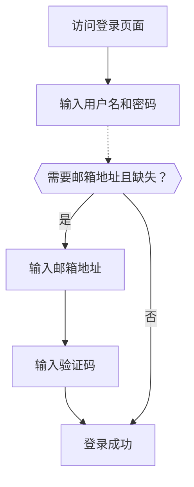

# 邮箱 / 手机号 / 用户名登录

## 配置标识符登录流程 \{#configure-the-identifier-sign-in-flow}

如前所述，可以在[注册流程](/end-user-flows/sign-up-and-sign-in/sign-up)或[在 Logto 中直接创建账户](/user-management/manage-users#add-users)时，从用户处收集多种标识符类型。此外，用户在探索和使用产品的过程中，也可能输入并完善更多信息。这些标识符可用于在 Logto 系统中唯一标识用户，并允许他们通过认证 (Authentication) 登录集成了 Logto 的应用程序。

无论你选择使用 Logto 托管的预构建登录页面，还是计划[构建你自己的自定义登录界面](/customization#custom-ui)，你都需要为终端用户配置可用的登录方式和验证设置。

## 设置标识符和认证 (Authentication) 设置 \{#set-up-the-identifier-and-authentication-settings}

### 1. 设置支持的登录标识符 \{#1-set-the-supported-sign-in-identifiers}

你可以从下拉列表中添加多个支持的标识符，作为终端用户可用的登录方式。可选项包括：

- **用户名**
- **邮箱地址**
- **手机号**

调整标识符的顺序会改变它们在登录页面上的显示顺序。第一个标识符将作为用户的主要登录方式。

### 2. 设置认证 (Authentication) 设置 \{#2-set-the-authentication-settings}

对于每个登录标识符，你需要配置至少一个有效的验证因子来验证用户身份。你可以选择以下两种因子：

- **密码**：适用于所有类型的登录标识符。启用后，用户必须输入密码才能完成登录流程。
- **验证码**：仅适用于 **邮箱地址** 和 **手机号** 标识符。启用后，用户必须输入发送到其邮箱或手机号的验证码才能完成登录流程。

如果同时启用了两种因子，用户可以选择任意一种方式完成登录流程。你还可以调整因子的顺序，以改变它们在登录页面上的显示顺序。第一个因子将作为用户的主要验证方式，第二个则作为备用链接显示。

## 标识符登录流程用户体验 \{#identifier-sign-in-flow-user-experience}

登录体验会根据所选标识符和可用认证 (Authentication) 因子自动适配。

- **多标识符智能输入：**
  如果启用了多种标识符登录方式，Logto 内置登录页面会自动检测用户输入的标识符类型，并显示相应的验证选项。例如，如果同时启用了 **邮箱地址** 和 **手机号**，登录页面会自动检测用户输入的标识符类型，并显示相应的验证选项。当连续输入数字时会切换为带区号的手机号格式，输入“@”符号时会切换为邮箱格式。
  - 手机号国家区号默认根据用户浏览器语言环境设置，用户可手动切换。你可以使用 [`ui_locales`](/end-user-flows/authentication-parameters/ui-locales) 参数设置特定的默认国家区号。详见[本地化语言](/customization/localized-languages#how-can-i-set-a-default-phone-number-country-code-for-the-sign-in-experience)。
- **启用的验证因子：**
  - **仅密码：** 登录页面首屏会同时显示标识符和密码输入框。
  - **仅验证码：** 首屏显示标识符输入框，第二屏显示验证码输入框。
  - **密码和验证码：** 首屏输入标识符，第二屏根据验证顺序输入密码或验证码，并提供切换链接，允许用户在两种验证方式间切换。

### 示例 \{#examples}

  

### 示例 1：邮箱地址 + 密码验证 \{#example-1-email-address-with-password-verification}

添加 **邮箱地址** 作为登录标识符，并启用 **密码** 验证因子。

  

### 示例 2：邮箱/手机号，启用密码（主）和验证码（备选）验证 \{#example-2-emailphone-with-passwordprimary-and-verification-code-alternative-verification-enabled}

同时添加 **邮箱地址** 和 **手机号** 作为登录标识符。
为两种标识符都启用 **密码** 和 **验证码** 验证因子。

## 登录时补充用户资料 \{#collect-additional-user-profile-on-sign-in}

在 Logto 的登录流程中，如果注册标识符设置发生更新，可能会触发资料补全流程。这确保所有用户（包括已有用户）都能补充任何新增的必填标识符。

当开发者添加了新的标识符（如邮箱地址）后，所有用户都必须填写。如果已有用户用原有标识符（如用户名）登录，但资料中缺少新标识符，则会被提示补充并验证新标识符。只有完成此步骤后，才能访问应用，确保平滑且一致地过渡到新要求。

流程分解如下：

1. 之前设置 **用户名** 作为注册标识符，并自动启用 **创建密码** 设置。
2. 后续将 **邮箱地址** 设置为注册标识符，**邮箱地址** 标识符会自动添加为启用的登录选项。
3. 回访用户用用户名和密码登录。
4. 用户在初步登录后被提示补充并验证邮箱地址。

同样的流程也适用于 **创建密码** 注册设置。如果在注册流程中新启用了 **创建密码** 设置，**密码** 因子会自动为你选择的所有登录标识符启用。所有没有密码的回访用户将在登录过程中被提示创建密码。

:::note
注意：如需自定义登录流程，请参考 [自定义界面 (Bring your UI)](/customization/bring-your-ui/) 功能。
:::

## 常见问题 \{#faqs}

  

### 自托管登录体验（嵌入式登录） \{#self-hosted-sign-in-experience-embedded-sign-in}

Logto 目前不支持无界面 API 方式的登录和注册。但你可以使用我们的 [自定义界面 (Bring your UI)](/customization/bring-your-ui/) 功能，将自定义登录表单上传到 Logto。我们还支持多种登录参数，你可以用来预填充从你的应用收集到的用户标识符，或直接通过第三方社交或企业 SSO 提供商登录。详见 [认证参数](/end-user-flows/authentication-parameters/)。

## 相关资源 \{#related-resources}

<Url href="https://www.youtube.com/watch?v=64rBXpWbScc">邮箱注册与登录体验</Url>

<Url href="https://www.youtube.com/watch?v=chQxCJX6e6w">用户名注册与登录体验</Url>
