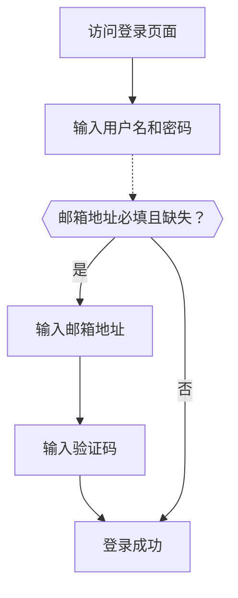

# 邮箱 / 手机号 / 用户名登录

## 配置标识符登录流程

如前所述，在 Logto 的注册流程或直接创建账户过程中，可能会从用户那里收集各种标识符类型。此外，用户在探索和使用产品时可能会输入和完成其他信息。这些标识符可以用于在 Logto 的系统中唯一标识用户，并允许他们在与 Logto 集成的应用程序中进行认证和登录。

无论你选择使用 Logto 托管的预构建登录页面，还是计划构建自己的自定义登录 UI，你都需要为终端用户配置可用的登录方法和验证设置。

## 设置标识符和认证设置

### 1. 设置支持的登录标识符

你可以从下拉列表中添加多个支持的标识符作为终端用户启用的登录方法。可用选项包括：

- **用户名**
- **邮箱地址**
- **手机号**

重新排序标识符将更改它们在登录页面上的显示顺序。第一个标识符将是用户的主要登录方法。

### 2. 设置认证设置

对于每个登录标识符，你需要配置至少一个有效的验证因素来验证用户的身份。你可以选择以下两种因素：

- **密码**：适用于所有类型的登录标识符。一旦启用，用户必须提供密码才能完成登录过程。
- **验证码**：仅适用于 **邮箱地址** 和 **手机号** 标识符。一旦启用，用户必须输入发送到其邮箱或手机号的验证码才能完成登录过程。

如果两个因素都启用，用户可以选择任一方法完成登录过程。你还可以重新排序因素以更改它们在登录页面上的显示顺序。第一个因素将用作用户的主要验证方法，第二个将显示为备用链接。

## 标识符登录流程用户体验

登录体验会根据所选标识符和可用的认证因素进行调整。

- **多标识符的智能输入：**
  如果启用了多个标识符登录方法，Logto 内置登录页面将自动检测用户输入的标识符类型并显示相应的验证选项。例如，如果同时启用了 **邮箱地址** 和 **手机号**，登录页面将自动检测用户输入的标识符类型并显示相应的验证选项。如果连续输入数字，则切换到带有地区代码的手机号格式；如果使用“@”符号，则切换到邮箱格式。
- **启用的验证因素：**
  - **仅密码：** 第一个屏幕将显示标识符和密码字段。
  - **仅验证码：** 第一个屏幕显示标识符字段，第二个屏幕显示验证码字段。
  - **密码和验证码：** 第一个屏幕最初输入标识符，然后根据验证顺序在第二个屏幕输入密码或验证码。提供切换链接以允许用户在两种验证方法之间切换。

### 示例

  
示例 1：邮箱地址和密码验证

添加 **邮箱地址** 作为登录标识符，并启用 **密码** 因素进行验证。

  
示例 2：邮箱 / 手机号启用密码（主要）和验证码（备用）验证

添加 **邮箱地址** 和 **手机号** 作为登录标识符。
为两个标识符启用 **密码** 和 **验证码** 因素。

## 在登录时收集额外的用户资料

在 Logto 的登录流程中，如果更新了注册标识符设置，可能会触发资料补全过程。这确保所有用户，包括现有用户，提供任何新要求的标识符。

当开发者添加新标识符（如邮箱地址）时，它将成为所有用户的必填项。如果返回用户使用现有标识符（如用户名）登录，他们将被提示提供并验证新标识符（如果其资料中缺少）。只有在完成此步骤后，他们才能访问应用程序，确保顺利和一致地过渡到更新的要求。

流程分解：

1. **用户名** 先前被设置为注册标识符，并自动启用了 **创建密码** 设置。
2. **邮箱地址** 后来被设置为注册标识符。**邮箱地址** 标识符自动添加为启用的登录选项。
3. 返回用户使用其用户名和密码登录。
4. 用户在初始登录步骤后被提示提供并验证邮箱地址。

同样的流程也适用于 **创建密码** 注册设置。如果在注册流程中新启用了 **创建密码** 设置，**密码** 因素将自动为你选择的所有登录标识符启用。所有没有密码的返回用户将在登录过程中被提示创建一个密码。

:::note
注意：对于自定义登录流程，请参考 [Bring your UI](/customization/bring-your-ui/) 功能。
:::

## 常见问题

  
自托管登录体验（嵌入式登录）

Logto 目前不支持无头 API 登录和注册。但是，你可以使用我们的 [Bring your UI](/customization/bring-your-ui/) 功能将自定义登录表单上传到 Logto。我们还支持多种登录参数，你可以使用这些参数预填充从应用程序收集的用户标识符的登录表单，或直接使用第三方社交或企业 SSO 提供商登录。了解更多信息，请访问 [认证参数](/end-user-flows/authentication-parameters/)。

## 相关资源

<Url href="https://www.youtube.com/watch?v=64rBXpWbScc">邮箱注册和登录体验</Url>

<Url href="https://www.youtube.com/watch?v=chQxCJX6e6w">用户名注册和登录体验</Url>
