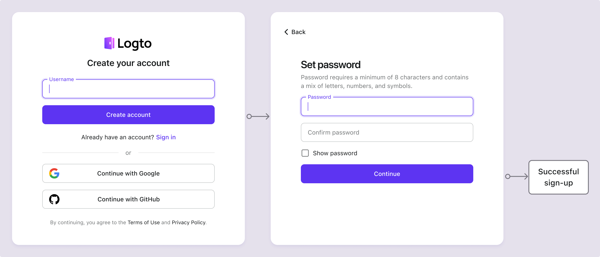
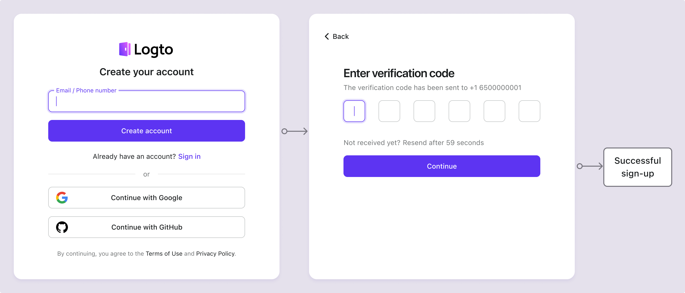

# 邮箱 / 手机号 / 用户名注册

用户注册是用户与应用程序互动的第一步。Logto 支持多种注册方式，包括用户名密码、邮箱或手机号验证、社交注册和企业单点登录 (SSO)。你可以根据应用程序的需求设置最合适的注册方式。

访问 <CloudLink to="/sign-in-experience/sign-up-and-sign-in">控制台 > 登录体验 > 注册和登录</CloudLink> 开始配置标识符注册流程。

## 设置注册标识符

要在 Logto 中成功创建新用户账户，用户必须提供一个在 Logto 系统中唯一标识他们的**标识符**。作为第一步，设置在注册过程中需要从用户那里收集的**标识符**。可用的选项有：

- **用户名**：用户可以用来登录应用程序的唯一用户名。
- **邮箱地址**：用户可以用来登录应用程序的有效邮箱地址。
- **手机号**：用户可以用来登录应用程序的有效手机号。
- **邮箱地址或手机号**：允许用户使用有效的邮箱地址或手机号注册。
- **不适用**：未启用注册标识符。这适用于仅社交或仅企业 SSO 的注册方式。

在注册过程中收集的所有标识符在同一租户下的用户中必须是唯一的。它们将存储在用户的个人资料中，并可用于登录与 Logto 集成的应用程序。

## 设置注册验证设置

为了确保用户注册和未来登录过程的安全性，你还需要配置在注册过程中收集的标识符的验证设置。可用的设置有：

- **创建你的密码**：要求用户在注册时创建一个符合你登录体验设置中配置的密码策略的密码。此密码与用户的标识符一起作为他们登录应用程序的凭证。如果你将**用户名**设置为注册标识符，则此要求会自动启用，因为**用户名**只能与密码一起使用以有效验证用户的身份。
- **注册时验证**：要求用户在注册时验证他们的邮箱地址或手机号。目前，Logto 仅接受经过验证的邮箱和手机号作为标识符。当**邮箱地址**或**手机号**用作注册标识符时，此设置会自动启用。用户必须通过输入在注册过程中发送到他们邮箱或手机号的验证码来确认所有权。

| 标识符       | 创建用户密码 | 注册时验证 |
| ------------ | ------------ | ---------- |
| 用户名       | 必需         | 不适用     |
| 邮箱地址     | 可选         | 必需       |
| 手机号       | 可选         | 必需       |
| 邮箱或手机号 | 可选         | 必需       |
| 不适用       | 不适用       | 不适用     |

## 注册流程示例

  
类型 1：用户名和密码创建

选择**用户名**作为注册标识符。创建你的密码被强制启用。

  
类型 2：邮箱地址或手机号验证流程

选择**邮箱地址或手机号**作为注册标识符。**注册时验证**被强制启用。

  
类型 3：邮箱地址验证和密码创建

选择**邮箱地址**作为注册标识符。**注册时验证**被强制启用。启用**创建你的密码**以要求用户在注册时创建密码。（同样适用于手机号注册流程）

## 使用社交或企业 SSO 注册

除了这些传统的标识符注册方式，Logto 还支持使用社交和企业 SSO 身份提供商 (IdP) 的无密码注册，使入职过程更加无缝和用户友好。

一旦在 Logto 中配置并启用了社交连接器或企业 SSO 连接器，用户可以轻松使用连接器提供的现有社交或企业身份注册。社交和企业 SSO 注册方式允许用户绕过创建密码或验证邮箱地址或手机号等额外步骤。Logto 将通过他们经过验证的社交或企业身份自动同步用户信息，并将其存储在用户的个人资料中。

查看 [社交登录](/end-user-flows/sign-up-and-sign-in/social-sign-in/) 和 [企业 SSO](/end-user-flows/enterprise-sso/) 部分以了解更多关于社交和企业 SSO 连接器的注册流程。

:::note
注意：对于自定义注册流程，请参考 [Bring your UI](/customization/bring-your-ui/) 功能。
:::

## 常见问题

  
在注册时收集额外的用户信息

  
要在注册时收集额外的用户个人资料信息（例如，全名、生日、公司名称），你有两个选项：

- **自托管入职流程**：在成功注册后将用户重定向到你自己的入职流程以进行可定制的数据收集。
- **自定义你的 UI**：使用我们的自定义 UI 功能和用户个人资料设置 API（即将推出）自定义你的注册流程。

  
 管理员创建的用户 / 邀请的用户

了解如何实现 [仅邀请注册流程](/end-user-flows/sign-up-and-sign-in/disable-user-registration/#implement-an-invitation-only-sign-up-flow)。

  
 在你的网站上嵌入注册表单

  
Logto 目前不支持无头 API 用于登录和注册。你可以使用 [Bring your UI](/customization/bring-your-ui/) 功能将你自己的注册表单上传到 Logto，或使用登录参数将用户信息从你的网站填充到 Logto。了解更多关于用户标识符填充的信息，请访问 [认证参数](/end-user-flows/authentication-parameters/)。

  
向新用户发送欢迎邮件

订阅 `User.Created` Webhook 事件以触发向新用户发送欢迎邮件。了解更多关于 [Webhook 事件](/developers/webhooks/webhooks-events/#data-mutation-hook-events)。

  
 跳过注册时的邮箱验证

目前，Logto 仅支持经过验证的邮箱和手机号作为标识符。验证过程是确保用户标识符的安全性和所有权所必需的。
对未经验证的邮箱或手机号的支持在我们的路线图上。敬请关注更新！

## 相关资源

<Url href="https://www.youtube.com/watch?v=64rBXpWbScc">邮箱注册和登录体验</Url>

<Url href="https://www.youtube.com/watch?v=chQxCJX6e6w">用户名注册和登录体验</Url>
