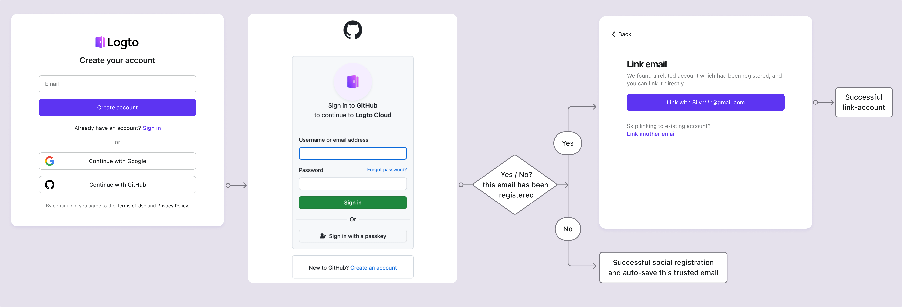

# 社交登录

社交登录是一种广泛使用的认证 (Authentication) 方法，允许用户使用他们现有的社交媒体账户（如 Google、Facebook、Twitter 和 LinkedIn）进行登录和注册。

社交登录的好处：

- **简化的注册流程**：社交登录允许用户通过单击即可注册或登录，无需创建新账户或记住另一个密码。这减少了摩擦并提高了用户参与度。
- **增加的信任和安全性**：通过利用像 Google 或 Facebook 这样已建立的、值得信赖的平台，用户对你的应用程序更有信心。
- **用户数据丰富**：社交登录使你能够从社交平台收集额外的个人资料信息，如姓名、电子邮件地址、个人资料图片等。

## 实现社交登录

1. **配置你的社交连接器**：<br/>
   导航到 <CloudLink to="/connectors/social">Console > Connectors > Social connectors</CloudLink>。点击“添加社交连接器”按钮，找到你想添加的社交连接器（例如 Google 或 Github）。有关添加 [社交连接器](/connectors/social-connectors/) 的详细说明，请参阅我们的文档。
2. **添加社交登录按钮**：<br/>
   默认情况下，新添加的社交连接器不会在终端用户登录页面上显示。要在登录页面上添加社交登录按钮，你需要在登录体验设置中启用社交连接器。

   导航到 <CloudLink to="/sign-in-experience/sign-up-and-sign-in">Console > Sign-in experience > Sign-up and sign-in</CloudLink>。点击“添加社交连接器”按钮，将社交登录按钮集成到你的注册和登录页面。使用拖放功能在 UI 上排列它们的顺序。

3. **设置账户链接选项**：<br/>
   对于使用 [社交身份](/user-management/user-data#social-identities) 注册的新用户，Logto 允许将他们的社交账户链接到 Logto 系统中的现有电子邮件或电话号码账户。默认情况下，在社交注册过程中会向用户显示相关的 [账户链接](#account-linking) 页面，允许他们将社交账户链接到现有账户或创建新账户。

   为简化此过程，你可以在登录体验设置中启用 **自动账户链接** 选项。如果电子邮件或电话号码匹配，这将自动将社交账户链接到现有账户。

4. **保存更改**：<br/>
   仔细检查你的更改并保存以应用配置。

## 社交登录的用户体验

通过社交登录，Logto 中的注册和登录过程为用户简化。


1. **使用社交登录**：用户点击显示在登录页面上的社交登录按钮。
2. **重定向**：用户被重定向到社交身份提供商的认证 (Authentication) 页面。
3. **社交认证 (Authentication)**：用户输入他们的社交凭据并通过社交提供商进行认证 (Authentication)。如果用户已经登录到社交提供商，他们可能会自动认证 (Authentication)。如果检测到多个登录会话，用户可能会被提示选择正确的账户（例如，多个 Google 账户）。
   :::note
   Google 的“prompt”参数可以在 Google 连接器中设置，允许你自定义 Google 登录的账户选择和用户授权页面的用户体验。
   :::
4. **返回 Logto**：认证 (Authentication) 成功后，社交提供商将用户重定向回 Logto 登录页面，并附带认证 (Authentication) 数据。
5. **社交身份验证**：Logto 验证社交认证 (Authentication) 数据和用户身份。如果没有与社交身份关联的用户账户，将创建一个新账户。
6. **用户认证 (Authentication)**：Logto 认证 (Authentication) 用户并将其重定向回客户端应用程序以完成认证 (Authentication) 过程。

### Google One-tap

Logto 还支持 Google 连接器的 [Google One-tap](https://developers.google.com/identity/gsi/web/guides/features) 登录方法，允许用户通过单击即可登录。此功能进一步简化了登录过程，无需用户重定向到 Google 认证 (Authentication) 页面。

要启用 Google One-tap 登录，请按照 [Google 连接器](/integrations/google) 设置中的说明进行操作。启用后，当用户进入登录页面时，将看到“使用 Google 登录”弹出窗口。点击后，他们将自动使用其 Google 账户进行认证 (Authentication) 并重定向回应用程序。


## 账户链接

如上所述，Logto 允许用户将其社交账户链接到 Logto 系统中的现有电子邮件或电话号码账户。此过程对于在不同的认证 (Authentication) 方法和身份提供商之间维护统一的用户账户至关重要。

- **新账户创建**：
  当用户使用 Logto 系统中不存在的 [社交身份](/user-management/user-data#social-identities) 登录，并且提供的电子邮件或电话号码与任何现有用户账户不匹配时，将直接在 Logto 中创建一个新账户。
- **现有账户链接**：
  如果社交身份提供的电子邮件或电话号码已与 Logto 中的现有账户关联，我们提供灵活的账户链接过程。

  - **自动账户链接**：如果在你的 <CloudLink to="/sign-in-experience/sign-up-and-sign-in">登录体验</CloudLink> 设置中启用了“自动账户链接”选项，Logto 将根据匹配的电子邮件或电话号码自动将社交账户链接到现有账户。用户不会被提示链接账户，并将立即登录到其现有账户。社交账户将被链接，允许用户在未来使用任一方法登录。
  - **手动账户链接**：如果禁用了“自动账户链接”选项，用户将在登录过程中被提示将其社交账户链接到现有账户。他们可以选择链接账户或创建新账户。

    

    ```mermaid
    flowchart TD
    A[使用社交身份认证 (Authentication)] --> B{{社交身份在 Logto 中存在吗？}}
    B -- 是 --> C[使用现有账户登录]
    B -- 否 --> D{{电子邮件/电话匹配任何现有账户吗？}}
    D -- 是 --> E{{启用了自动账户链接吗？}}
    E -- 是 --> G[将社交身份链接到现有账户]
    G --> C
    D -- 否 --> H[创建新账户并登录]
    E -- 否 --> I{{链接社交账户吗？}}
    I -- 是 --> G
    I -- 否 --> H
    ```

:::note
如果在社交注册过程中找到相关账户，并且电子邮件或电话号码与现有账户匹配，而用户选择不链接账户，则电子邮件或电话号码将不会同步到 Logto 中的新账户。这确保了电子邮件和电话号码在所有用户账户中保持唯一。

如果电子邮件或电话号码是必需的注册标识符，用户将在注册过程中被提示提供另一个电子邮件或电话号码。有关详细信息，请参阅 [收集额外的用户资料](#collect-additional-user-profile-data)。
:::

## 收集额外的用户资料数据

在社交注册过程中，根据你配置的必需注册标识符（**电子邮件地址**、**电话号码**和**用户名**）设置，用户可能会被提示在通过社交提供商认证 (Authentication) 后提供额外的验证信息以完成注册或登录过程。

例如，**电子邮件地址**已设置为注册标识符：

1. **使用提供验证电子邮件地址的社交身份注册**

   如果社交身份提供了验证的电子邮件地址，用户将自动使用社交身份注册，并且电子邮件地址将同步到用户资料。

2. **使用不提供验证电子邮件地址的社交身份注册**

   如果社交身份未提供验证的电子邮件地址，用户将在注册过程中被提示提供电子邮件地址。用户必须通过输入发送到提供的电子邮件地址的验证码来验证电子邮件地址。

   ```mermaid
   flowchart TD
      A[使用社交身份认证 (Authentication)] --> B{{需要电子邮件地址且缺失？}}
      B -- 是 --> C[输入电子邮件地址]
      C --> D[输入验证码]
      D --> E[注册成功]
      B -- 否 --> E
   ```

3. **使用提供已注册电子邮件地址的社交身份注册**

   如果社交身份提供的电子邮件地址已在 Logto 系统中注册，用户将被提示将社交账户链接到现有账户或创建新账户。如果用户选择创建新账户，他们将被提示提供新电子邮件地址并进行验证。

   ```mermaid
      flowchart TD
       A[使用社交身份认证 (Authentication)] --> B{{电子邮件地址匹配任何现有账户吗？}}
       B -- 是 --> C{{链接社交账户吗？}}
       C -- 是 --> D[将社交身份链接到现有账户]
       D --> E[登录成功]
       C -- 否 --> F[输入新电子邮件地址]
       F --> G[输入验证码]
       G --> E
       B -- 否 --> E
   ```

## 常见问题

<details>
  <summary> 如何在我的网站上添加社交登录按钮并直接使用社交登录？</summary>

Logto 允许你在你的网站上添加社交登录按钮，并直接启动社交登录过程，而无需显示默认登录表单。查看我们的 [直接登录](/end-user-flows/authentication-parameters/direct-sign-in/) 指南以获取详细说明。

</details>

<details>
  <summary> 为什么在使用社交注册后我的电子邮件或电话号码没有填充？</summary>

在 Logto 中，电子邮件地址和电话号码可以用作登录标识符，以唯一标识用户。只有经过验证的电子邮件地址和电话号码才被接受为标识符。如果社交身份未提供 `email_verified` 或 `phone_number_verified` 声明，电子邮件地址或电话号码将不会同步到用户资料中。你仍然可以在用户资料中的社交身份数据下找到它们。

对未验证的电子邮件或电话号码作为用户资料的支持将很快推出。

</details>

## 相关资源

<Url href="https://www.youtube.com/watch?v=sv60N9eW8Ew">社交登录体验</Url>
