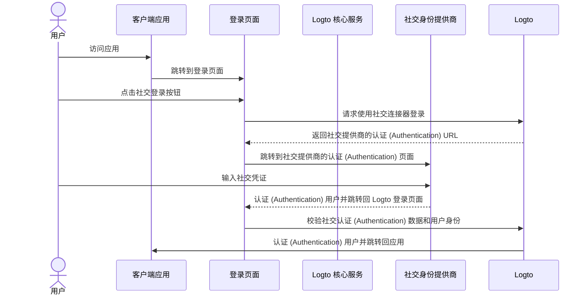
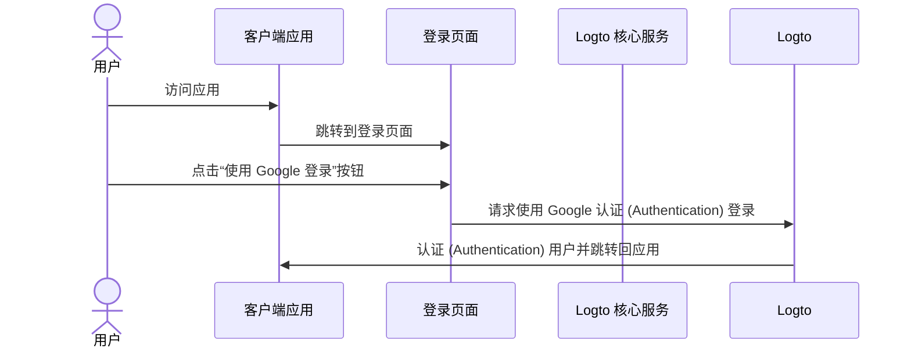

# 社交登录

社交登录是一种广泛使用的认证 (Authentication) 方法，允许用户使用他们现有的社交媒体账户（如 Google、Facebook、Twitter 和 LinkedIn）进行登录和注册。

社交登录的优势：

- **简化的注册流程**：社交登录让用户只需点击一次即可注册或登录，无需创建新账户或记住另一个密码。这减少了摩擦并提升了用户参与度。
- **提升信任与安全**：通过利用 Google 或 Facebook 等成熟、可信的平台，用户对你的应用更有信心。
- **用户数据丰富**：社交登录使你能够从社交平台收集更多的用户资料信息，如姓名、电子邮件地址、头像等。

## 实现社交登录 \{#implement-social-sign-in}

1. **配置你的社交连接器**：<br/>
   前往 <CloudLink to="/connectors/social">控制台 > 连接器 > 社交连接器</CloudLink>。点击“添加社交连接器”按钮，找到你想要添加的社交连接器（如 Google 或 Github）。详细操作请参考 [社交连接器](/connectors/social-connectors/)。
2. **添加社交登录按钮**：<br/>
   默认情况下，你新添加的社交连接器不会显示在终端用户的登录页面上。要在登录页面添加社交登录按钮，你需要在登录体验设置中启用该社交连接器。

   前往 <CloudLink to="/sign-in-experience/sign-up-and-sign-in">控制台 > 登录体验 > 注册和登录</CloudLink>。点击“添加社交连接器”按钮，将社交登录按钮集成到你的注册和登录页面。你可以通过拖拽来调整它们在界面上的顺序。

3. **设置账户关联选项**：<br/>
   对于使用 [社交身份](/user-management/user-data#social-identities) 注册的新用户，Logto 支持将其社交账户与 Logto 系统内现有的邮箱或手机号账户进行关联。默认情况下，在社交注册过程中会显示相关的 [账户关联](#account-linking) 页面，允许用户将社交账户关联到现有账户或创建新账户。

   为了简化流程，你可以在登录体验设置中启用 **自动账户关联** 选项。如果邮箱或手机号匹配，将自动把社交账户关联到现有账户。

4. **保存更改**：<br/>
   仔细检查你的更改并保存，以应用配置。

## 社交登录的用户体验 \{#user-experience-of-social-sign-in}

通过社交登录，Logto 中的注册和登录流程对用户来说更加流畅。



1. **社交登录**：用户点击登录页面上的社交登录按钮。
2. **重定向**：用户被重定向到社交身份提供商的认证 (Authentication) 页面。
3. **社交认证 (Authentication)**：用户输入社交凭证并在社交提供商处完成认证 (Authentication)。如果用户已登录社交提供商，可能会自动认证 (Authentication)。如果检测到多个登录会话，用户可能需要选择正确的账户（如多个 Google 账户）。
   :::note
   Google “prompt” 参数可在 Google 连接器中设置，允许你自定义 Google 登录时的账户选择和用户授权页面体验。
   :::
4. **返回 Logto**：认证 (Authentication) 成功后，社交提供商将用户重定向回 Logto 登录页面，并携带认证 (Authentication) 数据。
5. **社交身份校验**：Logto 校验社交认证 (Authentication) 数据和用户身份。如果没有与该社交身份关联的用户账户，将自动创建新账户。
6. **用户认证 (Authentication)**：Logto 认证 (Authentication) 用户并将其重定向回客户端应用，完成认证 (Authentication) 流程。

## 账户关联 \{#account-linking}

如上所述，Logto 允许用户将社交账户与 Logto 系统内现有的邮箱或手机号账户进行关联。此过程对于在不同认证 (Authentication) 方法和身份提供商之间维护统一的用户账户至关重要。

- **新账户创建**：
  当用户使用 [社交身份](/user-management/user-data#social-identities) 登录且该身份在 Logto 系统中不存在，并且提供的邮箱或手机号未与任何现有账户匹配时，Logto 会直接创建新账户。
- **现有账户关联**：
  如果社交身份提供的邮箱或手机号已与 Logto 中的现有账户关联，我们提供灵活的账户关联流程。

  - **自动账户关联**：如果在 <CloudLink to="/sign-in-experience/sign-up-and-sign-in">登录体验</CloudLink> 设置中启用了“自动账户关联”选项，Logto 会根据邮箱或手机号自动将社交账户关联到现有账户。用户不会被提示关联账户，且会直接登录到现有账户。社交账户将被关联，用户未来可以通过任一方式登录。
  - **手动账户关联**：如果未启用“自动账户关联”，用户在登录过程中会被提示将社交账户关联到现有账户。他们可以选择关联账户或创建新账户。

    

    ```mermaid
    flowchart TD
    A[使用社交身份认证 (Authentication)] --> B{{社交身份在 Logto 中存在？}}
    B -- 是 --> C[使用现有账户登录]
    B -- 否 --> D{{邮箱/手机号匹配现有账户？}}
    D -- 是 --> E{{启用自动账户关联？}}
    E -- 是 --> G[将社交身份关联到现有账户]
    G --> C
    D -- 否 --> H[创建新账户并登录]
    E -- 否 --> I{{关联社交账户？}}
    I -- 是 --> G
    I -- 否 --> H
    ```

:::note
如果在社交注册过程中，提供的邮箱或手机号与现有账户匹配且用户选择不关联账户，则该邮箱或手机号不会同步到 Logto 的新账户。这确保了邮箱和手机号在所有用户账户中保持唯一。

如果邮箱或手机号是必填注册标识符，用户在注册过程中会被要求提供另一个邮箱或手机号。详见 [收集额外用户资料](#collect-additional-user-profile-data)。
:::

## 收集额外用户资料 \{#collect-additional-user-profile-data}

### 收集注册标识符 \{#collect-sign-up-identifiers}

在社交注册过程中，根据你配置的必填注册标识符（**邮箱地址**、**手机号** 和 **用户名**）设置，用户可能需要在通过社交提供商认证 (Authentication) 后，补充额外的验证信息以完成注册或登录流程。

例如，**邮箱地址** 和 **用户名** 被设置为必填注册标识符：

1. **使用提供已验证邮箱地址的社交身份注册**

   如果社交身份提供了已验证的邮箱地址，该邮箱会同步到用户资料，用户将被要求输入用户名以完成注册流程。

   ```mermaid
   flowchart TD
      A[使用社交身份认证 (Authentication)] --> B{{包含已验证邮箱地址？}}
      B -- 是 --> C[输入用户名]
      C --> D[注册成功]
   ```

2. **使用未提供已验证邮箱地址的社交身份注册**

   如果社交身份未提供已验证邮箱地址，用户在注册过程中会被要求输入邮箱地址。用户必须通过输入发送到该邮箱的验证码来验证邮箱。

   ```mermaid
   flowchart TD
      A[使用社交身份认证 (Authentication)] --> B{{包含已验证邮箱地址？}}
      B -- 否 --> C[输入邮箱地址]
      C --> D[输入验证码]
      D --> E[输入用户名]
      E --> F[注册成功]
   ```

3. **使用提供已注册邮箱地址的社交身份注册**

   如果社交身份提供的邮箱地址已在 Logto 系统中注册，用户会被提示将社交账户关联到现有账户或创建新账户。如果用户选择创建新账户，则需要输入新的邮箱地址并进行验证。

   ```mermaid
      flowchart TD
       A[使用社交身份认证 (Authentication)] --> B{{邮箱地址匹配现有账户？}}
       B -- 是 --> C{{关联社交账户？}}
       C -- 是 --> D[将社交身份关联到现有账户]
       D --> E[登录成功]
       C -- 否 --> F[输入新邮箱地址]
       F --> G[输入验证码]
       G --> H[输入用户名]
       H --> I[注册成功]
       B -- 否 --> H
   ```

### 收集其他用户资料 \{#collect-other-user-profile}

除了必填注册标识符外，你还可以在社交注册过程中收集其他资料信息，如姓名、生日或任何自定义字段。

**方案一：收集用户资料**

将 Logto 预设的“告诉我们你的信息”步骤直接加入注册流程。用户必须填写所有必填字段后才能完成注册。该方式无需编码，开箱即用。

通过 <CloudLink to="/sign-in-experience/collect-user-profile">控制台 > 登录体验 > 收集用户资料</CloudLink> 设置，选择预设基础数据字段或创建带有灵活校验的自定义字段。了解更多：[收集用户资料](/end-user-flows/collect-user-profile)

:::note

收集注册标识符（邮箱、手机号、用户名）与在社交登录过程中收集其他用户资料数据是有区别的：

- **注册标识符**：无论新用户还是已有用户都必须填写，因为它们对用户身份识别和通知至关重要。
- **其他资料数据**（如姓名、生日）：仅在新用户注册时收集，因为这些信息对身份识别不是关键，可以后续通过 Account API 补充。

:::

**方案二：自托管引导流程**

在注册成功后将用户重定向到你自定义的引导流程，实现完全自定义的数据收集体验。该方式让你完全掌控用户体验，并支持复杂的多步骤引导流程。

通过 [Account API](/end-user-flows/account-settings/by-account-api) 编程管理用户资料数据。

## Google One-tap \{#google-one-tap}

Logto 也支持 Google 连接器的 [Google One-tap](https://developers.google.com/identity/gsi/web/guides/features) 登录方式，让用户一键登录。该功能进一步简化了登录流程，无需用户跳转到 Google 认证 (Authentication) 页面。

要启用 Google One-tap 登录，请按照 [Google 连接器](/integrations/google) 设置中的说明操作。启用后，用户在登录页面会看到“使用 Google 登录”的弹窗，点击后会自动用 Google 账户认证 (Authentication) 并跳转回应用。




## 关联或解绑社交账户 \{#link-or-unlink-social-accounts}

首次社交登录后，用户可以通过账户设置管理已连接的社交账户。这允许用户将更多社交账户关联到现有资料，或移除不再使用的社交连接。

用户可通过自助账户中心访问这些功能，灵活地：

- **关联新社交账户**：将更多社交提供商关联到同一用户资料
- **解绑已有社交账户**：移除社交连接，同时保留其他方式的访问权限
- **查看已关联账户**：查看所有当前已关联的社交身份

了解如何实现账户管理功能，请参阅 [账户设置](/end-user-flows/account-settings) 文档。

## 存储令牌并调用第三方 API \{#store-tokens-and-call-third-party-apis}

你可以为支持的社交连接器选择性启用第三方令牌存储。这样，在用户认证 (Authentication) 并授权后，提供商颁发的访问令牌 (Access token) 和刷新令牌 (Refresh token) 会安全地存储在 Logto 的密钥库中。你的应用（通过 Account API）可以随后获取并使用这些令牌，代表用户调用提供商 API（如让你的应用向 Google 日历添加事件），无需再次社交认证 (Authentication)。详见 [第三方令牌存储](/secret-vault/federated-token-set) 的配置说明。

## 常见问题 \{#faqs}

<details>
  <summary>

### 如何在我的网站添加社交登录按钮并直接用社交方式登录？ \{#how-to-add-social-login-buttons-and-directly-sign-in-with-social-on-my-website}

</summary>

Logto 允许你在网站上添加社交登录按钮，并直接发起社交登录流程，无需显示默认登录表单。详见我们的 [直接登录](/end-user-flows/authentication-parameters/direct-sign-in/) 指南。

</details>

<details>
  <summary>

### 为什么用社交注册后邮箱或手机号没有同步到账户？ \{#why-my-emails-or-phone-numbers-are-not-populated-after-signing-up-with-social}

</summary>

在 Logto 中，邮箱地址和手机号可作为登录标识符，用于唯一标识用户。只有已验证的邮箱和手机号才会作为标识符被接受。如果社交身份未提供 `email_verified` 或 `phone_number_verified` 声明，则邮箱或手机号不会同步到用户资料。你仍然可以在用户资料的社交身份数据中找到它们。

支持未验证邮箱或手机号作为用户资料的功能即将上线。

</details>

## 相关资源 \{#related-resources}

<Url href="https://www.youtube.com/watch?v=sv60N9eW8Ew">社交登录体验</Url>

<Url href="https://blog.logto.io/maximize-google-sign-in-conversions">
  通过 6 项配置最大化 Google 登录转化率
</Url>
