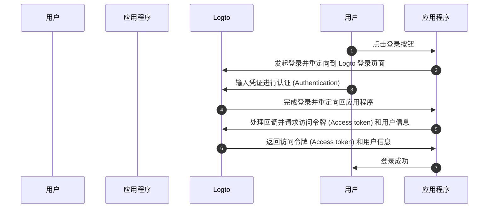
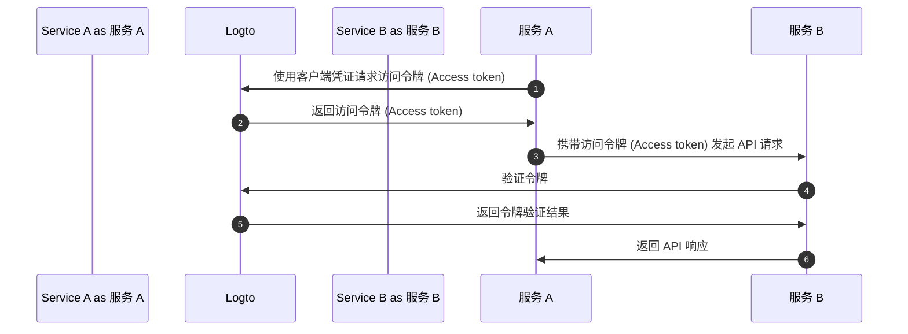
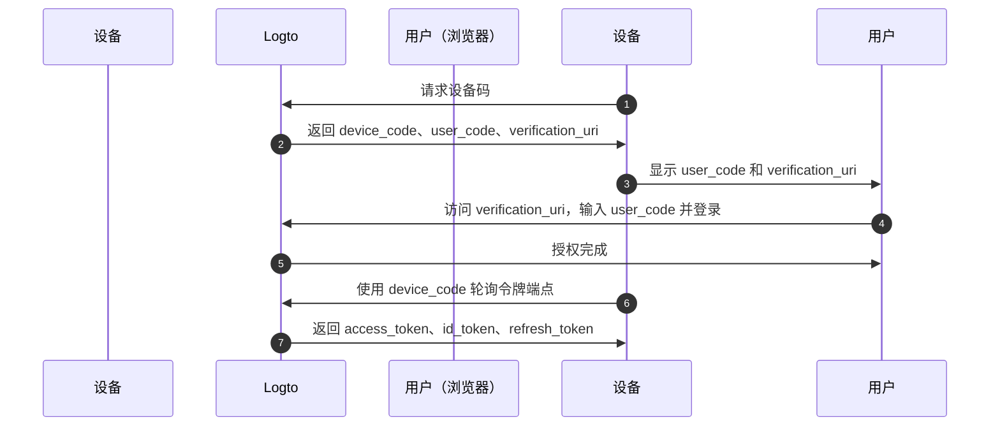
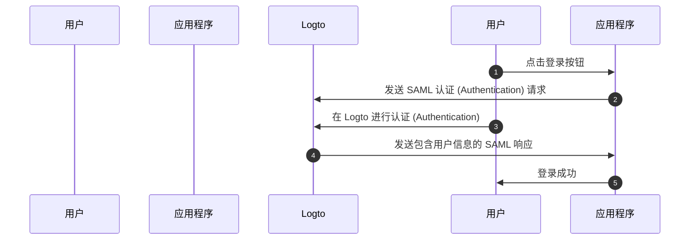

# 理解 OIDC 认证 (Authentication) 流程

Logto 基于 [OAuth 2.0](https://auth.wiki/oauth-2.0) 和 [OpenID Connect (OIDC)](https://auth.wiki/openid-connect) 标准构建。理解这些认证 (Authentication) 标准将让集成过程更加顺畅和直接。

### 用户认证 (Authentication) 流程 \{#user-authentication-flow}

以下是用户通过 Logto 登录时发生的流程：

```mermaid
sequenceDiagram
    autonumber
    participant User as 用户
    participant Application as 应用程序
    participant Logto

    用户->>应用程序: 点击登录按钮
    应用程序->>Logto: 发起登录并重定向到 Logto 登录页面
    用户->>Logto: 输入凭证进行认证 (Authentication)
    Logto->>应用程序: 完成登录并重定向回应用程序
    应用程序->>Logto: 处理回调并请求访问令牌 (Access token) 和用户信息
    Logto->>应用程序: 返回访问令牌 (Access token) 和用户信息
    应用程序->>用户: 登录成功
```

在此流程中，有几个关键概念对集成过程至关重要：

- `Application`：这代表你在 Logto 中的应用。你需要在 Logto 控制台创建应用配置，以建立你的实际应用与 Logto 服务之间的连接。了解更多关于 [Application](/integrate-logto/application-data-structure/#introduction)。
- `Redirect URI`：用户在 Logto 登录页面完成认证 (Authentication) 后，Logto 会通过此 URI 将其重定向回你的应用。你需要在应用设置中配置 Redirect URI。详情见 [Redirect URIs](/integrate-logto/application-data-structure/#redirect-uris)。
- `Handle sign-in callback`：当 Logto 将用户重定向回你的应用时，你的应用需要处理认证 (Authentication) 数据并请求访问令牌 (Access token) 和用户信息。不用担心——Logto SDK 会自动处理这些。

以上内容涵盖了快速集成的要点。如需更深入了解，请参阅我们的 [登录体验详解](/concepts/sign-in-experience/) 指南。

### 机器对机器认证 (Authentication) 流程 \{#machine-to-machine-authentication-flow}

Logto 提供了 [机器对机器 (M2M) 应用](/quick-starts/m2m) 类型，基于 [OAuth 2.0 客户端凭证流](https://auth.wiki/client-credentials-flow)，实现服务之间的直接认证 (Authentication)：

```mermaid
sequenceDiagram
    autonumber
    participant Service A as 服务 A
    participant Logto
    participant Service B as 服务 B

    服务 A->>Logto: 使用客户端凭证请求访问令牌 (Access token)
    Logto->>服务 A: 返回访问令牌 (Access token)
    服务 A->>服务 B: 携带访问令牌 (Access token) 发起 API 请求
    服务 B->>Logto: 验证令牌
    Logto->>服务 B: 返回令牌验证结果
    服务 B->>服务 A: 返回 API 响应
```

这种机器对机器 (M2M) 认证 (Authentication) 流程适用于无需用户交互（因此没有 UI），需要直接与资源通信的应用，例如 API 服务更新 Logto 中的用户数据，或统计服务拉取每日订单。

在此流程中，服务通过客户端凭证进行认证 (Authentication)——即 [Application ID](/integrate-logto/application-data-structure/#application-id) 和 [Application Secret](/integrate-logto/application-data-structure/#application-secret) 的组合，用于唯一标识和认证 (Authentication) 服务本身。这些凭证在向 Logto 请求 [访问令牌 (Access token)](https://auth.wiki/access-token) 时作为服务的身份。

### 设备流（输入受限设备）\{#device-flow}

对于输入能力有限的设备（如智能电视、游戏主机、CLI 工具、IoT 设备），Logto 支持 [OAuth 2.0 设备授权码模式](https://auth.wiki/device-flow)。设备会显示一个代码和 URL，用户则在另一台带浏览器的设备上完成认证 (Authentication)：

```mermaid
sequenceDiagram
    autonumber
    participant Device as 设备
    participant Logto
    participant User as 用户（浏览器）

    设备->>Logto: 请求设备码
    Logto->>设备: 返回 device_code、user_code、verification_uri
    设备->>用户: 显示 user_code 和 verification_uri
    用户->>Logto: 访问 verification_uri，输入 user_code 并登录
    Logto->>用户: 授权完成
    设备->>Logto: 使用 device_code 轮询令牌端点
    Logto->>设备: 返回 access_token、id_token、refresh_token
```

在此流程中：

- 设备向 Logto 请求设备码，获得一个简短的 `user_code` 和 `verification_uri`
- 用户在另一台设备（手机、笔记本）上访问验证 URL，输入代码并登录
- 设备轮询令牌端点，直到用户完成授权，然后获得令牌

与标准用户流程不同，设备流不需要设备本身具备重定向 URI 或浏览器能力。详细了解请参阅 [设备流快速上手](/quick-starts/device-flow)。

### SAML 认证 (Authentication) 流程 \{#saml-authentication-flow}

除了 OAuth 2.0 和 OIDC，Logto 还支持 SAML（安全断言标记语言）认证 (Authentication)，作为身份提供商 (IdP) 实现与企业应用的集成。目前，Logto 支持 SP 发起的认证 (Authentication) 流程：

#### SP 发起流程 \{#saml-authentication-flow-sp-init}

在 SP 发起流程中，认证 (Authentication) 过程从服务提供方（你的应用）开始：

```mermaid
sequenceDiagram
    autonumber
    participant User as 用户
    participant Application as 应用程序
    participant Logto

    用户->>应用程序: 点击登录按钮
    应用程序->>Logto: 发送 SAML 认证 (Authentication) 请求
    用户->>Logto: 在 Logto 进行认证 (Authentication)
    Logto->>应用程序: 发送包含用户信息的 SAML 响应
    应用程序->>用户: 登录成功
```

在此流程中：

- 用户从你的应用（服务提供方）发起认证 (Authentication) 流程
- 你的应用生成 SAML 请求并重定向用户到 Logto（身份提供商 (IdP)）
- 用户在 Logto 成功认证 (Authentication) 后，Logto 向你的应用发送 SAML 响应
- 你的应用处理 SAML 响应并完成认证 (Authentication)

#### IdP 发起流程 \{#saml-authentication-flow-idp-init}

Logto 未来版本将支持 IdP 发起流程，允许用户直接从 Logto 门户发起认证 (Authentication) 流程。敬请关注该功能的更新。

这种 SAML 集成让企业应用能够将 Logto 作为身份提供商 (IdP)，支持现代和传统的基于 SAML 的服务提供方。

## 相关资源 \{#related-resources}

<Url href="https://blog.logto.io/secure-cloud-apps-with-oauth-and-openid-connect">
  博客：使用 OAuth 2.0 和 OpenID Connect 保护云端应用
</Url>

<Url href="https://blog.logto.io/sso-is-better">为什么多应用场景下单点登录 (SSO) 更好</Url>

<Url href="https://blog.logto.io/centralized-identity-system">
  为什么你的多应用业务需要一个集中式身份系统
</Url>
