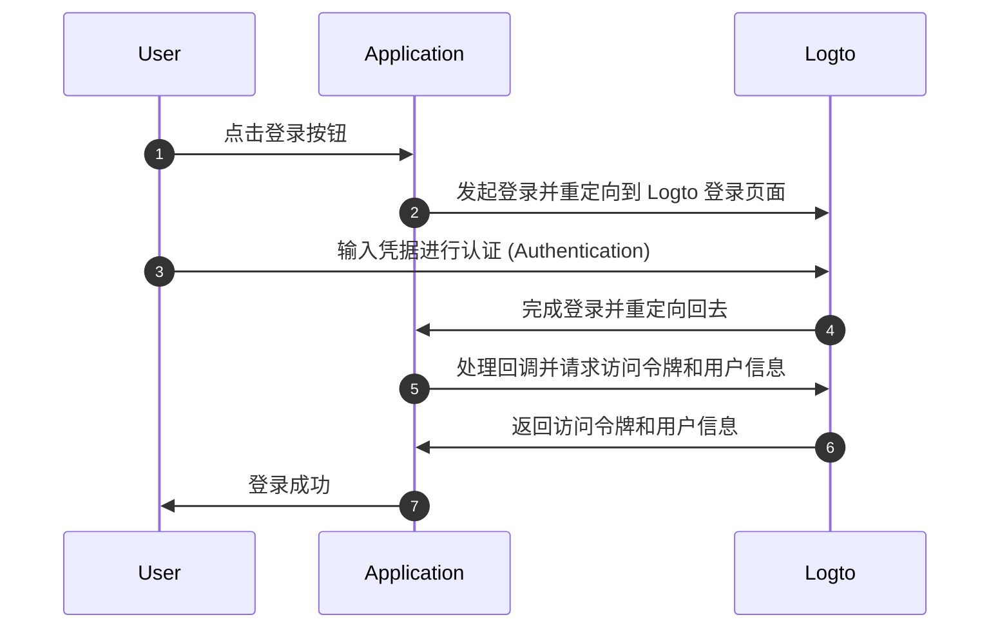
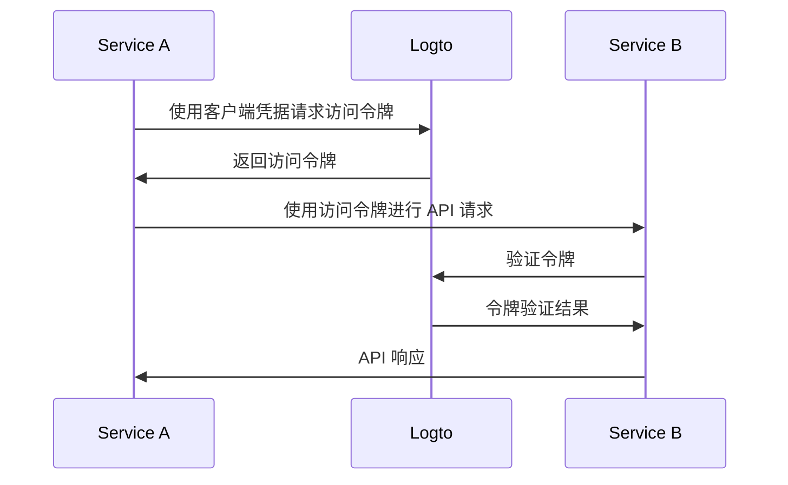

# 理解 OIDC 认证 (Authentication) 流程

Logto 基于 [OAuth 2.0](https://auth.wiki/oauth-2.0) 和 [OpenID Connect (OIDC)](https://auth.wiki/openid-connect) 标准。理解这些认证 (Authentication) 标准将使集成过程更加顺畅和简单。

### 用户认证 (Authentication) 流程 \{#user-authentication-flow}

以下是用户使用 Logto 登录时发生的情况：

在这个流程中，几个关键概念对于集成过程至关重要：

- `Application`：这代表你在 Logto 中的应用程序。你将在 Logto 控制台中创建一个应用程序配置，以建立你的实际应用程序与 Logto 服务之间的连接。了解更多关于 [Application](/integrate-logto/application-data-structure/#introduction)。
- `Redirect URI`：用户在 Logto 登录页面完成认证 (Authentication) 后，Logto 通过此 URI 将他们重定向回你的应用程序。你需要在应用程序设置中配置重定向 URI。更多详情请参见 [Redirect URIs](/integrate-logto/application-data-structure/#redirect-uris)。
- `处理登录回调`：当 Logto 将用户重定向回你的应用程序时，你的应用程序需要处理认证 (Authentication) 数据并请求访问令牌和用户信息。别担心 - Logto SDK 会自动处理这些。

这个概述涵盖了快速集成的基本要素。要深入了解，请查看我们的 [登录体验解释](/concepts/sign-in-experience/) 指南。

### 机器对机器认证 (Authentication) 流程 \{#machine-to-machine-authentication-flow}

Logto 提供 [机器对机器 (M2M) 应用程序](/quick-starts/m2m) 类型，以启用服务之间的直接认证 (Authentication)，基于 [OAuth 2.0 客户端凭据流程](https://auth.wiki/client-credentials-flow)：

这种机器对机器 (M2M) 认证 (Authentication) 流程是为需要直接与资源通信而无需用户交互（因此没有 UI）的应用程序设计的，例如在 Logto 中更新用户数据的 API 服务或提取每日订单的统计服务。

在这个流程中，服务使用客户端凭据进行认证 (Authentication) - 由 [Application ID](/integrate-logto/application-data-structure/#application-id) 和 [Application Secret](/integrate-logto/application-data-structure/#application-secret) 组成的组合，唯一标识和认证 (Authentication) 服务。这些凭据在从 Logto 请求 [访问令牌](https://auth.wiki/access-token) 时作为服务的身份。

## 相关资源 \{#related-resources}

<Url href="https://blog.logto.io/secure-cloud-apps-with-oauth-and-openid-connect">
  博客：使用 OAuth 2.0 和 OpenID Connect 保护基于云的应用程序
</Url>

<Url href="https://blog.logto.io/sso-is-better">为什么多个应用程序的单点登录 (SSO) 更好</Url>

<Url href="https://blog.logto.io/centralized-identity-system">
  为什么你需要一个集中式身份系统来支持多应用业务
</Url>
