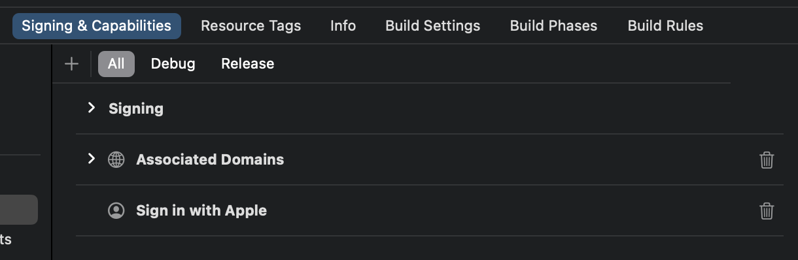

import GuideTip from '../../fragments/_guide-tip.mdx';

# 设置 Apple 社交登录

Logto 官方的 Apple 社交登录连接器。

<GuideTip />

## 开始 \{#get-started}

如果你不了解连接器的概念或不知道如何将此连接器添加到你的登录体验中，请参阅 [Logto 教程](/connectors/social-connectors)。

> ℹ️ **注意**
>
> 如果你的应用中有其他社交登录方法，AppStore 要求必须提供 Apple 登录。
> 如果你也提供 Android 应用，在 Android 设备上提供 Apple 登录是很好的选择。

在继续之前，你需要注册 [Apple Developer Program](https://developer.apple.com/programs/)。

### 为你的应用启用 Apple 登录 \{#enable-sign-in-with-apple-for-your-app}

> ⚠️ **注意**
>
> 即使你只想在 web 应用上实现 Apple 登录，你仍然需要拥有一个现有的应用，该应用融入了 AppStore 生态系统（即拥有有效的 App ID）。

你可以通过 Xcode -> 项目设置 -> 签名和功能，或者访问 [Certificates, Identifiers & Profiles](https://developer.apple.com/account/resources/identifiers/list/bundleId) 来完成此操作。

有关更多信息，请参阅 [Apple 官方文档](https://developer.apple.com/documentation/sign_in_with_apple/configuring_your_environment_for_sign_in_with_apple) 中的“启用 App ID”部分。

### 创建标识符 \{#create-an-identifier}

1. 访问 [Certificates, Identifiers & Profiles](https://developer.apple.com/account/resources/identifiers/list/serviceId)，然后点击“标识符”旁边的“+”按钮。
2. 在“注册新标识符”页面，选择“服务 ID”并点击“继续”。
3. 填写“描述”和“标识符”（例如，`Logto Test` 和 `io.logto.test`），然后点击“继续”。
4. 仔细检查信息并点击“注册”。

### 为你的标识符启用 Apple 登录 \{#enable-sign-in-with-apple-for-your-identifier}

点击你刚创建的标识符。在详细信息页面上勾选“Apple 登录”并点击“配置”。

在打开的模态窗口中，选择你刚刚启用 Apple 登录的 App ID。

输入你的 Logto 实例的域名，不带协议和端口，例如，`your.logto.domain`；然后输入“返回 URL”（即重定向 URI），这是带有 `/callback/${connector_id}` 的 Logto URL，例如，`https://your.logto.domain/callback/apple-universal`。你可以在 Admin Console 中创建 Apple 连接器后获取随机生成的 `connector_id`。

点击“下一步”，然后点击“完成”以关闭模态窗口。点击右上角的“继续”，然后点击“保存”以保存你的配置。

> ⚠️ **注意**
>
> Apple 不允许使用 HTTP 协议和 `localhost` 域名的返回 URL。
>
> 如果你想在本地测试，你需要编辑 `/etc/hosts` 文件，将 localhost 映射到自定义域名，并设置本地 HTTPS 环境。[mkcert](https://github.com/FiloSottile/mkcert) 可以帮助你设置本地 HTTPS。

## 配置权限 \{#configure-scope}

要从 Apple 获取用户的电子邮件，你需要将权限配置为包含 `email`。对于电子邮件和姓名，你可以使用 `name email` 作为权限。有关更多信息，请参阅 [Apple 官方文档](https://developer.apple.com/documentation/sign_in_with_apple/sign_in_with_apple_js/incorporating_sign_in_with_apple_into_other_platforms#3332113)。

> ℹ️ **注意**
>
> 用户可能会选择隐藏他们的电子邮件地址。在这种情况下，你将无法获取真实的电子邮件地址。相反，将返回类似 `random@privaterelay.appleid.com` 的电子邮件地址。

### 配置权限的陷阱 \{#pitfalls-of-configuring-scope}

如果你在用户已经通过 Apple 登录后配置应用请求用户的电子邮件地址，你将无法获取这些现有用户的电子邮件地址，即使他们再次使用 Apple ID 登录。为了解决这个问题，你需要指示用户访问 [Apple ID 账户管理页面](https://appleid.apple.com/account/manage) 并从“Apple 登录”部分中移除你的应用。这可以通过在应用的详细信息页面上选择“停止使用 Apple 登录”来完成。

例如，如果你的应用请求用户的电子邮件和姓名（`email name` 权限），新用户在首次登录时看到的用户授权页面应类似于此：

请参阅开发者讨论 [这里](https://forums.developer.apple.com/forums/thread/132223)。

## 测试 Apple 连接器 \{#test-apple-connector}

就是这样。Apple 连接器应该可以在 web 和原生应用中使用。别忘了在 [登录体验中启用社交连接器](/connectors/social-connectors/#enable-social-sign-in)。
