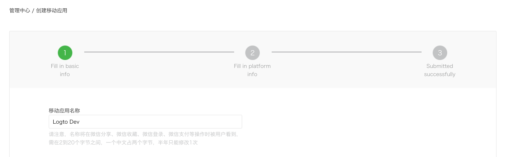

import GuideTip from '../../fragments/_guide-tip.mdx';

# 设置微信（原生）社交登录

Logto 官方连接器用于在原生应用（iOS 和 Android）中进行微信社交登录。

<GuideTip />

## 开始

如果你不了解连接器的概念或不知道如何将此连接器添加到你的登录体验中，请参阅 [Logto 教程](/connectors/social-connectors)。

在原生应用中，你不能使用网页作为微信的登录方式：需要导航到微信应用，并且还需要使用他们的 SDK。

我们知道这听起来很吓人，但别担心。在本教程中，我们将轻松处理它。

## 在微信开放平台创建一个移动应用

> 💡 **提示**
>
> 如果你已经完成了一些部分，可以跳过。

### 创建一个账户

打开 https://open.weixin.qq.com/，点击右上角的“注册”按钮，然后完成注册过程。

### 创建一个移动应用

使用你刚创建的账户登录。在“移动应用” (移动应用) 标签中，点击绿色大按钮“创建移动应用” (创建移动应用)。


让我们在申请表中填写所需的信息。



#### 基本信息

大多数都很简单，我们这里有几个提示：

- 如果你只是想测试微信登录且应用不在 App Store 上，在“应用是否上架”部分选择“否”以跳过“应用下载链接”。
- “应用操作流程图”看起来很棘手。根据我们的经验，你需要准备一个简单的流程图和几个应用截图，以提高通过审核的可能性。

点击“下一步”继续。

#### 平台信息

你可以配置 iOS 和 Android 平台之一或同时配置，以将 Logto 与微信原生登录集成。

**iOS 应用**

勾选“iOS 应用” (iOS 应用)，然后根据你的应用选择目标设备类型。


如果你选择了“否”作为 App Store 上架状态，你可以跳过填写“AppStore 下载地址”。

填写 _Bundle ID_、_测试版 Bundle ID_ 和 _Universal Links_（实际上只需要一个链接 😂）。

> ℹ️ **注意**
>
> _Bundle ID_ 和 _测试版 Bundle ID_ 可以是相同的值。

> 💡 **提示**
>
> 微信要求原生登录使用通用链接。如果你还没有设置或不知道它，请参考 [Apple 官方文档](https://developer.apple.com/ios/universal-links/)。

**Android 应用**

勾选“Android 应用” (Android 应用)。


填写 _应用签名_ 和 _应用包名_。

> ℹ️ **注意**
>
> 你需要签署你的应用以获取签名。有关更多信息，请参考 [签署你的应用](https://developer.android.com/studio/publish/app-signing)。

完成签署后，你可以执行 `signingReport` 任务以获取签名。

```bash
./gradlew your-android-project:signingReport
```

相应构建变体报告的 `MD5` 值将是 _应用签名_，但记得去掉所有分号并将其小写。

例如 `1A:2B:3C:4D` -> `1a2b3c4d`。

#### 等待审核结果

完成平台信息后，点击“提交审核”继续。通常，审核速度很快，通常在 1-2 天内结束。

我们怀疑每次提交的审核员是随机分配的，因为标准是浮动的。你可能第一次被拒绝，但不要放弃！说明你的现状并询问审核员如何修改。

## 在你的应用中启用微信原生登录

### iOS

我们假设你已经在应用中集成了 [Logto iOS SDK](/quick-starts/swift)。在这种情况下，事情非常简单，你甚至不需要阅读微信 SDK 文档：

**1. 在你的 Xcode 项目中配置通用链接和 URL 方案**

在 Xcode 项目 -> 签名和能力标签中，添加“关联域”功能和你之前配置的通用链接。


然后进入“信息”标签，添加一个 [自定义 URL 方案](https://developer.apple.com/documentation/xcode/defining-a-custom-url-scheme-for-your-app) 并使用微信 App ID。


最后打开你的 `Info.plist`，在 `LSApplicationQueriesSchemes` 下添加 `weixinULAPI` 和 `weixin`。


> 🤦 **注意**
>
> 我们知道这些操作不是很合理，但这是我们找到的最小可行解决方案。有关更多信息，请参阅 [神奇的官方指南](https://developers.weixin.qq.com/doc/oplatform/en/Mobile_App/Access_Guide/iOS.html)。

**2. 将 `LogtoSocialPluginWechat` 添加到你的 Xcode 项目中**

添加框架：


并将 `-ObjC` 添加到你的构建设置 > 链接 > 其他链接器标志：


> ℹ️ **注意**
>
> 插件包含微信开放 SDK 1.9.2。导入插件后，你可以直接使用 `import WechatOpenSDK`。

**3. 将插件添加到你的 `LogtoClient` 初始化选项中**

```swift
let logtoClient = LogtoClient(
  useConfig: config,
  socialPlugins: [LogtoSocialPluginWechat()]
)
```

**4. 正确处理 `onOpenURL`**

> ℹ️ **注意**
>
> 函数 `LogtoClient.handle(url:)` 将处理你启用的所有原生连接器。你只需要调用一次。

```swift
// SwiftUI
YourRootView()
  .onOpenURL { url in
      LogtoClient.handle(url: url)
  }

// 或 AppDelegate
func application(_ app: UIApplication, open url: URL, options: /*...*/) -> Bool {
  LogtoClient.handle(url: url)
}
```

### Android

我们假设你已经在应用中集成了 [Logto Android SDK](/quick-starts/android)。在这种情况下，事情非常简单，你甚至不需要阅读微信 SDK 文档：

**1. 将 `Wechat Open SDK` 添加到你的项目中**

确保 `mavenCentral()` 仓库在你的 Gradle 项目仓库中：

```kotlin
repositories {
  // ...
  mavenCentral()
}
```

将 Wechat Open SDK 添加到你的依赖项中：

```kotlin
dependencies {
  // ...
  api("com.tencent.mm.opensdk:wechat-sdk-android:6.8.0")  // kotlin-script
  // 或
  api 'com.tencent.mm.opensdk:wechat-sdk-android:6.8.0'   // groovy-script
}
```

**2. 将 `WXEntryActivity` 引入你的项目**

在你的包根目录下创建一个 `wxapi` 包，并在 `wxapi` 包中添加 `WXEntryActivity`（以 `com.sample.app` 为例）：

```kotlin
// WXEntryActivity.kt
package com.sample.app.wxapi

import io.logto.sdk.android.auth.social.wechat.WechatSocialResultActivity

class WXEntryActivity: WechatSocialResultActivity()
```

```java
// WXEntryActivity.java
package com.sample.app.wxapi

import io.logto.sdk.android.auth.social.wechat.WechatSocialResultActivity

public class WXEntryActivity extends WechatSocialResultActivity {}
```

项目中 `WXEntryActivity` 的最终位置应如下所示（以 Kotlin 为例）：

```bash
src/main/kotlin/com/sample/app/wxapi/WXEntryActivity.kt
```

**3. 修改 `AndroidManifest.xml`**

将以下行添加到你的 `AndroidManifest.xml` 中：

```xml
\<?xml version="1.0" encoding="utf-8"?>
\<manifest xmlns:android="http://schemas.android.com/apk/res/android"
  package="com.sample.app">

  \<application>
    \<!-- 要添加的行 -->
    \<activity android:name=".wxapi.WXEntryActivity" android:exported="true"/>
  \</application>

\</manifest>
```

## 测试微信原生连接器

就是这样。别忘了在 [登录体验中启用社交连接器](/connectors/social-connectors/#enable-social-sign-in)。

一旦启用了微信原生连接器，你可以构建并运行你的应用，看看它是否有效。

> ⚠️ **注意**
>
> 微信没有为那些没有安装微信应用的设备制定计划。如果是这样，Logto 将在登录时隐藏此连接器（这是 [官方开发指南](https://developers.weixin.qq.com/doc/oplatform/en/Mobile_App/WeChat_Login/Development_Guide.html) 推荐的方式）。
