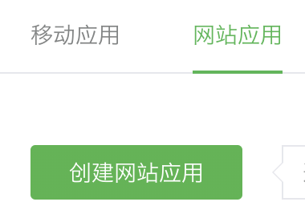

import GuideTip from '../../fragments/_guide-tip.mdx';

# 设置微信 (Web) 社交登录

Logto 官方提供的微信社交登录连接器，用于 Web 应用。

<GuideTip />

## 开始

如果你不了解连接器的概念或不知道如何将此连接器添加到你的登录体验中，请参阅 [Logto 教程](/connectors/social-connectors)。

> **⚠️ 注意**
>
> 此连接器仅适用于 Web 应用。如果你正在寻找在原生应用中使用微信登录的方法，请参阅 [微信原生连接器](/integrations/wechat-native)。

## 在微信开放平台创建一个 Web 应用

> 💡 **提示**
>
> 如果你已经完成了一些步骤，可以跳过相应部分。

### 创建账户

打开 https://open.weixin.qq.com/，点击右上角的“注册”按钮，然后完成注册流程。

### 创建 Web 应用

使用你刚创建的账户登录。在“网页应用” (网页应用) 标签中，点击绿色大按钮“创建网页应用” (创建网页应用)。

填写申请表中的必填信息。

#### 基本信息

大多数信息都很简单。完成表单后，点击“下一步”继续。

#### 网站信息

在“授权回调域” (授权回调域) 中填写你的 Logto 域。例如，`logto.io`。

#### 等待审核结果

完成网站信息后，点击“提交审核”继续。通常审核速度很快，通常在 1-2 天内完成。

我们怀疑每次提交的审核员是随机分配的，因为标准是浮动的。你可能第一次会被拒绝，但不要放弃！说明你的现状并询问审核员如何修改。

### 配置你的微信连接器

在 `clientId` 和 `clientSecret` 字段中填写你从 OAuth 应用详情页面获得的 _Client ID_ 和 _Client Secret_。

在 `scope` 字段中填写 'snsapi_userinfo' 或 'snsapi_base'。你可以将此字段留空，因为它是可选的。默认值设置为 'snsapi_userinfo'。你可以查看不同值之间的 [区别](https://developers.weixin.qq.com/doc/offiaccount/OA_Web_Apps/Wechat_webpage_authorization.html)。

### 测试微信 Web 连接器

就是这样。别忘了在 [登录体验中启用社交连接器](/connectors/social-connectors/#enable-social-sign-in)。

一旦微信 Web 连接器启用，你可以再次登录你的应用，看看它是否正常工作。
