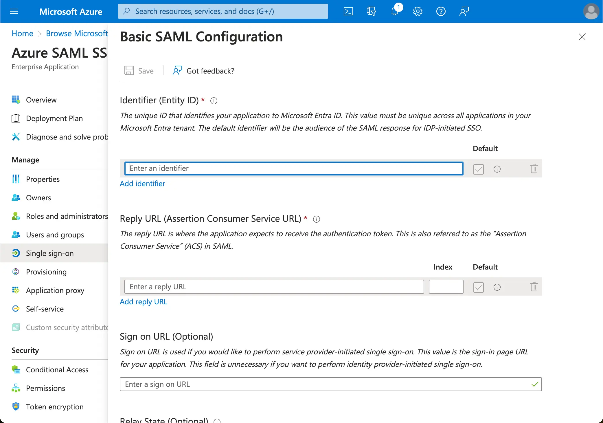

import GuideTip from '../../fragments/_sso_guide_tip.mdx';

# 使用 Microsoft Entra ID (SAML) 设置单点登录

通过最少的配置工作，此连接器允许与 Microsoft Entra ID（以前称为 Azure AD）集成以实现企业单点登录 (SSO)。

<GuideTip />

## 步骤 1：创建一个 Azure AD SSO 应用程序 \{#step-1-create-an-azure-ad-sso-application}

通过在 Azure AD 端创建一个 SSO 应用程序来启动 Azure AD SSO 集成。

1. 访问 [Azure 门户](https://portal.azure.com/) 并以管理员身份登录。
2. 选择 `Microsoft Entra ID` 服务。
3. 使用侧边菜单导航到 `Enterprise applications`。点击 `New application`，然后选择 `Create your own application`。

1. 输入应用程序名称并选择 `Integrate any other application you don't find in the gallery (Non-gallery)`。
2. 选择 `Setup single sign-on` > `SAML`。

1. 按照说明进行操作，第一步，你需要使用 Logto 提供的以下信息填写基本的 SAML 配置。

- **Audience URI(SP Entity ID)**：它表示为你的 Logto 服务的全局唯一标识符，在向身份提供商 (IdP) 发起认证请求时充当 SP 的 EntityId。此标识符对于在 IdP 和 Logto 之间安全交换 SAML 断言和其他认证相关数据至关重要。
- **ACS URL**：断言消费者服务 (ACS) URL 是通过 POST 请求发送 SAML 断言的位置。此 URL 由 IdP 用于将 SAML 断言发送到 Logto。它充当回调 URL，Logto 期望在此接收和消费包含用户身份信息的 SAML 响应。

点击 `Save` 继续。

## 步骤 2：在 Logto 配置 SAML SSO \{#step-2-configure-saml-sso-at-logto}

要使 SAML SSO 集成生效，你需要将 IdP 元数据提供给 Logto。让我们切换回 Logto 端，并导航到你的 Azure AD SSO 连接器的 `Connection` 选项卡。

Logto 提供了三种不同的方法来配置 IdP 元数据。最简单的方法是提供 Azure AD SSO 应用程序的 `metadata URL`。

从你的 Azure AD SSO 应用程序的 `SAML Certificates section` 复制 `App Federation Metadata Url`，并将其粘贴到 Logto 的 `Metadata URL` 字段中。

Logto 将从 URL 获取元数据并自动配置 SAML SSO 集成。

## 步骤 3：配置用户属性映射 \{#step-3-configure-user-attributes-mapping}

Logto 提供了一种灵活的方式来将 IdP 返回的用户属性映射到 Logto 中的用户属性。Logto 默认会从 IdP 同步以下用户属性：

- id：用户的唯一标识符。Logto 将从 SAML 响应中读取 `nameID` 声明作为用户 SSO 身份 id。
- email：用户的电子邮件地址。Logto 将默认从 SAML 响应中读取 `email` 声明作为用户的主要电子邮件。
- name：用户的姓名。

你可以在 Azure AD 端或 Logto 端管理用户属性映射逻辑。

1. 在 Logto 端将 AzureAD 用户属性映射到 Logto 用户属性。

   访问你的 Azure AD SSO 应用程序的 `Attributes & Claims` 部分。

   复制以下属性名称（带有命名空间前缀）并将其粘贴到 Logto 中的相应字段中。

   - `http://schemas.xmlsoap.org/ws/2005/05/identity/claims/emailaddress`
   - `http://schemas.xmlsoap.org/ws/2005/05/identity/claims/name`（建议：将此属性值映射更新为 `user.displayname` 以获得更好的用户体验）

1. 在 AzureAD 端将 AzureAD 用户属性映射到 Logto 用户属性。

   访问你的 Azure AD SSO 应用程序的 `Attributes & Claims` 部分。

   点击 `Edit`，并根据 Logto 用户属性设置更新 `Additional claims` 字段：

   - 根据 Logto 用户属性设置更新声明名称值。
   - 删除命名空间前缀。
   - 点击 `Save` 继续。

   最终应得到以下设置：

你还可以在 Azure AD 端指定其他用户属性。Logto 将在用户的 `sso_identity` 字段下记录从 IdP 返回的原始用户属性。

## 步骤 4：将用户分配给 Azure AD SSO 应用程序 \{#step-4-assign-users-to-the-azure-ad-sso-application}

访问你的 Azure AD SSO 应用程序的 `Users and groups` 部分。点击 `Add user/group` 将用户分配给 Azure AD SSO 应用程序。只有分配给你的 Azure AD SSO 应用程序的用户才能通过 Azure AD SSO 连接器进行认证。

## 步骤 5：设置电子邮件域并启用 SSO 连接器 \{#step-5-set-email-domains-and-enable-the-sso-connector}

在 Logto 的连接器 `SSO experience` 选项卡中提供你的组织的 `email domains`。这将启用 SSO 连接器作为这些用户的认证方法。

具有指定域中电子邮件地址的用户将被重定向以使用 SAML SSO 连接器作为他们唯一的认证方法。

请查看 Azure AD 的官方 [文档](https://learn.microsoft.com/en-us/entra/identity/enterprise-apps/add-application-portal-setup-sso) 以获取有关 Azure AD SSO 集成的更多详细信息。
