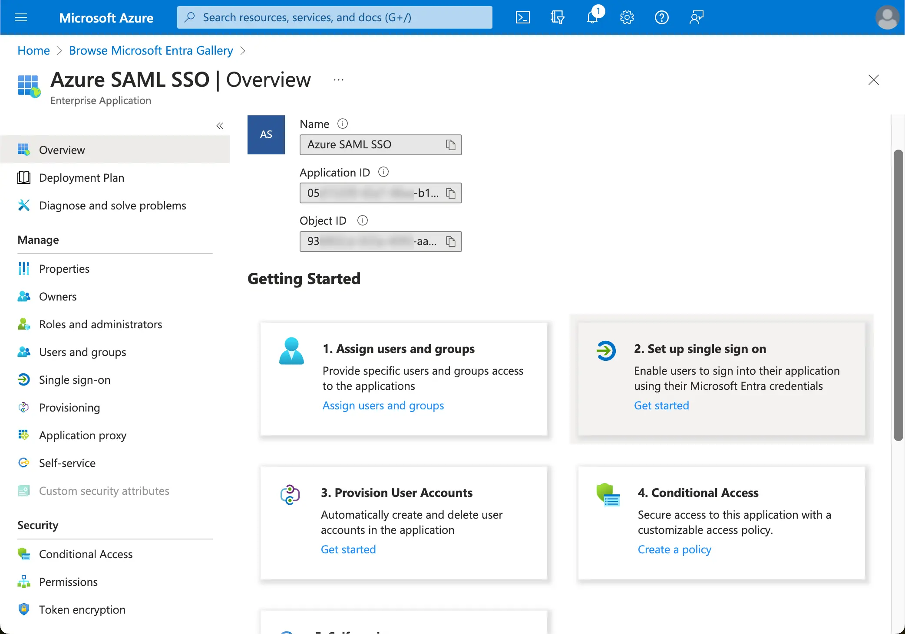
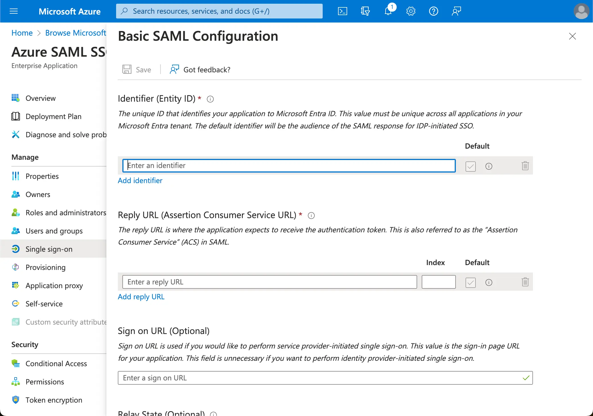

开始 Azure AD 单点登录 (SSO) 集成，首先在 Azure AD 端创建一个 SSO 应用程序。

1. 访问 [Azure 门户](https://portal.azure.com/) 并以管理员身份登录。
2. 选择 `Microsoft Entra ID` 服务。
3. 使用侧边菜单导航到 `企业应用程序`。点击 `新建应用程序`，然后选择 `创建你自己的应用程序`。

1. 输入应用程序名称并选择 `集成任何其他在库中找不到的应用程序（非库）`。
2. 选择 `设置单点登录` > `SAML`。

1. 按照说明进行操作，第一步，你需要使用 Logto 提供的以下信息填写基本的 SAML 配置。

- **受众 (Audience) URI(SP 实体 ID)**：它表示为你的 Logto 服务的全局唯一标识符，在向身份提供商 (IdP) 发送认证请求时作为 SP 的 EntityId。此标识符对于在 IdP 和 Logto 之间安全交换 SAML 断言和其他认证相关数据至关重要。
- **ACS URL**：断言消费者服务 (ACS) URL 是通过 POST 请求发送 SAML 断言的位置。此 URL 由 IdP 用于将 SAML 断言发送到 Logto。它充当回调 URL，Logto 期望在此接收和消费包含用户身份信息的 SAML 响应。

点击 `保存` 以继续。
