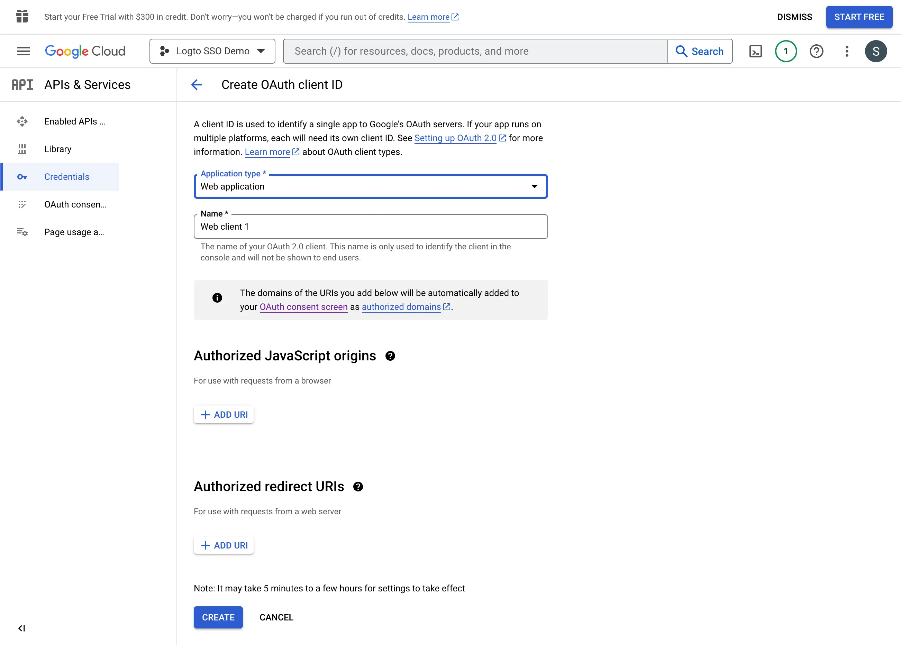

import GuideTip from '../../fragments/_sso_guide_tip.mdx';

# 设置 Google Workspace 的单点登录

通过最少的配置工作，此连接器允许与 Microsoft Entra ID 集成以实现企业单点登录 (SSO)。

<GuideTip />

## 步骤 1：在 Google Cloud Platform 上创建一个新项目

在你可以使用 Google Workspace 作为认证 (Authentication) 提供商之前，你必须在 [Google API Console](https://console.developers.google.com/) 中设置一个项目以获取 OAuth 2.0 凭据。如果你已经有一个项目，可以跳过此步骤。否则，请在你的 Google 组织下创建一个新项目。

## 步骤 2：为你的应用程序配置用户授权页面 (Consent Screen)

为了创建新的 OIDC 凭据，你需要为你的应用程序配置用户授权页面。

1. 导航到 [OAuth 用户授权页面](https://console.cloud.google.com/apis/credentials/consent) 页面并选择 `Internal` 用户类型。这将使 OAuth 应用程序仅对你的组织内的用户可用。

2. 按照页面上的说明填写 `用户授权页面` 设置。你需要提供以下最低信息：

- **应用程序名称**：你的应用程序的名称。它将在用户授权页面上显示。
- **支持电子邮件**：你的应用程序的支持电子邮件。它将在用户授权页面上显示。

3. 设置你的应用程序的 `权限 (Scopes)`。为了正确检索用户的身份信息和电子邮件地址，Logto SSO 连接器需要从 IdP 授予以下权限：

- **openid**：此权限是 OIDC 认证 (Authentication) 所必需的。它用于检索 ID 令牌 (ID token) 并访问 IdP 的 userInfo 端点。
- **profile**：此权限是访问用户基本个人信息所必需的。
- **email**：此权限是访问用户电子邮件地址所必需的。

点击 `Save` 按钮以保存用户授权页面设置。

## 步骤 3：创建新的 OAuth 凭据

导航到 [Credentials](https://console.cloud.google.com/apis/credentials) 页面并点击 `Create Credentials` 按钮。从下拉菜单中选择 `OAuth client ID` 选项以为你的应用程序创建新的 OAuth 凭据。

继续设置 OAuth 凭据，填写以下信息：

1. 选择 `Web application` 作为应用程序类型。
2. 填写你的客户端应用程序的 `名称`，例如 `Logto SSO Connector`。这将帮助你在将来识别凭据。
3. 使用 Logto 回调 URI 填写 `Authorized redirect URIs`。这是 Google 在成功认证 (Authentication) 后将用户的浏览器重定向到的 URI。当用户成功通过 IdP 认证 (Authentication) 后，IdP 会将用户的浏览器重定向回此指定的 URI，并附带授权代码。Logto 将根据从此 URI 接收到的授权代码完成认证 (Authentication) 过程。
4. 使用 Logto 回调 URI 的来源填写 `Authorized JavaScript origins`。这确保只有你的 Logto 应用程序可以向 Google OAuth 服务器发送请求。
5. 点击 `Create` 按钮以创建 OAuth 凭据。

## 步骤 4：使用客户端凭据设置 Logto 连接器

成功创建 OAuth 凭据后，你将收到一个包含客户端 ID 和客户端密钥的提示框。

复制 `Client ID` 和 `Client secret` 并填写到 Logto 的 SSO 连接器 `Connection` 选项卡中的相应字段。

现在你已经成功在 Logto 上配置了一个 Google Workspace SSO 连接器。

## 步骤 5：附加权限 (Scopes)（可选）

使用 `权限 (Scope)` 字段向你的 OAuth 请求添加附加权限。这将允许你从 Google OAuth 服务器请求更多信息。请参阅 [Google OAuth Scopes](https://developers.google.com/identity/protocols/oauth2/scopes) 文档以获取更多信息。

无论自定义权限设置如何，Logto 将始终向 IdP 发送 `openid`、`profile` 和 `email` 权限。这是为了确保 Logto 能够正确检索用户的身份信息和电子邮件地址。

## 步骤 6：设置电子邮件域并启用 SSO 连接器

在 Logto 的连接器 `SSO 体验 (Experience)` 选项卡中提供你的组织的 `电子邮件域`。这将启用 SSO 连接器作为这些用户的认证 (Authentication) 方法。

具有指定域中电子邮件地址的用户将被重定向以使用你的 SSO 连接器作为他们唯一的认证 (Authentication) 方法。

有关 Google Workspace SSO 连接器的更多信息，请查看 [Google OpenID Connector](https://developers.google.com/identity/openid-connect/openid-connect)。
